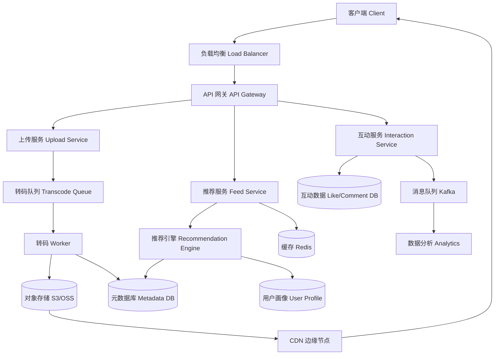

# Design TikTok

---

## 问题定义

设计一个类似 TikTok 的短视频平台，核心功能包括：
- 视频上传（Upload）与存储
- 个性化推荐信息流（News Feed）
- 视频播放（Streaming）
- 点赞、评论、分享等互动

**核心挑战：** 海量视频存储、高并发读取、推荐系统的实时性、全球低延迟播放。

---

## 规模估算

- DAU（日活用户）：约 5 亿
- 每个用户日均观看 100 条视频 → 读 QPS ≈ 50B / 86400 ≈ 500K+
- 每天新增视频：约 500 万条
- 读写比极高（Read-Heavy），约 1000:1

---

## High-Level Design

---

## 核心组件详解

### 1. 视频上传与转码

**流程：** 客户端上传原始视频 → 上传服务获取预签名 URL（Presigned URL）→ 客户端直传到对象存储 → 触发转码任务。

**转码（Transcoding）：** 将原始视频转为多种分辨率（360p/720p/1080p）和编码格式（H.264/H.265），适配不同设备和网络。转码是 CPU 密集型任务，通过消息队列异步处理。

**存储：** 视频文件存对象存储（S3/OSS），视频元数据（标题、作者、标签、时长）存关系型数据库或文档数据库。

### 2. 视频播放与 CDN

**自适应码率（Adaptive Bitrate Streaming, ABR）：** 根据用户网络状况动态切换视频质量。协议：HLS（HTTP Live Streaming）或 DASH。

**CDN 分发：** 热门视频预热（Pre-warm）到全球 CDN 边缘节点，冷门视频按需回源。CDN 命中率是播放体验的关键指标。

### 3. 推荐信息流（Feed）

**核心模式——Fan-out on Read vs Fan-out on Write：**

| 模式 | 机制 | 优点 | 缺点 |
|---|---|---|---|
| Fan-out on Write（推模式） | 用户发布时，预先写入所有粉丝的 Feed | 读取快 | 大V粉丝多时写放大严重 |
| Fan-out on Read（拉模式） | 用户刷 Feed 时，实时聚合关注的人的内容 | 写入简单 | 读延迟高 |
| 混合模式 | 普通用户推模式 + 大V拉模式 | 平衡读写 | 实现复杂 |

TikTok 以**算法推荐**为主（而非关注流），推荐引擎根据用户画像（User Profile）+ 视频特征（Content Feature）+ 实时行为（Real-time Behavior）生成个性化 Feed。

### 4. 互动系统（点赞/评论/分享）

- 点赞计数用 Redis 缓存，异步批量刷新到数据库
- 评论用时间线模型存储，支持分页（Cursor-based Pagination）
- 互动事件写入 Kafka，供下游分析系统和推荐引擎消费

---

## 关键 Trade-off

| 决策点 | 选项 A | 选项 B | 推荐 |
|---|---|---|---|
| 存储方案 | 自建存储 | 对象存储 + CDN | B（成本低，免运维） |
| 转码时机 | 上传时立即转码 | 按需转码 | A（用户体验更好） |
| Feed 模式 | Fan-out on Write | 推荐算法实时生成 | B（TikTok 以推荐为主） |
| 计数一致性 | 强一致 | 最终一致（Redis + 异步刷DB） | B（点赞数允许短暂不准确） |

---

## 小结

> TikTok 是典型的**数据密集型读多写少**系统。核心难点在于：海量视频的存储与分发（对象存储 + CDN）、异步转码流水线（消息队列 + Worker）、推荐引擎的实时性。面试时重点讲清楚 **上传-转码-存储-分发** 的完整链路和 Feed 的生成方式。
