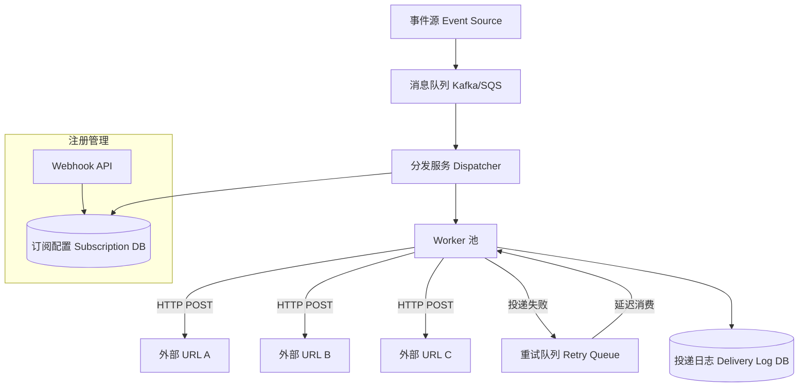

# Design Webhook System

---

## 问题定义

设计一个 Webhook 投递系统：当平台内发生特定事件时（如支付完成、订单状态变更），通过 HTTP 回调（Callback）将事件通知推送到用户配置的外部 URL。

**核心挑战：** 高可靠投递（至少一次 At Least Once）、重试与退避机制、防止目标服务器被打垮、大规模并发投递。

---

## 核心需求

- 用户注册 Webhook URL 并选择订阅事件类型
- 事件触发时，系统向注册的 URL 发送 HTTP POST 请求
- 投递失败时自动重试（指数退避 Exponential Backoff）
- 支持签名验证（Signature Verification），防止伪造
- 提供投递日志（Delivery Log）查询

---

## High-Level Design

---

## 核心组件详解

### 1. 事件采集与分发

业务服务产生事件（如 `payment.completed`）→ 写入消息队列 → Dispatcher 从队列消费事件 → 查询订阅配置 → 为每个匹配的 Webhook 生成一条投递任务。

**关键设计：** 事件与投递任务分离。一个事件可能对应多个 Webhook 订阅，Dispatcher 负责扇出（Fan-out）。

### 2. 投递与重试

**首次投递：** Worker 向外部 URL 发送 HTTP POST，包含事件 payload + 签名。等待响应：2xx 视为成功，其余视为失败。

**重试策略（Exponential Backoff + Jitter）：**
- 第 1 次重试：30 秒后
- 第 2 次重试：2 分钟后
- 第 3 次重试：10 分钟后
- 第 4 次重试：1 小时后
- 第 5 次重试：4 小时后
- 超过最大重试次数后标记为永久失败（Dead Letter），通知用户

**重试队列（Retry Queue）：** 使用延迟队列（Delayed Queue）实现，失败的任务按退避时间重新入队。

### 3. 安全机制

**签名验证（HMAC Signature）：** 每个 Webhook 注册时生成一个密钥（Secret），投递时用 HMAC-SHA256 对 payload 签名，放在请求头（如 `X-Signature`）中，接收方用同一密钥验证。

**防重放（Replay Attack Prevention）：** 请求头中加入时间戳（Timestamp），接收方校验时间差。

### 4. 投递保障

**幂等性（Idempotency）：** 每条投递带唯一 ID（Delivery ID），接收方应根据 ID 去重。

**熔断（Circuit Breaker）：** 如果某个 URL 连续多次投递失败，暂停投递一段时间，避免无意义的重试浪费资源。连续失败达到阈值后标记该 Webhook 为"不健康"，通知用户修复。

### 5. 投递日志

记录每次投递的请求/响应详情（状态码、延迟、错误信息），用户可在控制台查看投递历史，方便调试。

---

## 关键 Trade-off

| 决策点 | 选项 A | 选项 B | 推荐 |
|---|---|---|---|
| 投递语义 | At Most Once | At Least Once + 幂等 | B（可靠性优先） |
| 重试存储 | 内存队列 | 持久化延迟队列 | B（防止 Worker 重启丢任务） |
| 并发控制 | 不限制 | 按 URL 限流 | B（防止打垮接收方） |
| 失败处理 | 静默丢弃 | Dead Letter + 通知用户 | B（透明可追溯） |

---

## 小结

> Webhook 系统的核心是**可靠异步投递**。关键设计点：消息队列解耦 + 指数退避重试 + 签名安全 + 熔断保护。面试时重点讲清楚重试策略和失败兜底机制（Dead Letter Queue）。
