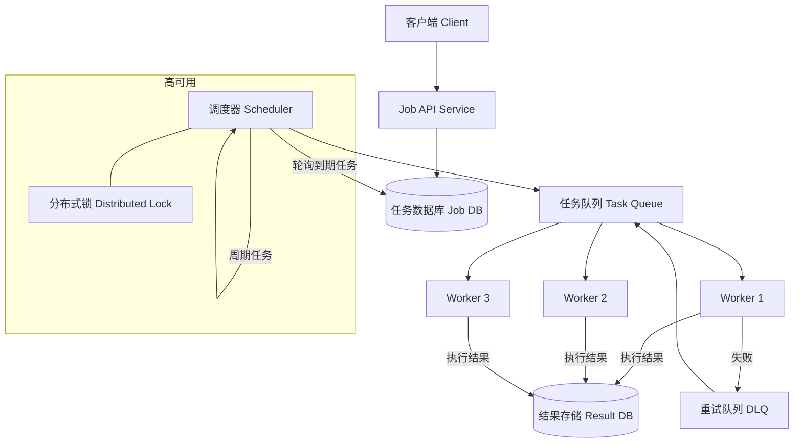

# Design Job Scheduler

---

## 问题定义

设计一个分布式任务调度系统（Job Scheduler），支持：
- 一次性任务（One-time Job）：在指定时间执行
- 周期性任务（Recurring Job / Cron Job）：按 cron 表达式周期执行
- 高可用、不丢任务、不重复执行

**核心挑战：** 定时精度、任务不丢不重、大规模任务的并发调度、故障恢复。

---

## 核心需求

- 用户通过 API 创建/管理任务（指定执行时间或 cron 表达式、回调地址或任务代码）
- 到达指定时间时准确触发任务执行
- 任务执行失败时支持重试
- 支持百万级任务调度

---

## High-Level Design



---

## 核心组件详解

### 1. 任务存储（Job Store）

每个任务记录包含：Job ID、任务类型（one-time / recurring）、cron 表达式、下次执行时间（next_execution_time）、状态（pending / running / completed / failed）、重试次数等。

**关键索引：** 在 `next_execution_time` 上建索引，调度器高效查询到期任务。

### 2. 调度器（Scheduler）

**核心逻辑：** 周期性扫描数据库，找出 `next_execution_time <= now()` 且状态为 `pending` 的任务，将其推入任务队列。

**防重复调度（多实例部署）：** 多个 Scheduler 实例同时运行时，使用分布式锁（Distributed Lock）或数据库乐观锁（Optimistic Lock）保证同一个任务只被调度一次。

```sql
-- 乐观锁方式：CAS 更新
UPDATE jobs
SET status = 'queued', version = version + 1
WHERE id = ? AND status = 'pending' AND version = ?
```

**周期任务处理：** 任务被调度后，Scheduler 根据 cron 表达式计算下一次执行时间，更新 `next_execution_time`。

### 3. 任务队列

Scheduler 将到期任务推入消息队列（Kafka / SQS / Redis），Worker 从队列中消费并执行。队列起到**解耦和削峰**的作用，避免大量任务同时到期导致系统过载。

**优先级队列（Priority Queue）：** 紧急任务优先消费。

### 4. Worker

从队列拉取任务并执行。支持水平扩展——任务量大时增加 Worker 实例。

**超时控制：** 每个任务设置最大执行时间，超时则标记失败。

**心跳机制（Heartbeat）：** 长时间运行的任务定期发送心跳，防止被误判为超时。

### 5. 高可用设计

**Scheduler 高可用：** 多实例部署，通过分布式锁选主（Leader Election），主节点负责调度，从节点待命。主节点故障时自动切换。

**Worker 高可用：** Worker 崩溃时，未确认的任务回到队列被其他 Worker 重新消费（At Least Once 语义），因此任务需要幂等设计。

---

## 扩展：时间轮（Timing Wheel）

当任务量极大时，逐条扫描数据库效率低。可以使用时间轮（Timing Wheel）数据结构：将时间划分为固定槽位（Slot），任务按触发时间挂到对应槽位上，指针每 tick 前进一格，触发当前槽位的所有任务。Kafka 内部的延迟队列就使用了分层时间轮。

---

## 关键 Trade-off

| 决策点 | 选项 A | 选项 B | 推荐 |
|---|---|---|---|
| 调度精度 | 秒级（轮询频率高） | 分钟级（轮询频率低） | 按业务需求选择 |
| 防重复 | 分布式锁 | 数据库乐观锁 | 任务量小用乐观锁，量大用分布式锁 |
| 任务存储 | 关系型数据库 | Redis（快但持久化弱） | 关系型 DB（可靠性优先） |
| 大规模调度 | 数据库轮询 | 时间轮 | 百万级任务用时间轮 |

---

## 小结

> Job Scheduler 的核心是**精准触发 + 不丢不重**。关键组件：调度器（轮询 / 时间轮）+ 分布式锁防重 + 消息队列解耦 + 幂等 Worker。面试时重点讲清楚调度器如何保证多实例下任务不被重复执行。
