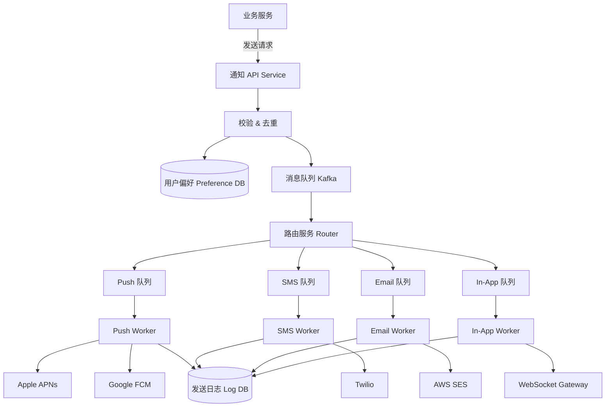

# Design Notification System

---

## 问题定义

设计一个通知推送系统，支持多种渠道（Channel）向用户发送通知：
- 推送通知（Push Notification）：iOS APNs / Android FCM
- 短信（SMS）：Twilio 等
- 邮件（Email）：SendGrid / SES 等
- 应用内通知（In-App Notification）

**核心挑战：** 多渠道统一管理、高吞吐异步发送、用户偏好与防骚扰、可靠投递。

---

## 核心需求

- 业务方通过 API 触发通知（指定用户、渠道、模板、参数）
- 支持即时发送和定时发送
- 用户可设置通知偏好（关闭某渠道、免打扰时段）
- 防重复发送（Deduplication）
- 提供发送状态追踪

---

## High-Level Design



---

## 核心组件详解

### 1. 通知接收层

**API 接口：** 接收业务方的发送请求，包含：目标用户（user_id / user_list / topic）、渠道（channel）、模板 ID（template_id）、模板参数。

**校验与预处理：**
- 检查参数合法性
- 去重（Deduplication）：用 `request_id` 做幂等键，防止业务方重试导致重复发送
- 查询用户通知偏好，过滤掉用户关闭的渠道
- 检查免打扰时段（Quiet Hours），需要延迟的放入延迟队列

### 2. 渠道路由（Channel Router）

从主队列消费消息，根据渠道类型分发到对应的子队列。每个渠道独立队列的好处：
- 某个渠道（如 SMS 供应商）故障不影响其他渠道
- 各渠道可独立扩缩容
- 不同渠道发送速率差异大（Push 极快，Email 较慢）

### 3. 各渠道 Worker

**Push Worker：** 调用 APNs / FCM API，需要管理设备 Token（Device Token），Token 失效时标记清理。

**SMS Worker：** 调用短信供应商 API，注意限流（不同供应商有发送速率限制）。

**Email Worker：** 渲染邮件模板 + 调用邮件服务 API，注意反垃圾（Anti-Spam）。

**In-App Worker：** 通过 WebSocket 实时推送给在线用户，离线用户存入通知收件箱（Inbox），用户上线后拉取。

### 4. 模板系统（Template Engine）

通知内容通过模板 + 参数动态生成，支持多语言（i18n）：
```
模板：「您的订单 {{order_id}} 已发货，预计 {{eta}} 送达。」
参数：{order_id: "12345", eta: "明天"}
结果：「您的订单 12345 已发货，预计明天送达。」
```

### 5. 发送日志与追踪

记录每条通知的完整生命周期：创建 → 入队 → 路由 → 发送 → 结果（成功/失败/送达/已读）。

**送达回执（Delivery Receipt）：** Push/SMS 供应商会异步回调告知送达状态，系统更新日志。

---

## 关键 Trade-off

| 决策点 | 选项 A | 选项 B | 推荐 |
|---|---|---|---|
| 队列结构 | 单一队列所有渠道 | 按渠道独立队列 | B（故障隔离） |
| 去重层级 | 业务方自行保证 | 系统层面去重 | B（幂等键 + 滑动窗口去重） |
| 大量发送 | 同步逐条发送 | 批量发送（Batch） | B（SMS/Email 供应商支持批量接口） |
| In-App 投递 | 纯推（WebSocket） | 推拉结合（在线推 + 离线拉） | B（覆盖离线场景） |

---

## 小结

> 通知系统的核心是**多渠道异步投递 + 用户偏好过滤 + 可靠去重**。架构上通过消息队列实现渠道解耦和故障隔离。面试时重点讲清楚渠道路由的设计和去重/防骚扰机制。
