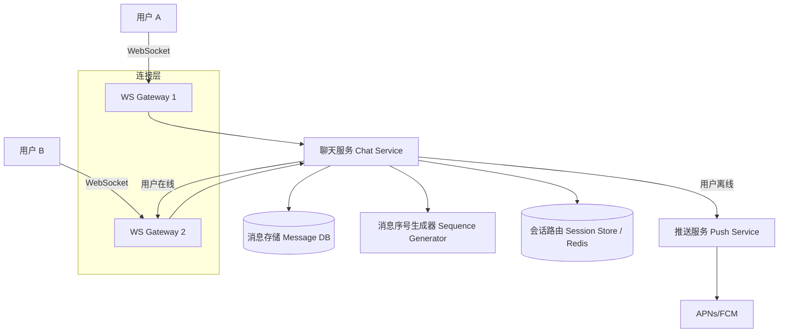

# Design 1-1 Chat（WhatsApp）

---

## 问题定义

设计一个类似 WhatsApp 的一对一即时聊天系统，核心功能：
- 一对一实时消息收发
- 消息持久化与历史记录
- 在线状态（Online Status）
- 已读回执（Read Receipt）
- 离线消息推送

**核心挑战：** 实时性（低延迟）、消息可靠送达（不丢消息）、海量连接管理、消息有序性。

---

## High-Level Design



---

## 核心组件详解

### 1. 连接层（WebSocket Gateway）

每个客户端通过 WebSocket 与网关（Gateway）保持长连接。网关是无状态的，可水平扩展。

**连接路由（Session Routing）：** 用户连接到哪台 Gateway 记录在 Redis 中（`user_id → gateway_id`）。发消息时根据接收方的 Gateway 路由转发。

**连接保活：** 客户端定期发心跳（Heartbeat），超时未收到心跳则断开连接并更新在线状态。

### 2. 消息发送流程

```
1. 用户 A 发送消息 → WS Gateway 1
2. Gateway 1 → Chat Service
3. Chat Service：
   a. 生成全局有序的消息 ID（Sequence Generator）
   b. 消息持久化写入 Message DB
   c. 查询 Redis 获取用户 B 的 Gateway 地址
4a. 用户 B 在线 → 转发到 Gateway 2 → 推送给用户 B
4b. 用户 B 离线 → 写入离线消息 → 触发 Push 通知
5. 用户 B 上线后拉取（Pull）离线消息
```

### 3. 消息存储

**Schema 设计：**
```
messages:
  message_id    (PK, 全局唯一 + 有序)
  conversation_id
  sender_id
  content
  content_type  (text / image / video)
  created_at
  status        (sent / delivered / read)
```

**分区策略：** 按 `conversation_id` 分片（Sharding），同一对话的消息在同一分片上，保证对话内消息有序且查询高效。

**存储选型：** HBase / Cassandra 适合海量消息写入和按时间范围查询。

### 4. 消息有序性

每个对话维护一个单调递增的序号（Sequence Number），由序号生成器保证。客户端根据序号排序显示消息，也用序号检测消息是否缺失（Gap Detection）。

### 5. 已读回执与在线状态

**已读回执：** 用户 B 阅读消息后发送 ACK，Chat Service 更新消息状态为 `read`，推送给用户 A。

**在线状态（Presence）：** 基于心跳机制，定期更新 Redis 中的在线时间戳。查询时判断时间戳是否在阈值内。

**优化：** 在线状态不需要实时精确，可以使用较粗粒度（如 30 秒更新一次），减少写压力。

---

## 关键 Trade-off

| 决策点 | 选项 A | 选项 B | 推荐 |
|---|---|---|---|
| 通信协议 | HTTP 轮询 | WebSocket 长连接 | B（低延迟、双向通信） |
| 消息投递 | 推模式（Push only） | 推拉结合（Push + Pull） | B（覆盖离线场景） |
| 消息存储 | MySQL | Cassandra / HBase | B（海量消息写入） |
| 已读回执传播 | 实时推送每条 | 批量汇报（Batch ACK） | B（减少网络开销） |

---

## 小结

> 1-1 聊天系统的核心是 **WebSocket 长连接 + 消息有序性 + 离线兜底**。面试时重点讲清楚：连接路由（用户在哪台 Gateway）、消息送达保证（在线推 + 离线存 + 上线拉）、按对话分片的存储设计。
