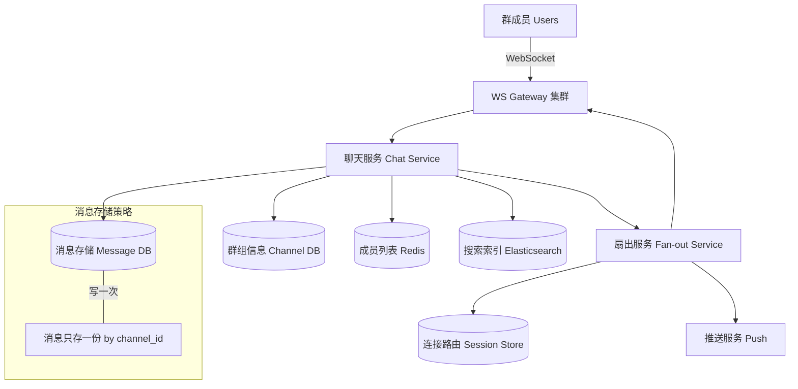

# Design Group Chat（Slack）

---

## 问题定义

设计一个类似 Slack 的群聊系统，核心功能：
- 群组（Channel）创建与管理
- 群消息收发（一个人发，所有成员收到）
- 消息线程（Thread）
- @提及（Mention）
- 历史消息搜索

**核心挑战：** 群消息的扇出（Fan-out）效率、大群的消息投递、消息搜索、Channel 内消息有序性。

**与 1-1 Chat 的核心区别：** 一条消息需要投递给群内所有成员（1 → N），消息放大问题更突出。

---

## High-Level Design



---

## 核心组件详解

### 1. 群消息存储——写扩散 vs 读扩散

| 方案 | 写入 | 读取 | 适用 |
|---|---|---|---|
| 写扩散（Fan-out on Write） | 每条消息复制到每个成员的收件箱 | 读自己的收件箱即可 | 小群、成员少 |
| 读扩散（Fan-out on Read） | 消息只存一份在 Channel | 读取时聚合 Channel 消息 | 大群、大 Channel |

**Slack 模式——读扩散为主：** 消息按 `channel_id` 存储一份，用户拉取某个 Channel 的消息时直接查询。避免了大群的写放大。

### 2. 消息投递（Fan-out）

消息写入存储后，需要实时通知在线成员：

1. 从 Redis 获取该 Channel 的成员列表
2. 查询每个成员的 WebSocket 连接路由（在哪台 Gateway）
3. 按 Gateway 聚合，批量推送给各 Gateway
4. Gateway 推送给在线用户

**大群优化：** 成员数万的 Channel，逐个推送太慢。改为 Gateway 订阅 Channel（Pub/Sub 模式），消息发布到 Channel 的 Topic，所有相关 Gateway 自动接收并推送给本机上属于该群的在线用户。

### 3. 未读计数（Unread Count）

每个用户在每个 Channel 维护一个 `last_read_message_id`：
- 未读数 = Channel 最新消息序号 - 用户的 last_read_message_id
- 存储在 Redis 中，读写频繁

**批量拉取优化：** 用户打开 Slack 时一次性拉取所有 Channel 的未读数（`MGET`），而非逐个查询。

### 4. 消息线程（Thread）

Thread 是消息的子对话，数据模型：

```
thread_messages:
  message_id
  parent_message_id   (线程的根消息)
  channel_id
  sender_id
  content
  created_at
```

查询某个 Thread 的所有回复：按 `parent_message_id` 查询并按时间排序。根消息上维护回复计数和最新回复预览。

### 5. @提及与通知

解析消息内容中的 `@user_id` 或 `@channel`，生成提及事件（Mention Event），触发高优先级通知（推送 + 角标 Badge）。

### 6. 消息搜索

消息写入 DB 的同时，异步同步到 Elasticsearch 建立全文索引。支持按关键词、Channel、发送者、时间范围搜索。

---

## 关键 Trade-off

| 决策点 | 选项 A | 选项 B | 推荐 |
|---|---|---|---|
| 消息存储 | 写扩散（每人一份） | 读扩散（Channel 存一份） | B（大群高效） |
| 实时投递 | 逐个成员推送 | Pub/Sub（Gateway 订阅 Channel） | B（大群高效） |
| 未读计数 | 实时精确计算 | 近似值（异步更新） | A（Slack 需要精确未读数） |
| 搜索 | 数据库 LIKE 查询 | Elasticsearch 全文索引 | B（性能和功能） |

---

## 小结

> 群聊与 1-1 聊天的最大区别是**消息扇出（1→N）**。核心设计选择是读扩散（消息按 Channel 只存一份）+ Pub/Sub 实时投递。面试时重点讲清楚大群场景下的投递优化和未读计数的实现方式。
