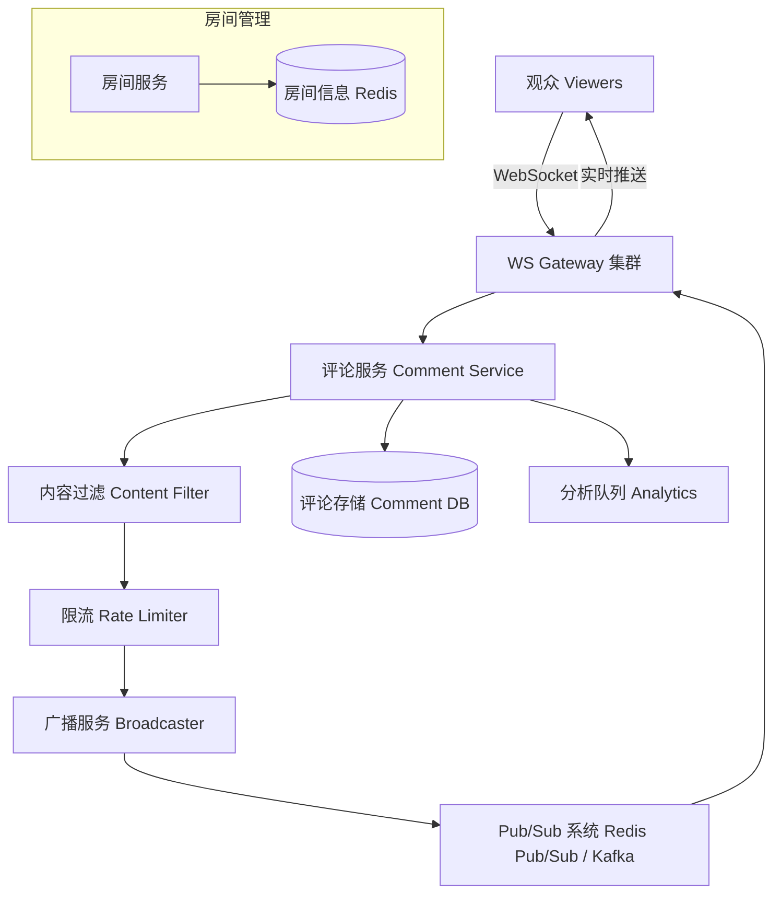

# Design Live Comment（直播弹幕/实时评论）

---

## 问题定义

设计一个直播实时评论系统（如 YouTube Live Chat、Twitch Chat、B站弹幕），核心功能：
- 用户在直播间发送实时评论
- 同一直播间的所有观众实时看到评论流
- 支持百万级同时在线观众

**核心挑战：** 超高并发读（百万观众同时接收）、评论的实时广播、流量控制与内容过滤。

**与群聊的核心区别：** 群聊成员固定且需要持久化所有消息；直播评论是临时的、面向海量观众的广播流，强调实时性而非持久性。

---

## High-Level Design



---

## 核心组件详解

### 1. 连接管理

每个观众通过 WebSocket 连接到 Gateway，加入对应直播间的 Room。Gateway 维护本地的 Room → 连接映射。

**百万连接挑战：** 单台 Gateway 可承载约 10-50 万 WebSocket 连接（取决于硬件），多台 Gateway 分担。

### 2. 评论发布流程

```
1. 用户发送评论 → WS Gateway → Comment Service
2. 内容过滤（Content Filter）：违规内容拦截
3. 限流（Rate Limiter）：每用户每秒最多 N 条
4. 写入评论存储（可选，用于回放）
5. 发布到 Pub/Sub 系统（按 room_id 为 Topic）
6. 所有订阅该 room_id 的 Gateway 收到消息
7. 各 Gateway 推送给本地该房间的所有连接
```

### 3. 广播模型——Pub/Sub

**核心架构：** 每个直播间对应一个 Pub/Sub Channel（如 Redis Pub/Sub 或 Kafka Topic）。所有连接该房间观众的 Gateway 实例订阅该 Channel。

```
评论 → Pub/Sub Channel (room_123) → Gateway A (推送给本地 2 万观众)
                                   → Gateway B (推送给本地 3 万观众)
                                   → Gateway C (推送给本地 1 万观众)
```

**为什么不逐个推送：** 百万观众逐个推送不可行。通过 Pub/Sub + Gateway 本地广播，将 1→N 的问题拆解为 1→K（K 台 Gateway）+ K 个 1→M（每台 Gateway 向本地 M 个连接推送）。

### 4. 流量控制

**热门直播间的评论洪峰：** 每秒可能产生数千条评论，全部推送会导致客户端渲染卡顿和带宽浪费。

**服务端采样/聚合：**
- 评论量超过阈值时，服务端采样（如只推送 30% 的评论）
- 或者按时间窗口聚合（每 200ms 打包一批评论一起推送），减少推送频率

**客户端限流：** 前端渲染也需要限流，评论滚动速度过快时做截断或渐隐。

### 5. 内容安全

- **关键词过滤：** 敏感词库匹配
- **AI 审核：** 机器学习模型检测垃圾信息/仇恨言论
- **人工审核：** 举报机制 + 人工复审
- **禁言（Mute/Ban）：** 对违规用户限制发言

### 6. 评论存储（可选）

直播评论可以不持久化（纯实时流），也可以存储用于：
- 直播回放（Replay）：按时间戳与视频进度关联
- 数据分析：评论高峰时段分析、情感分析

---

## 关键 Trade-off

| 决策点 | 选项 A | 选项 B | 推荐 |
|---|---|---|---|
| 广播机制 | 逐用户推送 | Pub/Sub + Gateway 本地广播 | B（可扩展） |
| 评论完整性 | 所有评论全量推送 | 高峰期采样/聚合 | B（用户体验优先） |
| 持久化 | 全量存储 | 可选存储（回放需要时才存） | 按需选择 |
| 协议 | WebSocket | SSE（Server-Sent Events） | WebSocket（双向，支持发评论） |

---

## 小结

> 直播评论系统的核心是**Pub/Sub 广播 + 流量控制**。与普通聊天的最大区别是读放大极其严重（1 条评论 → 百万人接收），必须通过分层广播（Pub/Sub → Gateway → 本地连接）和采样/聚合控制流量。面试时重点讲清楚百万连接下的广播架构。
