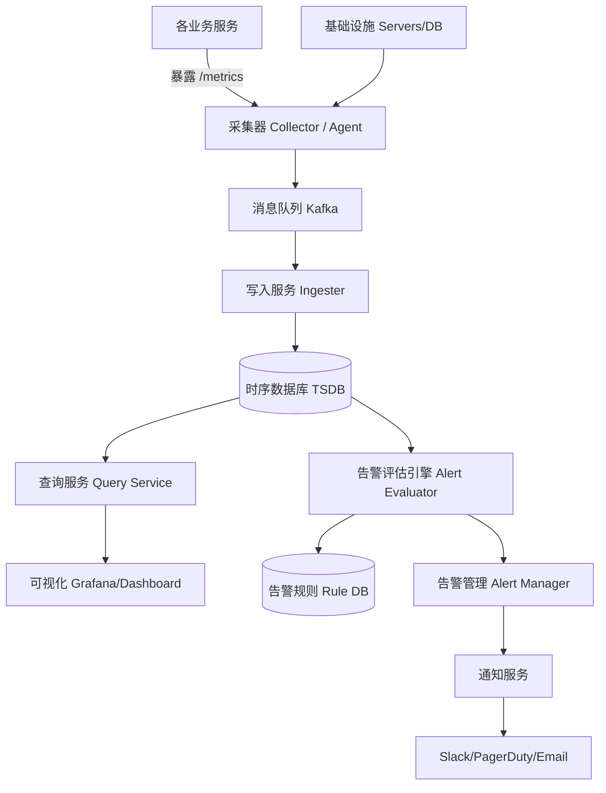

# Design Monitoring & Alert System

---

## 问题定义

设计一个监控与告警系统（如 Datadog、Prometheus + Grafana），核心功能：
- 采集各服务的指标数据（Metrics）
- 存储海量时序数据（Time-Series Data）
- 可视化仪表盘（Dashboard）
- 基于规则的告警（Alerting）

**核心挑战：** 海量指标的高频写入、时序数据的高效存储与查询、告警规则的实时评估。

---

## High-Level Design



---

## 核心组件详解

### 1. 数据采集（Collection）

**拉取模式（Pull）：** 采集器定期从各服务的 `/metrics` 端点拉取指标（Prometheus 模式）。服务需要暴露标准化的指标端点。

**推送模式（Push）：** 服务主动将指标推送到采集端（如 StatsD、Telegraf）。适合短生命周期任务（如 Lambda 函数）。

**指标数据模型：**
```
metric_name{label1="value1", label2="value2"}  metric_value  timestamp

例：
http_requests_total{method="GET", status="200", service="order"} 15234 1711612800
cpu_usage_percent{host="web-01"} 72.5 1711612800
```

### 2. 时序数据库（TSDB）

时序数据特点：写多读少、按时间递增、很少更新或删除、查询通常是时间范围聚合。

**代表产品：** InfluxDB、Prometheus TSDB、TimescaleDB（基于 PostgreSQL）、ClickHouse

**存储优化：**
- **按时间分片（Time-based Sharding）：** 每个时间段一个数据块（如每 2 小时一个 Block），旧数据自动归档或降采样
- **压缩（Compression）：** 时序数据相邻点差异小，适合差值编码（Delta Encoding）+ Gorilla 压缩，压缩比可达 10:1
- **降采样（Downsampling）：** 历史数据从秒级聚合为分钟级、小时级，减少存储量

### 3. 查询服务

支持灵活的时序查询：

```promql
# 过去 5 分钟的 P99 延迟
histogram_quantile(0.99, rate(http_request_duration_seconds_bucket[5m]))

# 按服务分组的错误率
sum(rate(http_requests_total{status=~"5.."}[5m])) by (service)
/ sum(rate(http_requests_total[5m])) by (service)
```

### 4. 告警评估引擎（Alert Evaluator）

**工作方式：** 定期（如每 15 秒）对所有告警规则执行查询，判断是否触发阈值。

**告警规则示例：**
```yaml
- alert: HighErrorRate
  expr: error_rate{service="payment"} > 0.05
  for: 5m          # 持续 5 分钟才触发，避免瞬时抖动
  severity: critical
  annotations:
    summary: "支付服务错误率超过 5%"
```

### 5. 告警管理器（Alert Manager）

接收告警事件后，做进一步处理：
- **去重（Deduplication）：** 同一告警持续触发时只通知一次
- **分组（Grouping）：** 同一服务的多个告警合并为一条通知
- **抑制（Inhibition）：** 高优先级告警已触发时，抑制关联的低优先级告警
- **静默（Silence）：** 计划维护期间临时关闭某些告警
- **路由（Routing）：** 按严重程度路由到不同通知渠道（P0 → PagerDuty 电话，P1 → Slack）

---

## 规模设计

假设监控 1000 个服务，每个服务 100 个指标，采集频率 15 秒：
- 写入 QPS = 1000 × 100 / 15 ≈ **6,700 点/秒**
- 每天数据量 ≈ 6,700 × 86,400 × 16 bytes ≈ **9 GB/天**（压缩前）

需要分布式 TSDB + Kafka 缓冲写入峰值。

---

## 关键 Trade-off

| 决策点 | 选项 A | 选项 B | 推荐 |
|---|---|---|---|
| 采集模式 | Pull（Prometheus） | Push（StatsD） | Pull 为主，短任务用 Push |
| 存储精度 | 永久保留原始精度 | 降采样（近期秒级，历史小时级） | B（节省存储成本） |
| 告警评估 | 流式实时计算 | 定期轮询查询 TSDB | B（简单可靠，Prometheus 模式） |
| TSDB 选型 | InfluxDB（单机） | ClickHouse（分布式分析） | 按规模选择 |

---

## 小结

> 监控系统是**派生数据系统**的典型——从原始指标数据中派生出仪表盘和告警。核心链路：采集 → Kafka 缓冲 → TSDB 存储 → 查询/告警。面试时重点讲清楚时序数据的存储优化（压缩、降采样）和告警管理器的去重/分组机制。
