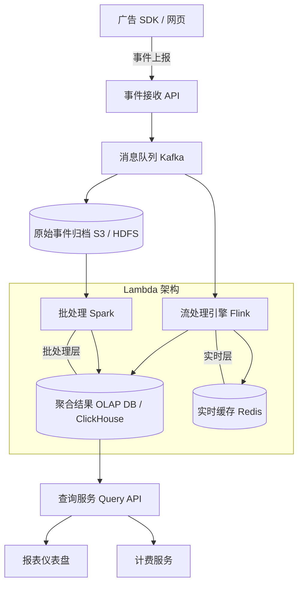

# Design Ad Event Aggregation（广告事件聚合）

---

## 问题定义

设计一个广告点击/展示事件聚合系统，核心功能：
- 实时采集广告事件（展示 Impression、点击 Click）
- 对事件按维度聚合（按广告 ID、广告主、时间窗口）
- 提供实时和历史报表查询
- 支持广告计费（Billing）

**核心挑战：** 海量事件的高吞吐写入（日均数十亿）、聚合计算的实时性、数据准确性（不丢不重，直接关系到计费）。

---

## High-Level Design



---

## 核心组件详解

### 1. 事件采集

**事件格式：**
```json
{
  "event_id": "uuid",
  "event_type": "click",
  "ad_id": "ad_123",
  "advertiser_id": "adv_456",
  "user_id": "user_789",
  "timestamp": 1711612800,
  "device": "iOS",
  "geo": "US"
}
```

**防作弊（Anti-Fraud）：** 过滤机器人点击、重复点击、异常高频行为。在采集层做基本校验，下游做深度分析。

**去重（Deduplication）：** 客户端可能因网络重试导致重复上报。用 `event_id` 做幂等去重（Bloom Filter 或 Redis Set）。

### 2. 实时聚合——流处理（Flink）

从 Kafka 消费原始事件，按维度实时聚合：

```
窗口：每分钟
维度：ad_id, advertiser_id, event_type
指标：count, unique_users (HyperLogLog)
```

**窗口计算：** 使用滚动窗口（Tumbling Window）或滑动窗口，按事件时间（Event Time）聚合，配合水位线（Watermark）处理迟到数据。

**聚合结果写入：** 实时结果写入 Redis（支持低延迟查询）+ OLAP 数据库（支持多维分析）。

### 3. 批处理修正

原始事件同时归档到对象存储（S3 / HDFS），定期用 Spark 做批量重新聚合，用批处理结果修正流处理可能的误差。

**Lambda 架构：** 实时层提供低延迟近似结果，批处理层提供最终准确结果。两层合并得到完整视图。

**简化方案（Kappa 架构）：** 只用 Flink 流处理，通过重放 Kafka 历史数据修正错误，省去批处理层。

### 4. 存储与查询

**OLAP 数据库选型：** ClickHouse 或 Apache Druid，适合高维度聚合查询。

**查询示例：**
- "广告 A 过去 7 天每小时的点击数"
- "广告主 X 今日各广告的 CTR（点击率 = 点击数/展示数）"

**预聚合（Pre-Aggregation）：** 对高频查询维度预先计算好聚合结果（物化视图 Materialized View），避免每次实时计算。

### 5. 计费

广告计费直接基于聚合数据（如 CPC = Cost Per Click），数据准确性至关重要：
- 事件去重防止重复计费
- 流处理与批处理对账（Reconciliation），差异超过阈值时告警
- 计费数据需要审计追踪（Audit Trail）

---

## 关键 Trade-off

| 决策点 | 选项 A | 选项 B | 推荐 |
|---|---|---|---|
| 聚合架构 | Lambda（流 + 批） | Kappa（仅流） | Kappa 更简洁，Lambda 更准确 |
| 去重方式 | 精确去重（Redis Set） | 近似去重（Bloom Filter） | 计费用精确，统计用近似 |
| 存储 | 传统数据仓库 | OLAP（ClickHouse） | B（实时分析性能） |
| 迟到数据 | 丢弃 | Watermark + 允许窗口延迟关闭 | B（保证数据完整性） |

---

## 小结

> 广告聚合是典型的**派生数据系统**——从海量原始事件中派生出聚合指标。核心链路：Kafka 采集 → Flink 实时聚合 → ClickHouse 多维查询。面试时重点讲清楚去重机制（关系到计费准确性）和 Lambda/Kappa 架构的选择。
