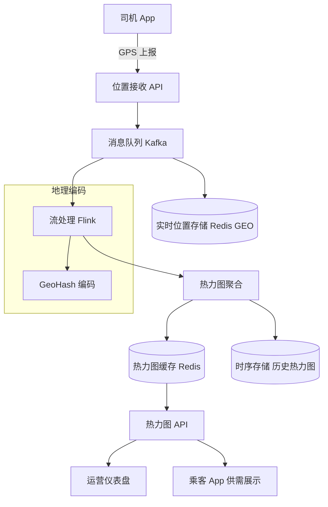

# Design Driver Heatmap（司机热力图）

---

## 问题定义

设计一个类似 Uber 的司机热力图系统，核心功能：
- 实时采集所有在线司机的 GPS 位置
- 基于地理区域聚合司机密度
- 生成热力图（Heatmap）供运营查看和供需调度
- 支持历史热力图回放

**核心挑战：** 高频位置更新（百万司机，每秒上报一次）、地理数据的聚合与索引、实时可视化。

---

## High-Level Design



---

## 核心组件详解

### 1. 位置数据采集

每个在线司机每 3-5 秒上报一次 GPS 坐标。假设 100 万在线司机：
- 写入 QPS ≈ 1,000,000 / 4 ≈ **250K/秒**

**数据格式：**
```json
{
  "driver_id": "d_123",
  "lat": 37.7749,
  "lng": -122.4194,
  "timestamp": 1711612800,
  "status": "available"
}
```

写入 Kafka 做缓冲，下游并行消费。

### 2. 地理编码——GeoHash

**GeoHash** 将二维经纬度编码为一维字符串，精度由字符串长度决定：

| GeoHash 长度 | 格子大小 | 适用场景 |
|---|---|---|
| 4 | ~39 km | 城市级 |
| 5 | ~5 km | 区域级 |
| 6 | ~1.2 km | 街道级 |
| 7 | ~150 m | 精细网格 |

热力图聚合通常使用精度 5-6（~1-5 km），将每个司机的 GPS 映射到一个 GeoHash 格子。

**优点：** 同一 GeoHash 前缀的格子在地理上相邻，便于范围查询和聚合。

### 3. 实时聚合

Flink 从 Kafka 消费位置事件：

```
1. 计算每条位置数据的 GeoHash
2. 按 GeoHash + 时间窗口（如每 30 秒）聚合
3. 输出：每个格子内的在线司机数量
```

**窗口策略：** 滑动窗口（Sliding Window），每 10 秒滑动一次、窗口大小 30 秒，产出平滑的热力图数据。

**聚合结果写入 Redis：**
```
heatmap:geohash_9q8yy → {"count": 42, "timestamp": 1711612800}
```

### 4. 热力图服务

**实时查询：** 前端按视口（Viewport）范围请求热力图，API 返回该区域内所有 GeoHash 格子的司机密度。

**渲染：** 前端将密度值映射为颜色梯度（绿→黄→红），叠加在地图上。

**缓存策略：** 热力图数据每 10-30 秒更新一次，加 CDN 缓存减少后端压力。对于全局热力图（Overview），可以预生成图片瓦片（Map Tile）缓存。

### 5. 历史热力图

聚合结果同时写入时序数据库（如 InfluxDB），支持回放历史任意时间段的热力图，用于运营分析（如哪些时段/区域供需失衡）。

---

## 扩展：供需调度

热力图不仅用于展示，还驱动动态定价（Surge Pricing）和调度：

```
某区域需求高（订单多）+ 供给低（司机少）→ 热力图显示红色
→ 触发动态调价（提高乘客费用 + 提高司机奖励）
→ 吸引周边司机前往 → 供需平衡
```

---

## 关键 Trade-off

| 决策点 | 选项 A | 选项 B | 推荐 |
|---|---|---|---|
| 位置存储 | 每次上报都持久化到 DB | 只保留最新位置（覆盖写） | B（热力图只需实时数据） |
| 地理索引 | GeoHash | H3（Uber 自研六边形网格） | GeoHash（通用，面试常见）|
| 聚合频率 | 实时（每条事件触发） | 微批（每 10-30 秒一次） | B（平衡实时性与计算量） |
| 精度级别 | 固定精度 | 多级精度（缩放自适应） | B（地图缩放时切换精度） |

---

## 小结

> 司机热力图是**地理位置 + 流处理 + 实时聚合**的综合题。核心链路：GPS 上报 → Kafka → Flink 按 GeoHash 聚合 → Redis 缓存 → 前端渲染。面试时重点讲清楚 GeoHash 编码原理和流处理窗口设计。
