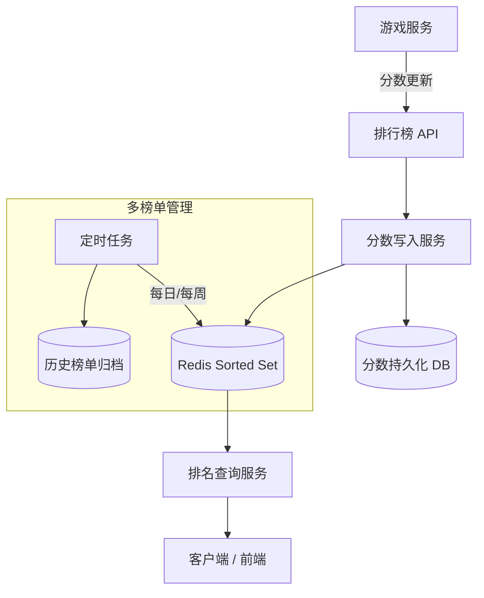

# Design Game Scoreboard（游戏排行榜）

---

## 问题定义

设计一个游戏实时排行榜系统，核心功能：
- 实时更新玩家分数
- 查询全局 Top N 排行
- 查询某个玩家的排名和周围玩家
- 支持多种排行榜（日榜、周榜、总榜）

**核心挑战：** 亿级玩家的排名实时计算、高并发读写、排名查询的低延迟。

---

## High-Level Design

---

## 核心组件详解

### 1. Redis Sorted Set——排行榜的核心

Redis Sorted Set（有序集合）天然适合排行榜：每个元素有一个分数（Score），自动按分数排序。

**核心操作（时间复杂度）：**

| 操作 | 命令 | 复杂度 |
|---|---|---|
| 更新分数 | `ZADD leaderboard score user_id` | O(log N) |
| 查 Top K | `ZREVRANGE leaderboard 0 K-1 WITHSCORES` | O(K + log N) |
| 查玩家排名 | `ZREVRANK leaderboard user_id` | O(log N) |
| 查玩家分数 | `ZSCORE leaderboard user_id` | O(1) |
| 查周围玩家 | `ZREVRANGE leaderboard rank-5 rank+5` | O(log N) |

N = 1000 万玩家时，log N ≈ 23 次比较，操作在微秒级完成。

### 2. 分数更新策略

**覆盖式（Replace）：** `ZADD key score member`，新分数直接覆盖旧分数。适合"最高分"排行榜。

**累加式（Increment）：** `ZINCRBY key increment member`，在现有分数上累加。适合"总积分"排行榜。

### 3. 超大规模排行榜（亿级玩家）

单个 Redis Sorted Set 在千万级别性能优秀，亿级可能遇到内存瓶颈。

**方案 A——分片（Sharding）：**
按分数范围分片，如 0-1000 分在 Shard A，1000-5000 分在 Shard B。查 Top N 时合并各分片结果。缺点：分片边界处理复杂。

**方案 B——分层：**
只维护 Top 10 万的精确排名（热区），其余玩家返回近似排名（如"排名约 150 万"）。大多数业务场景不需要精确到每一名。

### 4. 多种排行榜

**日榜/周榜实现：** 用带时间标识的 Key：`leaderboard:daily:20260328`、`leaderboard:weekly:2026W13`。

**定时任务：** 每天/每周初始化新榜单 Key，旧榜单转为只读并归档。

**跨时间段聚合：** 周榜可以实时更新（每次加分同时更新日榜和周榜），或定时从日榜数据合并生成。

### 5. 持久化与容灾

Redis 数据易失，需要持久化保障：
- 分数变更同时写入数据库（MySQL/PostgreSQL）
- Redis 故障时从数据库重建排行榜
- 使用 Redis 集群（Cluster）+ 持久化（RDB/AOF）

---

## 关键 Trade-off

| 决策点 | 选项 A | 选项 B | 推荐 |
|---|---|---|---|
| 存储方案 | 纯数据库 + ORDER BY | Redis Sorted Set | B（性能差距巨大） |
| 亿级排名 | 全量精确排名 | Top N 精确 + 其余近似 | B（务实方案） |
| 多榜更新 | 每次更新所有榜单 | 日榜实时 + 周/月榜定时合并 | 按实时性要求选择 |
| 分数并发 | 加锁 | ZINCRBY 原子操作 | B（Redis 单线程原子性） |

---

## 小结

> 排行榜是 **Redis Sorted Set** 的经典应用场景。面试时核心考点：Sorted Set 的操作复杂度、超大规模时的分片/分层策略、多时间维度榜单的管理方式。
