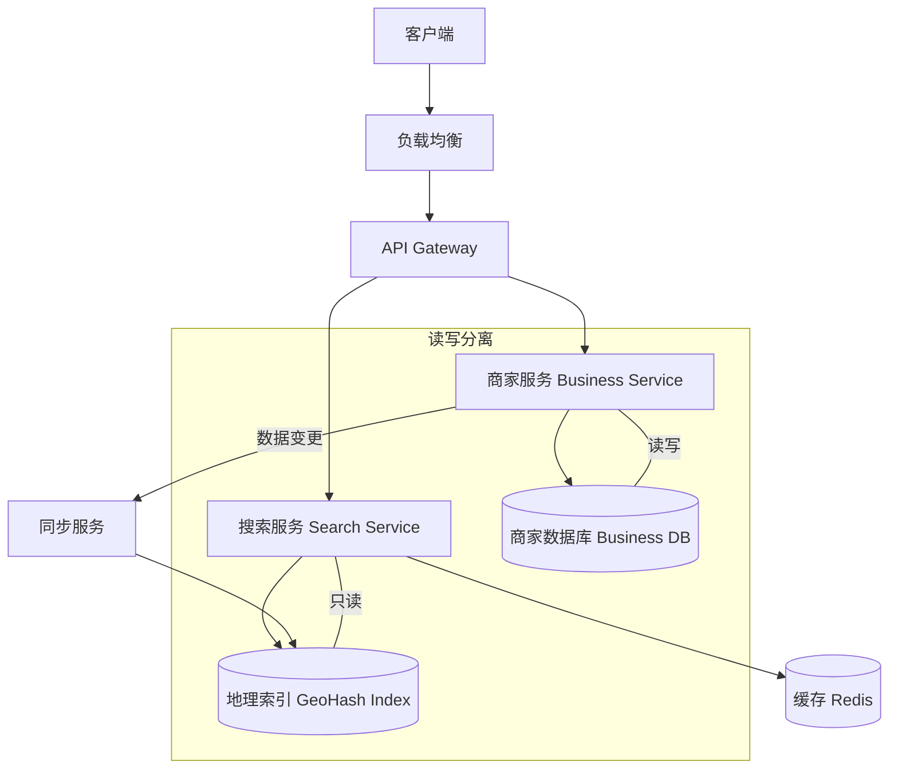

# Design POI / Yelp（附近地点搜索）

---

## 问题定义

设计一个附近地点搜索服务（Proximity Service），类似 Yelp/Google Maps 的"搜索附近餐厅"功能：
- 根据用户位置搜索附近的 POI（Point of Interest，兴趣点）
- 支持按距离、评分、类别过滤
- 支持 POI 的增删改

**核心挑战：** 海量 POI 的地理空间索引、距离计算的效率、搜索结果的排序与过滤。

---

## High-Level Design



---

## 核心组件详解

### 1. 地理空间索引方案

#### 方案 A：GeoHash

将经纬度编码为字符串，利用前缀匹配实现范围查询：

```
搜索"附近 5km"：
1. 计算用户位置的 GeoHash（精度 5，约 5km 格子）
2. 查询该 GeoHash 及相邻 8 个格子（避免边界遗漏）
3. 从这 9 个格子中过滤出实际距离 ≤ 5km 的 POI
```

**数据库索引：** 在 GeoHash 列上建 B-Tree 索引，前缀查询（`WHERE geohash LIKE 'abc%'`）高效。

#### 方案 B：QuadTree（四叉树）

递归将地图四等分，直到每个叶节点的 POI 数量低于阈值。内存中构建，查询时从根节点向下搜索。

| 对比 | GeoHash | QuadTree |
|---|---|---|
| 存储位置 | 数据库索引 | 内存 |
| 动态更新 | 容易（更新 DB） | 需要重建或增量更新 |
| 实现复杂度 | 低 | 中 |
| 适用场景 | 通用 | POI 密度不均匀时更优 |

#### 方案 C：Google S2 / H3

将地球表面映射为层级化的 Cell，比 GeoHash 的矩形格子更均匀。Uber 使用 H3（六边形网格），Google Maps 使用 S2。

### 2. 搜索流程

```
1. 用户请求：{lat, lng, radius, category, sort_by}
2. 计算用户位置的 GeoHash + 相邻格子
3. 从地理索引中查询这些格子内的 POI 列表
4. 过滤：
   a. 精确距离过滤（Haversine 公式计算实际距离）
   b. 类别过滤（餐厅 / 咖啡 / 加油站）
5. 排序：按距离 / 评分 / 热度
6. 分页返回结果
```

### 3. 商家服务（Business Service）

管理 POI 的 CRUD 操作，与搜索服务分离（读写分离）：
- 商家信息存在关系型数据库（名称、地址、评分、营业时间等）
- 数据变更后异步同步到地理索引

### 4. 缓存策略

**按 GeoHash 缓存：** Key = `geohash:abc12`，Value = 该格子内的 POI 列表。大部分 POI 数据变化不频繁，缓存命中率高。

**热门区域预热：** 城市中心等热门区域提前加载到缓存。

### 5. 距离计算

**Haversine 公式：** 计算地球上两点的大圆距离（Great-Circle Distance），考虑地球曲率，精度高但计算稍复杂。

**近似计算：** 在小范围内（几十公里），可以用平面距离近似：
```
dx = (lng2 - lng1) * cos(lat) * 111.32 km
dy = (lat2 - lat1) * 111.32 km
distance ≈ sqrt(dx² + dy²)
```

---

## 关键 Trade-off

| 决策点 | 选项 A | 选项 B | 推荐 |
|---|---|---|---|
| 地理索引 | GeoHash + DB | QuadTree（内存） | GeoHash（简单通用） |
| 搜索引擎 | 自建地理索引 | Elasticsearch（内置 geo_distance 查询） | ES（功能丰富，开发快） |
| 距离精度 | Haversine 精确计算 | GeoHash 格子粗过滤 + 精确后过滤 | B（两阶段过滤） |
| 数据一致性 | 强一致（同步更新索引） | 最终一致（异步同步） | B（POI 数据变化不频繁） |

---

## 小结

> POI 搜索是**地理空间索引**的经典题。核心考点：GeoHash 编码原理（或 QuadTree）、相邻格子查询避免边界问题、两阶段过滤（粗过滤 + 精确距离计算）。面试时先讲 GeoHash 方案，再提 QuadTree / S2 作为优化方向。
