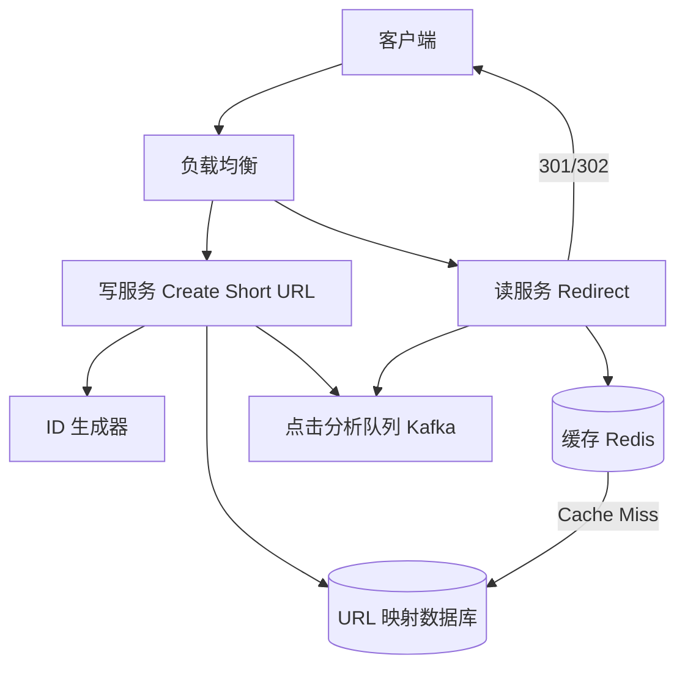

# Design URL Shortener（短链接服务）

---

## 问题定义

设计一个类似 TinyURL / bit.ly 的短链接服务：
- 输入长 URL，生成唯一的短 URL（如 `https://short.ly/abc123`）
- 访问短 URL 时 301/302 重定向到原始长 URL
- 支持自定义短码（Custom Alias）
- 点击统计分析（可选）

**核心挑战：** 短码的唯一性生成、高并发读取（重定向）、存储与缓存设计。

---

## High-Level Design



---

## 核心组件详解

### 1. 短码生成策略

**方案 A：Base62 编码自增 ID**

使用全局自增 ID（数据库自增或分布式 ID 生成器），转为 Base62（a-z, A-Z, 0-9）：

```
ID = 123456789
Base62 = "8M0kX"  (6-7 位)
```

6 位 Base62 = 62^6 ≈ 568 亿个短码，足够使用。

- 优点：简单、无冲突
- 缺点：短码可预测（连续 ID），可能被遍历

**方案 B：哈希截取**

对长 URL 做 MD5/SHA256 哈希，取前 6-7 位 Base62 字符：

```
hash("https://example.com/very-long-url") → "abc123"
```

- 优点：不可预测
- 缺点：可能冲突（Hash Collision），需要冲突检测和重试

**方案 C：预生成 + 发号（Key Generation Service, KGS）**

提前生成大量唯一短码存入数据库，请求时取一个分配。
- 优点：无冲突、无计算开销
- 缺点：需要维护短码池

### 2. 重定向（301 vs 302）

| 状态码 | 含义 | 浏览器行为 | 适用场景 |
|---|---|---|---|
| 301 Moved Permanently | 永久重定向 | 浏览器缓存，后续直接访问原 URL | 减少服务器压力 |
| 302 Found | 临时重定向 | 每次都请求短链服务 | 需要统计点击次数 |

大多数短链服务使用 **302**，因为需要统计每次点击。

### 3. 存储设计

**URL 映射表：**
```
url_mappings:
  short_code   (PK, 索引)
  long_url
  user_id      (创建者)
  created_at
  expires_at   (可选，过期时间)
```

**存储选型：** 读多写少，数据模型简单，DynamoDB 或 MySQL 均可。写入量不大（创建短链），读取量极大（重定向）。

### 4. 缓存

读取是极高频操作，必须加缓存：
- 热门短链缓存在 Redis 中，Key = short_code，Value = long_url
- 缓存命中率通常极高（热门链接被大量访问）
- 使用 LRU 淘汰策略

### 5. 点击统计（可选）

每次重定向时将点击事件写入 Kafka，异步消费做统计：
- 点击次数、UV（去重用户数）
- 地理分布、设备类型、来源 Referer
- 按时间维度的点击趋势

---

## 关键 Trade-off

| 决策点 | 选项 A | 选项 B | 推荐 |
|---|---|---|---|
| 短码生成 | Base62(自增ID) | Hash 截取 | A（简单无冲突） |
| 重定向 | 301 永久 | 302 临时 | B（支持点击统计） |
| 存储 | SQL（MySQL） | NoSQL（DynamoDB） | 按规模选择 |
| 过期清理 | 同步删除 | 惰性删除 + 定时清理 | B（不阻塞请求） |

---

## 小结

> URL Shortener 虽然功能简单，但考察了 **ID 生成策略、缓存设计、读写分离** 等基础能力。面试时核心考点：短码生成的三种方案对比、301 vs 302 的选择理由、缓存层设计。
