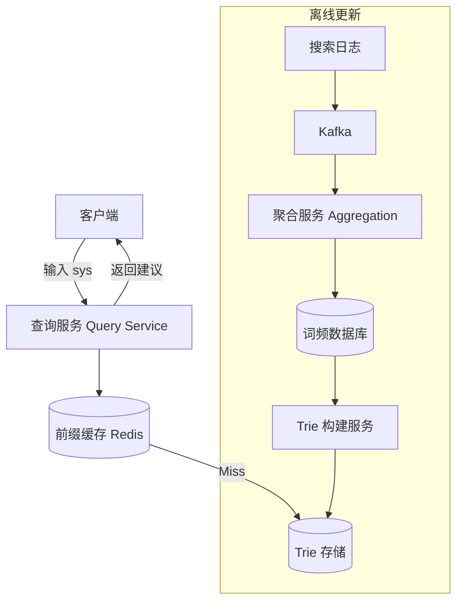

# Design Autocomplete（搜索自动补全）

---

## 问题定义

设计一个搜索自动补全系统（Typeahead / Autocomplete），核心功能：
- 用户输入前缀时，实时返回 Top N 补全建议
- 建议基于搜索热度排序
- 搜索热度需要定期更新

**核心挑战：** 极低延迟（< 100ms）、海量前缀的存储与查询、热度数据的更新。

---

## High-Level Design



---

## 核心组件详解

### 1. Trie 树（前缀树）

Trie 是 Autocomplete 的核心数据结构，每个节点代表一个字符，从根到叶子的路径构成一个完整的词：

```
         root
        /    \
       s      d
      /        \
     y          e
    /             \
   s               s
  / \               \
 t   [tem design]   [ign]
  \
   [em]
```

**查询流程：** 输入前缀 "sys" → 沿 Trie 走到 `s→y→s` 节点 → 遍历子树找出所有词 → 按热度排序返回 Top N。

**优化——在节点上缓存 Top N：** 每个节点预存以该前缀开头的 Top N 热门词，查询时无需遍历子树，直接返回。用空间换时间。

### 2. 查询服务（在线路径）

```
1. 客户端每输入一个字符，发起一次查询（或做 debounce，每 200ms 查一次）
2. 查询服务先查 Redis 缓存
3. 缓存未命中时查 Trie 存储
4. 返回 Top 5-10 建议
```

**延迟要求：** P99 < 100ms，用户体验才流畅。

**缓存策略：** 热门前缀（如 "how"、"what"、"sys"）缓存在 Redis，TTL 设为分钟级。短前缀（1-3 个字符）的查询量最大，优先缓存。

### 3. 热度聚合（离线路径）

**数据来源：** 用户搜索日志。

**聚合流程：**
1. 搜索日志写入 Kafka
2. 聚合服务按时间窗口统计每个搜索词的频次
3. 使用衰减权重（如指数衰减）：近期搜索权重更高，老数据逐渐降低
4. 更新词频数据库

**Trie 重建：** 定期（如每小时或每天）从最新词频数据重新构建 Trie，替换旧版本。使用蓝绿部署（Blue-Green）方式切换，不影响在线查询。

### 4. 多语言支持

中文、日文等无空格语言需要分词：
- 用户输入 "系统设" → 候选 "系统设计"、"系统设置"
- 需要集成分词器（如 jieba）或使用字符级 Trie

### 5. 个性化建议（可选）

除了全局热度，还可以结合用户历史搜索做个性化排序：
- 用户最近搜过 "system design" → 下次输入 "sys" 时优先展示
- 存储方式：每个用户维护一个小型个人 Trie 或最近搜索列表

---

## 扩展：浏览器端优化

**Debounce（防抖）：** 用户持续输入时不立即请求，停止输入 200ms 后才发请求，减少请求量。

**前端缓存：** 前一次 "sys" 的结果已包含 "syst" 的子集，前端可以本地过滤而不请求后端。

**预取（Prefetch）：** 客户端预测用户可能输入的下一个字符，提前请求。

---

## 关键 Trade-off

| 决策点 | 选项 A | 选项 B | 推荐 |
|---|---|---|---|
| 数据结构 | Trie 树 | 数据库 LIKE 查询 | A（性能差距巨大） |
| Trie 存储 | 全量内存 | 分片 + 持久化 | 按数据量选择 |
| 热度更新 | 实时更新 Trie | 离线定期重建 | B（简单可靠） |
| 请求频率 | 每个按键都请求 | Debounce + 前端缓存 | B（减少 70%+ 请求） |

---

## 小结

> Autocomplete 的核心是 **Trie 树 + 节点 Top N 预缓存 + 离线热度更新**。面试时重点讲清楚 Trie 的查询机制、如何在节点上缓存 Top N 以优化查询、以及在线查询与离线更新如何解耦。
