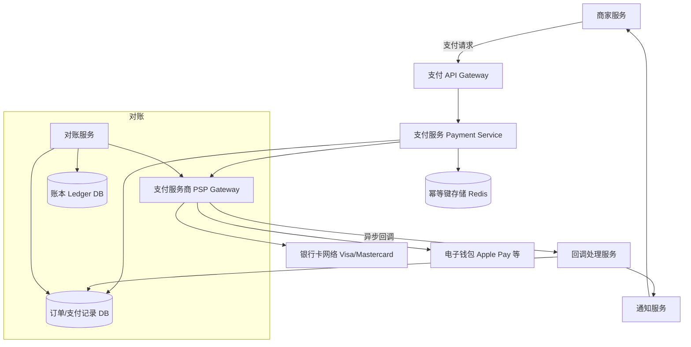

# Design Payment System（Stripe）

---

## 问题定义

设计一个类似 Stripe 的在线支付系统，核心功能：
- 处理支付请求（Pay-in）：用户 → 商家
- 对接多种支付方式（信用卡、借记卡、电子钱包）
- 退款（Refund）
- 支付状态查询与对账（Reconciliation）

**核心挑战：** 强一致性（不能多扣/少扣）、幂等性（重试不重复扣款）、可靠性（钱不能丢）、合规（PCI DSS）。

---

## High-Level Design



---

## 核心组件详解

### 1. 支付流程（Happy Path）

```
1. 商家发起支付请求（amount, currency, payment_method, idempotency_key）
2. 支付服务检查幂等键（防重复扣款）
3. 创建支付记录，状态 = PENDING
4. 调用 PSP（Payment Service Provider）发起扣款
5. PSP 返回结果（同步或异步回调）
6. 更新支付记录状态为 SUCCESS / FAILED
7. 通知商家
```

### 2. 幂等性（Idempotency）——最核心的设计

支付系统**必须保证幂等**：同一笔支付请求无论重试多少次，只会扣款一次。

**实现方式：**
- 客户端每次请求携带唯一的 `idempotency_key`（如 UUID）
- 服务端收到请求后，先查 Redis 是否已处理过该 key
- 已处理 → 直接返回之前的结果
- 未处理 → 正常执行，完成后存储结果（TTL 24h-7d）

```
请求 1: idempotency_key=abc → 执行扣款 → 返回 SUCCESS → 缓存结果
请求 2: idempotency_key=abc → 命中缓存 → 直接返回 SUCCESS（不再扣款）
```

### 3. 支付状态机（State Machine）

```
CREATED → PENDING → SUCCESS
                  → FAILED → (可重试)
         SUCCESS → REFUND_PENDING → REFUNDED
```

每次状态流转都写入数据库（事务性），状态只能单向流转，防止并发导致状态混乱。

### 4. PSP 对接（Payment Service Provider）

PSP 是连接银行网络的中间服务商（如 Stripe、PayPal）。

**同步 vs 异步结果：**
- 部分支付方式（如信用卡）PSP 同步返回结果
- 部分（如银行转账）需要异步 Webhook 回调

**超时处理：** 调用 PSP 超时时，**不能直接标记失败**（因为可能已经扣款成功），需要后续查询 PSP 确认实际状态。

### 5. 对账（Reconciliation）

每天定时将内部支付记录与 PSP 账单对账，确保每一笔交易金额一致：
- **对平（Matched）：** 双方记录一致
- **单边差（One-sided）：** 内部有记录但 PSP 无（或反之），需要人工排查
- **金额差（Amount Mismatch）：** 金额不一致，紧急排查

### 6. 账本系统（Ledger / Double-Entry Bookkeeping）

使用复式记账法（Double-Entry），每笔交易至少产生两条记录（借方 Debit + 贷方 Credit），确保账目平衡：

```
用户支付 $100 给商家：
  借方: 用户账户 -$100
  贷方: 商家账户 +$100 (扣除手续费后)
  贷方: 平台手续费 +$2
```

---

## 关键 Trade-off

| 决策点 | 选项 A | 选项 B | 推荐 |
|---|---|---|---|
| 一致性 | 最终一致 | 强一致（ACID 事务） | B（钱相关必须强一致） |
| PSP 超时 | 直接标记失败 | 挂起 + 异步查询确认 | B（防止已扣款却标失败） |
| 幂等存储 | 数据库 | Redis + DB 双写 | B（Redis 快速判断 + DB 持久化） |
| 退款 | 同步退款 | 异步退款（队列 + Worker） | B（退款流程长） |

---

## 小结

> 支付系统的核心是**数据一致性和幂等性**，一切设计都围绕"钱不能多也不能少"。面试时重点讲清楚：幂等键机制、支付状态机、PSP 超时的处理方式、对账流程。
