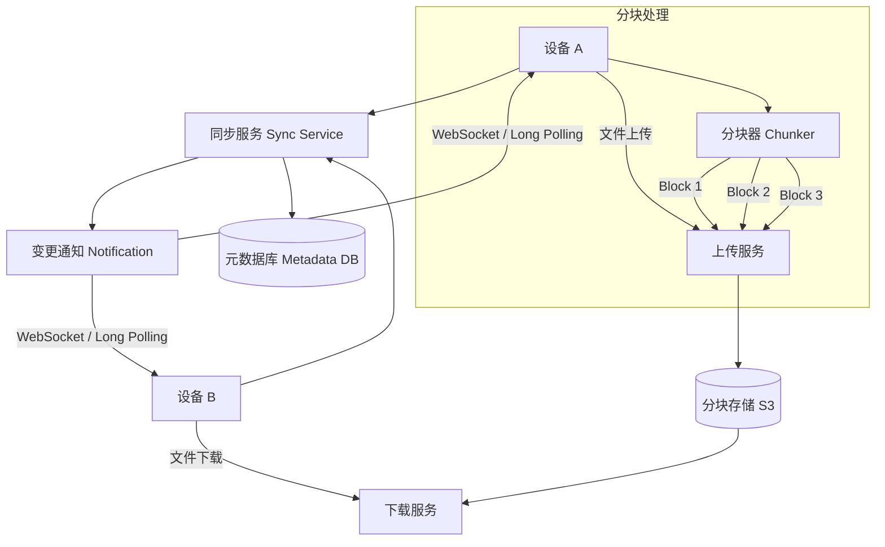

# Design Cloud Storage（Dropbox / Google Drive）

---

## 问题定义

设计一个云文件存储与同步系统，核心功能：
- 文件上传、下载
- 多设备自动同步（Multi-device Sync）
- 文件版本历史（Version History）
- 文件分享与协作

**核心挑战：** 大文件的高效传输、多设备冲突解决（Conflict Resolution）、增量同步（Delta Sync）节省带宽。

---

## High-Level Design



---

## 核心组件详解

### 1. 文件分块（Chunking）

大文件拆分为固定大小（如 4MB）的块（Block/Chunk），每块独立上传和存储。

**优点：**
- 断点续传（Resume）：上传中断后只需重传未完成的块
- 增量同步（Delta Sync）：文件修改后只上传变化的块，而非整个文件
- 去重（Deduplication）：相同内容的块只存储一份

**分块算法：** 固定大小分块简单；内容定义分块（Content-Defined Chunking, CDC，如 Rabin Fingerprint）更智能，文件插入内容时不会导致后续所有块都变化。

### 2. 元数据管理

**文件元数据（Metadata）：**
```
files:
  file_id
  user_id
  file_name
  file_path
  latest_version
  created_at / updated_at

file_versions:
  version_id
  file_id
  block_list    (有序的 block hash 列表)
  size
  created_at

blocks:
  block_hash    (SHA256，内容寻址)
  storage_url   (S3 地址)
  ref_count     (引用计数，用于垃圾回收)
```

**内容寻址（Content-Addressable）：** 每个 Block 的 Key 是其内容的哈希值，相同内容的 Block 自动去重。

### 3. 同步流程

**上传（文件修改后）：**
```
1. 客户端分块，计算每块哈希
2. 与服务端对比，找出新增/变化的块
3. 只上传新块到 S3
4. 更新元数据：创建新 version，记录 block_list
5. 通知其他设备有文件变更
```

**下载（收到变更通知后）：**
```
1. 设备 B 收到通知
2. 拉取最新文件元数据（block_list）
3. 对比本地 block，找出缺失的块
4. 只下载缺失的块
5. 本地组装文件
```

### 4. 变更通知

**长轮询（Long Polling）或 WebSocket：** 服务端感知到文件变更后，通知所有关联设备拉取更新。

**通知内容：** 只推送"哪个文件有变更"，具体变更内容由设备主动拉取（推拉结合）。

### 5. 冲突解决（Conflict Resolution）

两个设备同时修改同一文件：

**方案 A——Last Write Wins（LWW）：** 以最后一次写入为准，简单但可能丢失数据。

**方案 B——保留两个版本（Conflict Copy）：** 将冲突版本保存为 `filename (conflict copy).txt`，让用户手动合并（Dropbox 的做法）。

**方案 C——OT / CRDT：** 适用于实时协作编辑（如 Google Docs），文档级别的冲突自动合并。

---

## 关键 Trade-off

| 决策点 | 选项 A | 选项 B | 推荐 |
|---|---|---|---|
| 分块方式 | 固定大小 | CDC（内容定义分块） | CDC（增量同步更高效） |
| 同步方式 | 全量同步 | 增量同步（Delta Sync） | B（节省 90%+ 带宽） |
| 冲突策略 | Last Write Wins | 保留冲突副本 | B（不丢数据） |
| 通知机制 | 轮询 | Long Polling / WebSocket | B（实时性好） |

---

## 小结

> 云存储的核心是**分块 + 增量同步 + 冲突处理**。面试时重点讲清楚：文件分块与内容寻址去重、增量同步只传变化块的机制、多设备冲突的处理策略。
