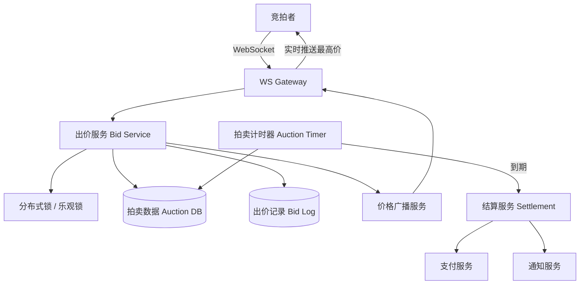

# Design Auction System（拍卖系统）

---

## 问题定义

设计一个在线拍卖系统（如 eBay 竞拍），核心功能：
- 创建拍卖（设置起拍价、结束时间）
- 实时出价（Bid），出价必须高于当前最高价
- 拍卖倒计时结束后，最高出价者竞拍成功
- 实时展示当前最高价

**核心挑战：** 出价的并发控制（不能出现两个人同时以相同价格成功）、拍卖结束的精确判定、实时价格推送。

---

## High-Level Design



---

## 核心组件详解

### 1. 出价并发控制——最核心的设计

**问题：** 多人同时出价时，如何保证只有一个人以最高价胜出，不出现超卖/并发冲突？

**方案 A——悲观锁（Pessimistic Lock）：**
对每个拍卖项加分布式锁，同一时刻只有一个出价请求在处理。
- 优点：逻辑简单
- 缺点：热门拍卖锁竞争激烈，吞吐量低

**方案 B——乐观锁（Optimistic Lock）+ CAS：**
```sql
UPDATE auctions
SET current_price = new_bid, highest_bidder = user_id, version = version + 1
WHERE auction_id = ? AND current_price < new_bid AND version = ?
```
更新成功 → 出价成功；更新失败（version 不匹配 → 被其他人抢先出价）→ 返回"出价已过期，请重新出价"。

- 优点：无锁，吞吐量高
- 缺点：高并发下重试率高

**推荐：** 乐观锁为主，极热门拍卖可结合排队（出价先入队，串行处理）。

### 2. 出价校验规则

```
1. 拍卖是否在进行中（未结束、未取消）
2. 出价 > 当前最高价（且满足最小加价幅度 Minimum Increment）
3. 出价者不能是当前最高出价者（不能自己加价）
4. 出价者信用/余额验证
```

### 3. 实时价格推送

每次出价成功后，通过 WebSocket 向该拍卖的所有关注者推送最新价格和剩余时间。

**Pub/Sub 模式：** 每个拍卖对应一个 Channel，关注者通过 WebSocket 订阅。出价成功后发布价格更新消息。

### 4. 拍卖定时结束

**方案 A——Job Scheduler：** 创建拍卖时注册一个定时任务，到期触发结算。

**方案 B——延迟队列（Delayed Message Queue）：** 创建拍卖时向延迟队列写入一条消息（延迟时间 = 拍卖时长），到期自动消费触发结算。

**"最后一分钟规则"：** 部分拍卖平台在最后 1 分钟有新出价时自动延长结束时间，防止"卡点抢拍"。需要动态更新定时任务。

### 5. 结算（Settlement）

拍卖结束后：
1. 确认最高出价者
2. 冻结出价金额 → 调用支付服务扣款
3. 通知卖家发货
4. 通知未成功的出价者解冻资金
5. 更新拍卖状态为 SETTLED

**补偿机制：** 若最高出价者支付失败，自动轮到第二高出价者。

---

## 关键 Trade-off

| 决策点 | 选项 A | 选项 B | 推荐 |
|---|---|---|---|
| 并发控制 | 悲观锁 | 乐观锁 + CAS | B（吞吐量高） |
| 定时结束 | 定时任务轮询 | 延迟队列 | B（精确且高效） |
| 出价确认 | 同步确认 | 异步队列串行化 | 普通拍卖同步，热门拍卖异步 |
| 价格推送 | 轮询 | WebSocket + Pub/Sub | B（实时性好） |

---

## 小结

> 拍卖系统的核心是**出价并发控制 + 拍卖定时结束**。面试时重点讲清楚：乐观锁 CAS 防止并发超卖、WebSocket 实时价格推送、拍卖到期的精确触发和结算补偿机制。
