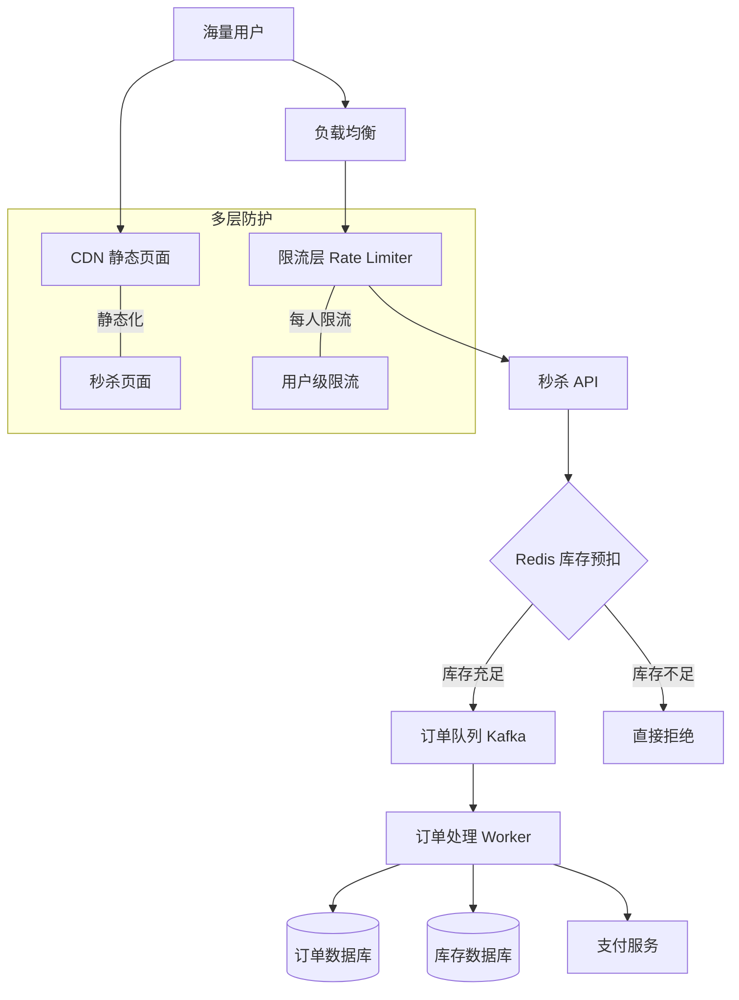

# Design Flash Sale（秒杀系统）

---

## 问题定义

设计一个秒杀/抢购系统（如双十一限时抢购），核心功能：
- 在指定时间开放抢购，商品限量（如 1000 件）
- 海量用户同时涌入
- 保证不超卖、不重复购买
- 秒杀结束后正常下单支付

**核心挑战：** 极高瞬时并发（百万级）、库存一致性（不超卖）、系统保护（不被打垮）。

---

## High-Level Design



---

## 核心组件详解

### 1. 多层流量过滤——核心思路

秒杀的流量像漏斗，每一层过滤掉大量无效请求：

```
第 1 层 - CDN + 静态化：秒杀页面静态化，CDN 承担读流量
第 2 层 - 前端限制：按钮防抖、验证码、定时放开
第 3 层 - 网关限流：全局 QPS 限制 + 用户级限流（每人 1 次/秒）
第 4 层 - Redis 库存预扣：内存中原子扣减，库存为 0 立即拒绝
第 5 层 - 异步下单：通过消息队列削峰，Worker 串行处理

100 万请求 → 限流后 10 万 → 库存过滤后 1000 → 最终成功 1000 单
```

### 2. Redis 库存预扣——防超卖的核心

使用 Redis 原子操作做库存预扣：

```lua
-- Lua 脚本保证原子性
local stock = redis.call('GET', KEYS[1])
if tonumber(stock) > 0 then
    redis.call('DECR', KEYS[1])
    return 1  -- 扣减成功
else
    return 0  -- 库存不足
end
```

**为什么用 Redis 而非数据库：** 数据库承受不了百万 QPS 的并发扣减，Redis 单线程执行 Lua 脚本，天然避免竞态条件（Race Condition），QPS 可达数十万。

### 3. 异步下单（消息队列削峰）

库存预扣成功后，将订单请求写入 Kafka/RabbitMQ，由下游 Worker 按自身处理能力消费：
- 创建订单记录
- 扣减数据库真实库存（Double Check）
- 生成待支付订单
- 通知用户进入支付页

**用户体验：** 前端显示"排队中"，轮询或 WebSocket 等待下单结果。

### 4. 防重复购买

- 用户级限流：每个用户只能提交 1 次秒杀请求
- Redis Set 记录已参与用户：`SADD flash_sale:users user_id`，已存在则拒绝
- 数据库唯一约束兜底：`(user_id, flash_sale_id)` 唯一索引

### 5. 超时释放库存

用户抢到后不支付，需要释放库存：
- 下单后启动 15-30 分钟倒计时（延迟队列）
- 超时未支付 → 取消订单 → Redis 库存 +1 + 数据库库存恢复
- 其他等待用户有机会继续抢购

### 6. 热点隔离

秒杀流量不应影响正常业务：
- **独立部署：** 秒杀服务独立集群，与正常下单流程物理隔离
- **独立数据库：** 秒杀库存与正常库存分开
- **降级开关：** 秒杀期间可关闭非核心功能（如评论、推荐）

---

## 关键 Trade-off

| 决策点 | 选项 A | 选项 B | 推荐 |
|---|---|---|---|
| 库存扣减 | 数据库扣减 | Redis 预扣 + DB 兜底 | B（性能和一致性兼顾） |
| 下单方式 | 同步下单 | 异步队列削峰 | B（保护下游） |
| 超卖风险 | 只靠 Redis | Redis + DB 双重校验 | B（Redis 预扣可能因故障不准） |
| 用户体验 | 直接返回成功/失败 | 排队等待 + 轮询结果 | B（异步下单的配套方案） |

---

## 小结

> 秒杀系统的核心是**多层流量过滤 + Redis 原子库存预扣 + 消息队列异步下单**。面试时重点讲清楚流量漏斗的每一层如何过滤、Redis Lua 脚本的原子扣减、以及超时释放库存的机制。
