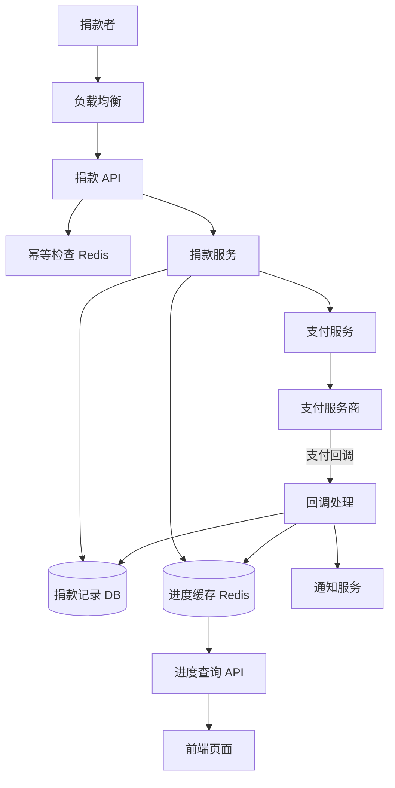

# Design Charity Event（在线募捐/众筹系统）

---

## 问题定义

设计一个在线慈善募捐/众筹系统（如 GoFundMe），核心功能：
- 创建募捐活动（目标金额、截止时间）
- 用户捐款（支持多种支付方式）
- 实时展示募捐进度（当前总金额、捐款人数）
- 到达目标后自动关闭或延期

**核心挑战：** 捐款金额的一致性（不能多记/少记）、高并发场景下的计数准确性、资金安全。

**与秒杀的区别：** 秒杀是抢有限库存（排他性），募捐是累加金额（非排他性）。但两者都需要在高并发下保证数据一致性。

---

## High-Level Design



---

## 核心组件详解

### 1. 捐款流程

```
1. 用户发起捐款（event_id, amount, idempotency_key）
2. 幂等检查：防止重复扣款
3. 创建捐款记录，状态 = PENDING
4. 调用支付服务扣款
5. 支付成功回调 → 更新记录为 SUCCESS → 更新进度
6. 支付失败 → 标记 FAILED，不更新进度
```

**关键：** 只有支付确认成功后才更新募捐进度，防止"承诺捐款但未实际到账"。

### 2. 募捐进度——高并发计数

**问题：** 热门活动（如明星发起的募捐）可能瞬时有大量捐款，如何高效更新和读取总金额？

**方案 A——数据库直接累加：**
```sql
UPDATE events SET total_amount = total_amount + donation_amount WHERE event_id = ?
```
简单但高并发下数据库是瓶颈（行锁竞争严重）。

**方案 B——Redis 原子累加 + 异步刷DB：**
```
INCRBY event:123:total 5000   -- 原子增加 $50.00（存分为单位避免浮点数）
INCR event:123:count           -- 捐款人数 +1
```
Redis 承担实时读写，定期或异步将 Redis 数据刷到数据库持久化。

**方案 C——分桶计数（Sharded Counter）：**
将一个计数器拆成 N 个桶（如 10 个），每次随机写入一个桶，读取时求和。减少单点写竞争：
```
event:123:shard:0 = 15000
event:123:shard:1 = 12000
...
event:123:shard:9 = 8000
总计 = SUM(all shards)
```

### 3. 幂等性

与支付系统一致：每次捐款携带 `idempotency_key`，防止网络重试导致重复扣款。

### 4. 目标金额检查

**到达目标后的处理：**
- 方案 A：到达目标自动关闭，新捐款被拒绝
- 方案 B：到达目标后仍可继续捐款（GoFundMe 模式）
- 方案 C：超募后转入下一阶段（Stretch Goal，Kickstarter 模式）

**并发边界问题：** 目标差 $10 时，两人同时捐 $10，可能导致轻微超募。通常可接受（事后处理），或用 Redis Lua 脚本原子检查+累加。

### 5. 资金安全

- 捐款资金先进入平台托管账户（Escrow），活动结束后统一拨付给受益人
- 退款机制：活动取消时支持全额退款
- 审计追踪（Audit Trail）：每笔捐款有完整的支付流水和账本记录
- 合规要求：税务凭证（Donation Receipt）生成

### 6. 实时展示与社交传播

- 捐款人列表（最新 N 位捐款者 + 金额）
- 进度条动画：前端定时轮询或 WebSocket 推送最新进度
- 捐款里程碑通知（如"已达成 50%目标"）
- 社交分享（生成分享卡片，引导传播）

---

## 关键 Trade-off

| 决策点 | 选项 A | 选项 B | 推荐 |
|---|---|---|---|
| 进度计数 | 数据库直接累加 | Redis 原子计数 + 异步刷 DB | B（高并发性能） |
| 金额精度 | 浮点数 | 整数（分为单位） | B（避免浮点精度问题） |
| 目标达成 | 精确控制不超募 | 允许轻微超募 | B（简化并发处理） |
| 展示更新 | 前端轮询 | WebSocket 推送 | 中等并发轮询，高并发 WS |

---

## 小结

> 募捐系统的核心是**支付一致性 + 高并发计数**。与秒杀不同，募捐是累加而非排他，核心考点从"防超卖"变为"计数准确性"。面试时重点讲清楚：Redis 原子累加或分桶计数、幂等支付、资金托管机制。
