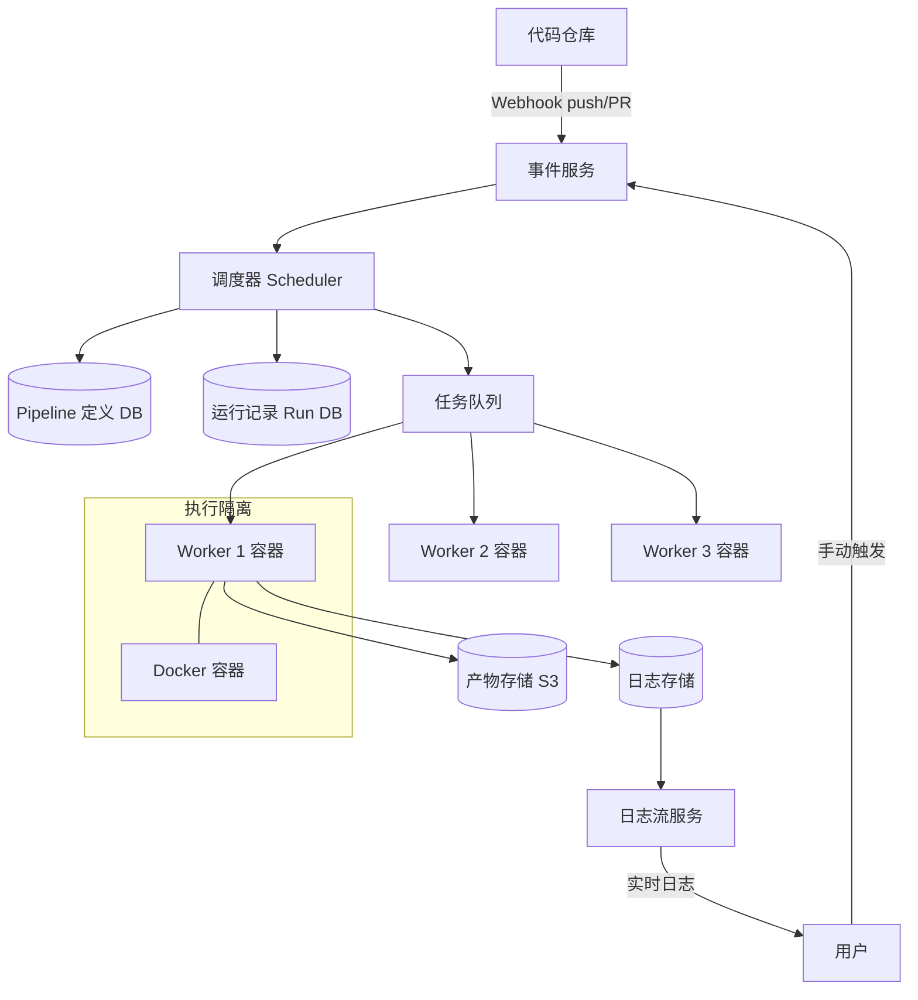

# Design CI/CD System（GitHub Actions）

---

## 问题定义

设计一个 CI/CD（持续集成/持续部署）系统，类似 GitHub Actions / Jenkins，核心功能：
- 用户定义 Pipeline（触发条件、步骤、依赖关系）
- 代码提交时自动触发构建和测试
- 任务在隔离环境中执行（容器化）
- 展示执行日志和状态

**核心挑战：** Pipeline DAG 调度（步骤间有依赖关系）、任务隔离（安全）、大规模并发任务执行、日志实时流式输出。

**分层架构体现：** 职责分层——触发层（事件监听）→ 调度层（任务编排）→ 执行层（Worker 运行）→ 存储层（日志/产物）。

---

## High-Level Design



---

## 核心组件详解

### 1. Pipeline 定义与 DAG

用户通过 YAML 定义 Pipeline（如 `.github/workflows/ci.yml`）：

```yaml
on: [push]
jobs:
  build:
    steps:
      - run: npm install
      - run: npm run build
  test:
    needs: [build]
    steps:
      - run: npm test
  deploy:
    needs: [test]
    steps:
      - run: ./deploy.sh
```

**DAG（有向无环图）调度：** `build → test → deploy`，Scheduler 需要解析依赖关系，按拓扑排序（Topological Sort）调度：
- 无依赖的 Job 并行执行
- 依赖的前置 Job 完成后才调度后续 Job
- 任一 Job 失败 → 取消下游 Job（或可配置为继续）

### 2. 调度器（Scheduler）

```
1. 收到触发事件（push/PR/定时）
2. 读取 Pipeline 定义，创建 Run 记录
3. 解析 DAG，找出可立即执行的 Job（无依赖的）
4. 将 Job 推入任务队列
5. Job 完成后检查是否有新的 Job 可调度
6. 所有 Job 完成 → Run 标记为完成
```

**状态管理：** 每个 Run / Job / Step 都有状态：`queued → running → success / failed / cancelled`

### 3. Worker 执行与隔离

**容器隔离：** 每个 Job 在独立的 Docker 容器中执行，Job 之间互不影响。执行完成后容器销毁。

**安全性：**
- 用户代码在沙箱中运行，无法访问宿主机资源
- Secrets（密钥）通过环境变量注入，不写入日志
- 网络隔离：限制对内部网络的访问

**资源限制：** CPU、内存、执行时间上限，防止恶意或失控的任务占满资源。

### 4. 产物管理（Artifacts）

Build 产物（如编译后的二进制文件、测试报告）上传到对象存储（S3），关联到 Run 记录，供后续 Job 或用户下载。

**缓存（Cache）：** 依赖下载（如 `node_modules`、Maven 依赖）缓存到对象存储，下次构建直接复用，加速构建。

### 5. 日志实时输出

用户希望看到正在执行的 Job 的实时日志输出。

**实现：** Worker 将日志按行写入日志缓冲（Redis Stream 或 Kafka），前端通过 SSE（Server-Sent Events）或 WebSocket 实时拉取。Job 完成后日志归档到持久化存储。

### 6. 扩缩容

**Worker 池自动扩缩：** 任务队列积压时自动增加 Worker 实例（K8s HPA 或云 Auto Scaling），空闲时缩容节省成本。

**多租户隔离：** 不同用户/组织的任务在不同 Worker 池中执行，避免互相影响。

---

## 关键 Trade-off

| 决策点 | 选项 A | 选项 B | 推荐 |
|---|---|---|---|
| 执行隔离 | 进程级隔离 | 容器隔离（Docker） | B（安全性更强） |
| 日志传输 | Job 完成后上传 | 实时流式输出 | B（用户体验好） |
| 调度模型 | 中心化调度器 | 分布式调度 | 中心化（简单，加 HA） |
| Worker 管理 | 固定 Worker 池 | 按需弹性扩缩 | B（成本效率） |

---

## 小结

> CI/CD 系统是**分层架构**的典型应用——事件触发 → DAG 调度 → 容器执行 → 产物/日志存储，各层职责清晰。面试时重点讲清楚 DAG 调度逻辑（拓扑排序）、容器隔离的安全设计、日志实时输出方案。
