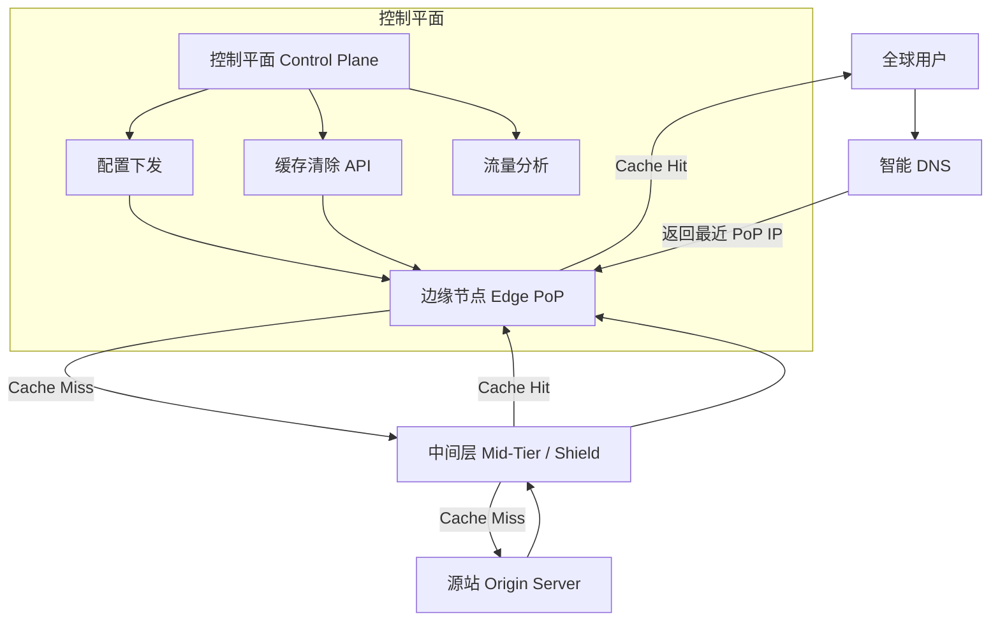

# Design CDN（Cloudflare）

---

## 问题定义

设计一个 CDN（Content Delivery Network）服务，从架构内部视角出发：
- 全球分布的边缘节点（Edge Node / PoP）
- 内容缓存与分发
- 智能 DNS 路由（将用户引导到最近节点）
- 缓存失效与回源

**核心挑战：** 全球拓扑的节点管理、缓存一致性、智能路由、DDoS 防护。

**分层架构体现：** 拓扑分层——用户 → 边缘节点 → 中间层 → 源站，层层过滤请求。

---

## High-Level Design



---

## 核心组件详解

### 1. 三层缓存拓扑

```
用户 → 边缘节点（Edge PoP）→ 中间层（Mid-Tier / Shield）→ 源站（Origin）
```

**边缘节点（Edge PoP）：** 部署在全球各地（数百个节点），离用户最近，处理大部分请求。

**中间层（Mid-Tier / Origin Shield）：** 位于源站前方的缓存层，多个边缘节点共享一个中间层。作用：
- 减少对源站的回源请求（多个 Edge Miss 合并为一次回源）
- 防止缓存击穿打垮源站

**源站（Origin）：** 客户的服务器，内容的最终来源。

### 2. 智能 DNS 路由

用户请求 `cdn.example.com` 时，DNS 需要返回最优的边缘节点 IP：

**Anycast：** 多个边缘节点共用一个 IP 地址，网络层通过 BGP 路由自动将用户引导到最近的节点。Cloudflare 的核心路由方式。

**GeoDNS：** 根据用户 IP 的地理位置，DNS 返回地理最近的节点 IP。

**延迟探测：** 定期测量用户到各节点的实际延迟，选择延迟最低的节点（比纯地理距离更准确）。

### 3. 缓存策略

**缓存键（Cache Key）：** 通常是 URL + 部分请求头（如 `Accept-Encoding`），决定了什么算"同一份内容"。

**缓存控制：** 遵循 HTTP 标准——`Cache-Control`、`ETag`、`Expires` 等响应头控制缓存行为。

**Request Coalescing（请求合并）：** 同一资源同时有多个 Cache Miss 请求时，只向源站发一个请求，其他请求等待结果，避免回源风暴（Thundering Herd）。

### 4. 缓存失效（Cache Invalidation）

**TTL 过期：** 最简单的方式，到期自动失效。

**主动清除（Purge）：** 通过 API 主动清除指定 URL 或全部缓存。挑战在于将 Purge 指令快速传播到全球所有节点。

**Purge 传播：** 控制平面将 Purge 指令通过 Pub/Sub 广播到所有边缘节点，通常在数秒内全球生效。

**版本化 URL：** `main.v2.css`，通过改文件名绕过缓存，最安全的失效方式。

### 5. 安全与 DDoS 防护

CDN 是天然的 DDoS 防护层：
- **流量吸收：** 全球分布的节点分担攻击流量
- **速率限制（Rate Limiting）：** 按 IP / 区域限制请求速率
- **WAF（Web Application Firewall）：** 过滤恶意请求（SQL 注入、XSS 等）
- **Bot 检测：** 识别并阻止自动化攻击流量

### 6. 控制平面（Control Plane）

全球 CDN 的"大脑"，负责：
- 配置管理：域名绑定、缓存规则、安全策略的下发
- 监控：每个节点的流量、命中率、错误率
- 分析：客户流量报告、Top URL 分析

---

## 关键 Trade-off

| 决策点 | 选项 A | 选项 B | 推荐 |
|---|---|---|---|
| 路由方式 | GeoDNS | Anycast | Anycast（更简单、更快） |
| 缓存层级 | Edge 直接回源 | Edge → Mid-Tier → Origin | B（保护源站） |
| Purge 方式 | TTL 自然过期 | API 主动清除 | 两者结合使用 |
| 动态内容 | 不缓存 | Edge Compute（边缘计算） | B（Cloudflare Workers 趋势） |

---

## 小结

> CDN 设计体现了**拓扑分层**思想——请求经过边缘 → 中间层 → 源站层层过滤。面试时重点讲清楚：三层缓存拓扑（尤其是 Mid-Tier 的作用）、Anycast 路由原理、缓存失效的全球传播机制。
