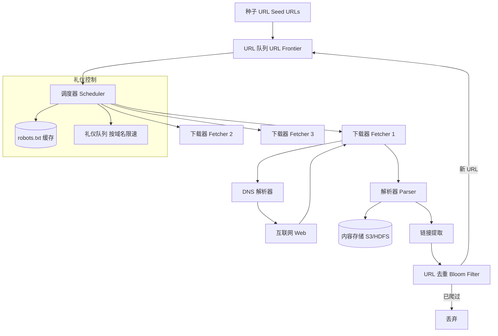

# Design Web Crawler（网页爬虫）

---

## 问题定义

设计一个大规模网页爬虫系统（如 Googlebot），核心功能：
- 从种子 URL 出发，递归爬取整个互联网的网页
- 解析 HTML 提取内容和新链接
- 去重（避免重复爬取）
- 遵守 robots.txt 和爬取礼仪

**核心挑战：** 互联网规模（数十亿网页）、URL 去重、爬取优先级调度、分布式协调。

**分层架构体现：** URL 调度层 → 下载层 → 解析层 → 存储层，流水线式处理。

---

## High-Level Design



---

## 核心组件详解

### 1. URL Frontier（URL 队列）

URL Frontier 是爬虫的核心数据结构，决定"下一个爬什么"。它不是简单的 FIFO 队列，而是兼顾**优先级和礼仪**的调度系统：

**优先级队列：** 不同 URL 有不同的爬取优先级：
- 高优先级：首页、新闻页、频繁更新的页面
- 低优先级：深层子页面、静态内容

**礼仪队列（Politeness Queue）：** 按域名分桶，同一域名的 URL 在同一队列中，保证对同一域名的请求间隔（如 ≥ 1 秒），避免打垮目标网站。

```
队列架构：
  优先级队列 → 选出高优先级 URL → 按域名分发到礼仪队列
  礼仪队列 (example.com) → 限速 1 req/sec → Fetcher
  礼仪队列 (another.com) → 限速 1 req/sec → Fetcher
```

### 2. 下载器（Fetcher）

- 发送 HTTP 请求获取网页内容
- 处理重定向（3xx）
- 处理超时和错误
- 本地 DNS 缓存（减少 DNS 查询延迟）
- 支持 HTTP/HTTPS，需要处理各种编码

### 3. 解析器（Parser）

- 解析 HTML，提取文本内容
- 提取页面内的所有链接（`<a href="...">`）
- URL 标准化（Normalization）：去除锚点、统一协议、处理相对路径
- 检测内容类型（HTML / PDF / 图片等）

### 4. URL 去重——Bloom Filter

互联网有数十亿 URL，需要高效判断一个 URL 是否已爬过。

**Bloom Filter（布隆过滤器）：** 概率数据结构，可以快速判断"一定不存在"或"可能存在"：
- 不存在 → 确定是新 URL，放入 Frontier
- 可能存在 → 可能已爬过，跳过（允许极小概率的误判）
- 空间效率极高：10 亿 URL 仅需约 1.2 GB 内存（1% 误判率）

**精确去重（补充方案）：** 对于需要精确去重的场景，使用 Redis Set 或数据库做二次校验。

### 5. robots.txt 遵守

爬虫必须检查目标网站的 `robots.txt` 文件，遵守网站允许/禁止爬取的规则：

```
# robots.txt
User-agent: *
Disallow: /private/
Crawl-delay: 2
```

**缓存 robots.txt：** 每个域名的 robots.txt 缓存在本地（TTL 24h），避免每次爬取前都请求。

### 6. 内容存储

爬取的网页内容存储到分布式文件系统（HDFS / S3），供搜索引擎索引、数据分析等下游使用。

**内容去重：** 不同 URL 可能指向相同内容（镜像站），使用内容指纹（SimHash / MinHash）检测近似重复页面。

### 7. 重新爬取（Re-crawl）

互联网内容不断更新，需要定期重新爬取。更新策略：
- 新闻网站：每小时重爬
- 普通网站：每周/每月重爬
- 静态内容：频率更低

---

## 关键 Trade-off

| 决策点 | 选项 A | 选项 B | 推荐 |
|---|---|---|---|
| 去重方式 | HashSet（精确） | Bloom Filter（概率） | Bloom Filter（空间效率） |
| 调度优先级 | BFS（广度优先） | 基于 PageRank / 重要性 | B（高价值页面优先） |
| 下载并发 | 单机多线程 | 分布式多 Fetcher | B（大规模必须分布式） |
| 内容存储 | 只存文本 | 存完整 HTML | 按需求选择 |

---

## 小结

> Web Crawler 体现了**流水线分层架构**——URL 调度 → 下载 → 解析 → 存储，各层解耦并行。面试时重点讲清楚：URL Frontier 的优先级+礼仪双队列设计、Bloom Filter 去重、robots.txt 遵守机制。
