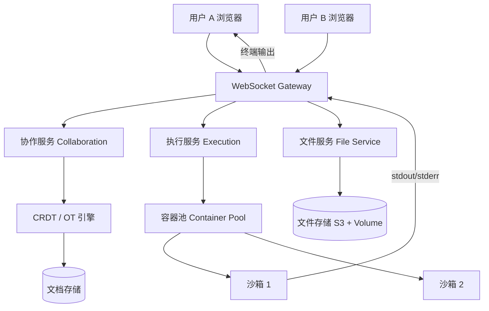

# Design Online IDE（在线代码编辑器）

---

## 问题定义

设计一个在线 IDE（如 Replit、CodeSandbox、GitHub Codespaces），核心功能：
- 浏览器内代码编辑（语法高亮、自动补全）
- 代码编译与运行（多语言支持）
- 实时协作编辑（多人同时编辑）
- 文件系统管理
- 终端（Terminal）访问

**核心挑战：** 远程代码执行的安全隔离、多人实时协作的冲突解决、用户环境的快速启动。

---

## High-Level Design



---

## 核心组件详解

### 1. 代码编辑器（前端）

**Monaco Editor：** VS Code 的核心编辑器组件，开源，支持语法高亮、IntelliSense、多光标等。大多数在线 IDE 基于 Monaco 构建。

**Language Server Protocol（LSP）：** 通过 WebSocket 连接远程 Language Server，提供代码补全、跳转定义、错误诊断等智能功能。每种语言一个 Language Server。

### 2. 远程代码执行——安全隔离

**最核心的设计：** 用户代码不可信，必须在严格隔离的沙箱（Sandbox）中执行。

**隔离方案：**

| 方案 | 隔离级别 | 启动速度 | 安全性 |
|---|---|---|---|
| Docker 容器 | 进程级 | 秒级 | 中（共享内核） |
| MicroVM（Firecracker） | 虚拟机级 | 亚秒级 | 高（独立内核） |
| gVisor | 内核代理 | 秒级 | 高（系统调用过滤） |
| WebAssembly (Wasm) | 浏览器沙箱 | 毫秒级 | 高（指令级隔离） |

**Firecracker（AWS Lambda 使用的方案）：** 轻量级 MicroVM，启动时间 < 150ms，每个用户一个独立 VM，安全性接近虚拟机但开销接近容器。

**资源限制：**
- CPU：限制核数和使用时间
- 内存：上限（如 512MB）
- 磁盘：只读基础镜像 + 可写层
- 网络：限制出站（防止恶意攻击外部）
- 执行时间：超时强制 kill

### 3. 实时协作——CRDT / OT

多人同时编辑同一文件，需要解决冲突：

**OT（Operational Transformation）：** Google Docs 使用的方案。每个编辑操作（插入/删除）发送到服务器，服务器负责转换并发操作，保证最终一致。需要中心服务器。

**CRDT（Conflict-free Replicated Data Type）：** 无中心、最终一致的数据结构。每个字符有唯一 ID，插入/删除操作天然可合并，无需中心协调。代表：Yjs、Automerge。

```
用户 A 在位置 5 插入 "hello"
用户 B 同时在位置 3 删除 2 个字符
→ CRDT 自动合并两个操作，双方最终看到相同结果
```

**选型：** CRDT 更适合 P2P 和离线场景，OT 更成熟。在线 IDE 两者都有使用。

### 4. 文件系统

**远程文件系统：** 用户项目文件存储在远程（S3 + 持久化 Volume），通过文件服务 API 进行 CRUD。

**虚拟文件系统（VFS）：** 前端模拟文件树，变更通过 WebSocket 双向同步到服务端。

### 5. 终端（Terminal）

**前端：** xterm.js（浏览器终端模拟器），通过 WebSocket 与后端 Shell 交互。

**后端：** 在用户的沙箱容器中启动一个 PTY（伪终端），stdin/stdout 通过 WebSocket 双向传输。

### 6. 环境快速启动

用户打开项目时需要快速获得可用环境：
- **预热容器池（Warm Pool）：** 预先启动一批通用容器，用户分配一个已运行的容器，秒级可用
- **快照恢复（Snapshot Resume）：** 将用户上次的容器状态快照保存，下次打开时从快照恢复
- **分层镜像（Layered Image）：** 基础镜像共享，用户自定义层叠加

---

## 关键 Trade-off

| 决策点 | 选项 A | 选项 B | 推荐 |
|---|---|---|---|
| 代码执行 | 浏览器端（Wasm） | 远程容器 | B（功能完整）/ A（轻量场景） |
| 协作方案 | OT（中心化） | CRDT（去中心化） | 按架构选择，CRDT 趋势上升 |
| 沙箱隔离 | Docker | MicroVM（Firecracker） | MicroVM（更安全） |
| 环境启动 | 按需创建 | 预热容器池 | B（用户体验好） |

---

## 小结

> Online IDE 融合了**实时协作 + 安全沙箱执行 + 远程文件系统**三大技术。面试时重点讲清楚：MicroVM/容器的安全隔离方案、CRDT/OT 的协作冲突解决、WebSocket 驱动的终端和编辑器实时通信。
