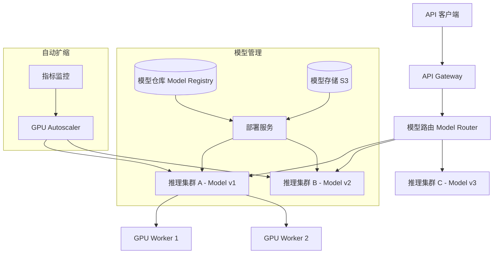

# Design Model Distribution（模型分发系统）

---

## 问题定义

设计一个 AI 模型分发与推理服务系统（如 Anthropic/OpenAI 的 API 服务），核心功能：
- 大模型（LLM）的高效推理服务（Inference Serving）
- 模型版本管理与灰度发布
- 多模型、多版本的路由与负载均衡
- 弹性扩缩容（GPU 资源昂贵）

**核心挑战：** GPU 资源利用率优化、大模型的加载时间、推理延迟控制、成本效率。

---

## High-Level Design



---

## 核心组件详解

### 1. 推理服务（Inference Server）

**GPU Worker：** 每个 Worker 加载一个模型到 GPU 显存，接收推理请求，返回结果。

**主流推理框架：** vLLM、TensorRT-LLM、Triton Inference Server

**关键优化技术：**

**KV Cache：** LLM 推理中，已生成 Token 的 Key-Value 缓存可以复用，避免重复计算。KV Cache 占用大量 GPU 显存，管理策略直接影响吞吐量。

**Continuous Batching（连续批处理）：** 传统批处理等一批请求全部完成后才返回。Continuous Batching 允许已完成的请求先返回，新请求随时加入 Batch，GPU 利用率大幅提升。

**Tensor Parallelism（张量并行）：** 将单个大模型切分到多块 GPU 上并行计算，解决单卡显存不足的问题。

**量化（Quantization）：** 将模型权重从 FP16 压缩到 INT8/INT4，减少显存占用和推理延迟，但可能轻微影响质量。

### 2. 模型仓库（Model Registry）

管理所有模型的版本、元数据：
- 模型名称、版本号
- 模型大小、所需 GPU 规格
- 存储路径（S3 地址）
- 部署状态（staging / production / deprecated）

### 3. 模型部署流程

```
1. 训练团队上传新模型到 S3
2. 在 Model Registry 注册新版本
3. 部署服务启动新的 GPU Worker，下载模型权重到本地/GPU 显存
4. 模型加载完成后，标记为 Ready
5. 路由层开始将部分流量引导到新版本（金丝雀发布）
6. 指标正常后逐步全量切换
```

**模型加载时间：** 大模型（数十 GB）从 S3 下载到 GPU 显存可能需要数分钟。优化：
- 模型权重预下载到本地 NVMe SSD
- 使用 FSDP/模型并行分块加载
- 预热 Worker Pool，提前加载

### 4. 模型路由（Model Router）

**版本路由：** 根据请求指定的模型版本（`model: claude-3-opus`）路由到对应集群。

**灰度发布（Canary Deployment）：** 新模型版本先接收 5% 流量，监控质量指标（延迟、错误率、用户反馈），逐步扩大到 100%。

**流量分配：** 基于权重的负载均衡，同一模型版本的多个 GPU Worker 之间按负载分配请求。

### 5. GPU 自动扩缩容

GPU 资源极其昂贵，需要精细化扩缩容：

**扩容信号：**
- 请求队列长度 > 阈值
- 推理延迟 P99 > SLO
- GPU 利用率持续 > 80%

**缩容信号：**
- 请求量持续低于阈值
- GPU 利用率 < 30%

**挑战：** 模型加载时间长（分钟级），扩容响应慢。解决：
- 维持最小实例数（Min Pool）
- 预测性扩容：基于历史流量模式提前扩容
- 预热实例池：保持一批已加载模型的 Standby 实例

### 6. 请求队列与优先级

高峰期请求可能超过推理能力：
- 请求入队等待，设置超时（如 30 秒）
- 付费用户优先（Priority Queue）
- 超时未处理的请求返回 429 Too Many Requests

---

## 关键 Trade-off

| 决策点 | 选项 A | 选项 B | 推荐 |
|---|---|---|---|
| 推理优化 | 标准推理 | vLLM + Continuous Batching | B（吞吐量提升 5-10x） |
| 模型精度 | FP16 全精度 | INT8/INT4 量化 | 按质量要求选择 |
| 扩缩容 | 反应式（基于指标） | 预测式（基于历史流量） | 两者结合 |
| 部署方式 | 替换式部署 | 金丝雀 + 蓝绿 | B（降低风险） |

---

## 小结

> 模型分发系统的核心是**GPU 资源管理和推理性能优化**。面试时重点讲清楚：Continuous Batching 和 KV Cache 的推理优化、模型加载的延迟问题和预热策略、GPU 扩缩容的挑战、灰度发布保证模型质量。
