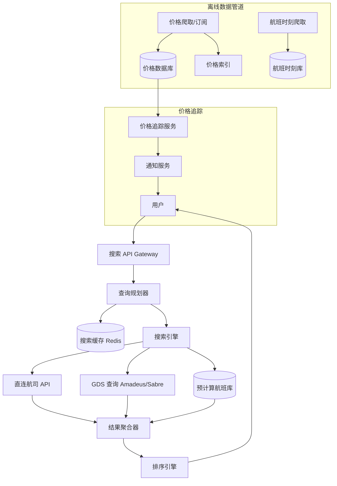

# Design Google Flights（机票搜索系统）

---

## 问题定义

设计一个类似 Google Flights 的机票搜索系统，核心功能：
- 机票搜索：根据出发地、目的地、日期查询航班
- 价格比较：聚合多家航司和 OTA（在线旅行社）的报价
- 筛选与排序：按价格、时长、中转次数、航司等过滤
- 价格追踪：监控航线价格变化，价格下降时通知用户
- 灵活搜索：支持模糊日期（±3天）、模糊目的地（"亚洲所有城市"）

**核心挑战：** 搜索空间巨大（出发地 × 目的地 × 日期 × 航司组合爆炸）、实时报价查询延迟、价格频繁变化、多源数据聚合。

---

## 规模估算

- 全球机场：~10,000 个
- 航线组合：数十亿（含中转）
- 每日搜索请求：数亿次
- 每日航班数据更新：数百万条价格变更
- 搜索延迟要求：< 2-3 秒返回结果

---

## High-Level Design



---

## 核心组件详解

### 1. 数据源与数据获取

**GDS（Global Distribution System）：** 全球分销系统，航空业的核心基础设施。主要玩家：Amadeus、Sabre、Travelport。GDS 聚合了大部分航司的库存和价格，通过标准 API 查询。

**航司直连（Direct Connect）：** 直接对接航司 API，获取更准确的价格和更多舱位信息。低成本航司（如 Southwest、Ryanair）通常不接入 GDS，必须直连。

**数据获取策略：**
- **实时查询：** 用户搜索时实时调用 GDS/航司 API。最新但延迟高（1-5 秒/源）。
- **预计算缓存：** 离线周期性爬取热门航线价格，存入本地数据库。搜索时直接查本地，毫秒级响应。
- **混合策略：** 先返回缓存的预计算结果（即时显示），后台异步查询实时数据更新价格。

### 2. 搜索引擎

**查询拆解：** 用户搜索 "北京→纽约, 3月15日" 需要拆解为：
- 直飞：PEK→JFK, PEK→EWR, PKX→JFK...
- 一次中转：PEK→ICN→JFK, PEK→NRT→JFK, PEK→LAX→JFK...
- 两次中转：更多组合

**中转路径搜索：** 本质是图搜索问题。
- 将机场作为节点，航线作为边，构建全球航线图
- 用 BFS/Dijkstra 搜索从出发地到目的地的所有合理路径
- 剪枝策略：限制最大中转次数（通常 ≤ 2）、限制总行程时间、排除绕路航线

**预计算索引：**
```
Route Index: (出发机场, 到达机场, 日期) → [航班列表 + 价格]
```
热门航线预计算所有日期组合的结果，冷门航线实时查询。

### 3. 价格数据管理

**价格特点：** 机票价格极其动态——同一航班的价格可能一天变化数十次，受库存、时间、需求影响。

**价格存储：**
```
FlightPrice:
  flight_id: "UA100-20240315"
  route: PEK → JFK
  departure: 2024-03-15 08:00
  arrival: 2024-03-15 09:30
  airline: United Airlines
  cabin_class: economy
  price: $850
  currency: USD
  source: amadeus
  fetched_at: 2024-03-10 14:30:00
  ttl: 15min  # 价格有效期
```

**价格新鲜度（Freshness）：** 缓存价格有 TTL（如 15 分钟），过期后需要重新查询。热门航线 TTL 更短（价格变化快），冷门航线 TTL 更长。

**历史价格：** 保存价格历史用于趋势分析（"现在的价格是高还是低？"）。按时间序列存储，支持图表展示。

### 4. 灵活搜索（Explore）

**模糊日期搜索：** "3月15日 ±3天" → 查询 3.12-3.18 共 7 天的价格，展示日期价格矩阵。
- 预计算：热门航线预算每天价格，存入 Date-Price Matrix
- 展示：日历视图，每天标注最低价

**模糊目的地搜索：** "从北京出发，预算 $500 以内能去哪？"
- 预计算所有从 PEK 出发的航线最低价
- 按价格排序展示目的地列表
- 地图视图：在地图上标注各目的地价格

### 5. 价格追踪（Price Tracking）

```
用户创建追踪：(PEK→JFK, 3月15日, 目标价 $800)
                    ↓
价格追踪服务定期检查该航线价格
                    ↓
价格 ≤ $800 → 推送通知给用户
```

**实现：**
- 用户追踪请求存入追踪任务表
- 后台 Worker 按优先级周期性查询价格（临近出发日的追踪更频繁）
- 价格触发阈值后通过 Push/Email 通知用户

### 6. 排序与推荐

**排序因子：**
- 价格（默认主排序）
- 总行程时间
- 中转次数（直飞优先）
- 出发/到达时间偏好
- 航司评分

**"Best Flights" 推荐：** 综合评分 = f(价格, 时长, 中转次数, 航司)，将性价比最高的航班标为 "Best"。

---

## 关键 Trade-off

| 决策点 | 选项 A | 选项 B | 推荐 |
|---|---|---|---|
| 数据获取 | 全部实时查询 | 预计算 + 实时混合 | B（平衡延迟和准确性） |
| 价格缓存 TTL | 短（5 分钟，更准确） | 长（1 小时，更快） | 按航线热度动态调整 |
| 中转搜索 | 实时图搜索 | 预计算中转路径 | B（热门航线预计算） |
| 搜索结果 | 等所有源返回再展示 | 渐进式展示（先缓存后实时） | B（用户体验更好） |

---

## 小结

> Google Flights 的核心是**搜索空间管理和价格数据时效性**。面试时重点讲清楚：预计算 + 实时查询的混合策略、中转路径的图搜索与剪枝、价格缓存的 TTL 管理和新鲜度策略、以及灵活搜索（模糊日期/目的地）的预计算索引设计。
