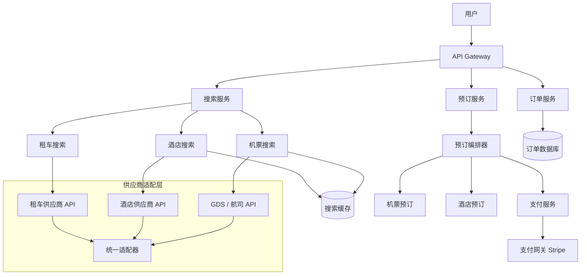

# Design Expedia（在线旅行预订平台）

---

## 问题定义

设计一个类似 Expedia 的在线旅行预订平台（OTA），核心功能：
- 机票、酒店、租车的搜索与预订
- 聚合多个供应商（航司、酒店集团、租车公司）的库存和价格
- 订单管理：预订、支付、退改、行程管理
- 打包产品（Bundle）：机票 + 酒店组合优惠

**核心挑战：** 多供应商库存聚合与一致性、预订的分布式事务（跨航司 + 酒店）、价格实时性、高并发搜索与预订。

---

## 规模估算

- DAU：数千万
- 每日搜索量：数亿次
- 每日订单量：数百万
- 供应商 API 延迟：500ms-3s 不等
- 搜索延迟要求：< 3 秒
- 预订成功率要求：> 99%

---

## High-Level Design



---

## 核心组件详解

### 1. 供应商聚合层（Supplier Aggregation）

**挑战：** 每个供应商 API 格式不同、延迟不同、可靠性不同。

**适配器模式（Adapter Pattern）：**
```
统一接口:
  search(origin, destination, date) → List<FlightOffer>
  book(offer_id, passenger_info) → BookingConfirmation
  cancel(booking_id) → CancellationResult

每个供应商实现一个 Adapter:
  AmadeusAdapter implements FlightSupplier
  SabreAdapter implements FlightSupplier
  UnitedDirectAdapter implements FlightSupplier
```

**并行查询：** 搜索时同时请求多个供应商，设置超时（如 3 秒），在超时前收到多少结果就返回多少。

**熔断器（Circuit Breaker）：** 某个供应商持续超时/报错时自动熔断，不再请求该供应商，避免拖慢整体响应。

### 2. 搜索系统

**机票搜索：** 与 Google Flights 类似（参见 Design Google Flights），但更侧重可预订性而非仅展示价格。

**酒店搜索：**
```
输入: (城市/区域, 入住日期, 退房日期, 人数, 房间数)
输出: 可用酒店列表 + 房型 + 价格
```

- 酒店库存按日期管理：每个房型每天有独立库存
- 连住查询：入住 3 晚 = 3 个日期都有库存才可预订
- 价格可能按日浮动（周末更贵）

**搜索排序：** 除了价格和评分，OTA 排序通常还考虑：
- 佣金率（OTA 从供应商获得的佣金比例，影响平台收入）
- 转化率（历史数据显示该酒店/航班的预订转化率）
- 用户偏好（历史预订行为、会员等级）

### 3. 预订流程（核心难点）

**两阶段预订：**

```
阶段 1: Price Verification（验价）
  用户选择航班/酒店后，再次调用供应商 API 确认价格和可用性。
  因为搜索结果可能已过期（缓存延迟），必须验价。
  如果价格变化，展示新价格让用户确认。

阶段 2: Booking（下单）
  调用供应商 API 创建预订 → 获取供应商确认号（PNR/Confirmation Number）
  扣款 → 生成平台订单 → 发送确认邮件
```

**打包预订（Bundle Booking）的分布式事务：**

用户预订 "机票 + 酒店" 组合，需要同时预订两个供应商：

```
BookingOrchestrator:
  1. 预订机票 → 成功，获得 PNR: ABC123
  2. 预订酒店 → 失败！
  3. 补偿：取消机票预订（Cancel PNR: ABC123）
```

**Saga 模式：** 每个步骤有对应的补偿操作（Cancel），任何步骤失败时依次回滚已完成的步骤。

| 步骤 | 正向操作 | 补偿操作 |
|---|---|---|
| 1 | 预订机票 | 取消机票 |
| 2 | 预订酒店 | 取消酒店 |
| 3 | 扣款 | 退款 |

**幂等性：** 预订请求必须幂等（相同请求重复提交只产生一次预订）。通过幂等键（Idempotency Key）实现。

### 4. 库存与价格一致性

**超卖问题：** 多个 OTA 同时卖同一个航班/酒店房间，库存在供应商侧管理。OTA 的缓存可能显示有库存，但实际已售罄。

**解决方案：**
- 验价步骤（Price Verification）在预订前实时确认库存
- 预订失败时自动推荐替代方案
- 热门航班/酒店缩短缓存 TTL

**价格担保（Price Guarantee）：** OTA 承诺用户看到的价格就是最终价格。如果验价时涨价，OTA 承担差价或允许用户取消。

### 5. 订单管理

**订单状态机：**
```
CREATED → PENDING_PAYMENT → PAYMENT_SUCCESS → CONFIRMED → 
  → COMPLETED（行程结束）
  → CANCELLED（用户取消）
  → REFUNDED（退款完成）
```

**退改处理：**
- 每个供应商有不同的退改政策（免费取消、收费取消、不可退）
- 订单系统需要存储供应商侧的退改规则
- 退改请求通过适配层调用供应商 API，获取退款金额

### 6. 打包优惠（Bundle Pricing）

机票 + 酒店组合比单独购买更便宜：
- OTA 从供应商处获得批发价（Net Rate），自行定价加利润
- 打包时将利润分摊到多个产品，总价更低
- 不可拆分展示单品价格（隐藏批发价）

---

## 关键 Trade-off

| 决策点 | 选项 A | 选项 B | 推荐 |
|---|---|---|---|
| 搜索策略 | 等所有供应商返回 | 设超时，先返回已有结果 | B（用户体验优先） |
| 预订事务 | 2PC（分布式事务） | Saga + 补偿 | B（跨供应商无法 2PC） |
| 库存缓存 | 长缓存（快但可能超卖） | 短缓存（准但慢） | 验价步骤兜底 |
| 排序 | 纯用户价值（价格+评分） | 混合商业因素（佣金） | B（平衡用户体验和商业） |

---

## 小结

> Expedia 的核心是**多供应商聚合和预订的分布式事务**。面试时重点讲清楚：供应商适配层的统一接口设计、Saga 模式处理跨供应商预订的补偿逻辑、两阶段预订（验价 + 下单）保证价格一致性、以及超卖问题的应对策略。
