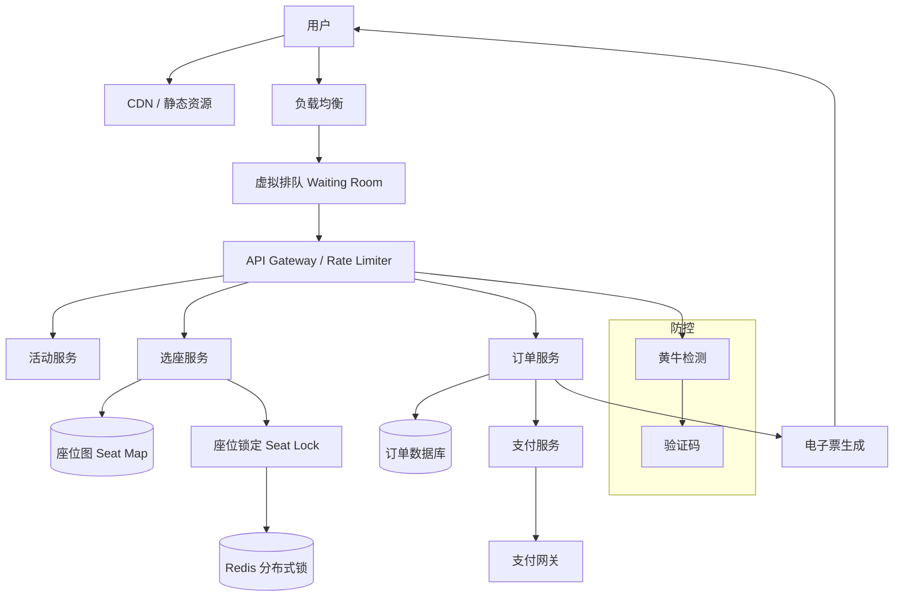

# Design Ticketmaster（票务系统）

---

## 问题定义

设计一个类似 Ticketmaster 的大型活动票务系统，核心功能：
- 活动浏览与搜索（演唱会、体育赛事、话剧等）
- 选座购票（座位图交互）
- 高并发抢票（热门演出开票瞬间百万级流量）
- 订单支付与电子票生成
- 票务转让与二级市场

**核心挑战：** 开票瞬间的极端高并发（百万人同时抢数千张票）、座位库存的严格一致性（不能超卖）、黄牛防控、公平排队。

---

## 规模估算

- 热门演唱会（Taylor Swift）：数百万人同时涌入
- 可售座位：5,000-80,000 张
- 开票瞬间 QPS：数百万 → 数十万（经过多层过滤后到达库存服务）
- 购票窗口：通常 10-30 分钟内售罄
- 库存一致性要求：**绝对不能超卖**

---

## High-Level Design



---

## 核心组件详解

### 1. 虚拟排队系统（Waiting Room）

**为什么需要排队？** 热门演出开票时，百万用户同时涌入。如果全部放进购票系统，后端会被压垮。

**机制：**
```
1. 开票前用户进入 Waiting Room（静态页面，由 CDN 承载）
2. 开票时间到，系统将排队用户随机打乱（公平性），分配排队号
3. 按排队号分批放入购票系统（如每批 5000 人）
4. 前一批有人完成购票或超时后，放入下一批
5. 用户在排队期间看到"前面还有 N 人"的进度
```

**技术实现：**
- Waiting Room 页面纯静态，由 CDN 处理，承载百万并发无压力
- 排队状态通过轮询或 SSE 更新（每 5-10 秒查询一次排队进度）
- 发放"入场 Token"，只有持有有效 Token 的请求才能进入购票 API

### 2. 座位管理与库存

**座位模型：**
```
Seat:
  seat_id: "A-12-15"  # 区域-排-座
  event_id: "taylor-swift-2024-nyc"
  status: AVAILABLE | LOCKED | SOLD
  price_tier: VIP | A | B | C
  price: $350
  locked_by: user_123 (nullable)
  lock_expires_at: 2024-03-15T10:05:00Z (nullable)
```

**座位锁定（Temporary Hold）：**
```
1. 用户选座 → 系统锁定该座位（status = LOCKED），设置过期时间（如 5-10 分钟）
2. 用户在时限内完成支付 → status = SOLD
3. 超时未支付 → 自动释放座位（status = AVAILABLE），供其他用户购买
```

**锁定实现：** Redis `SET seat:{id} user_123 EX 300 NX`（原子操作，300 秒过期）。NX 保证只有一个用户能锁定成功。

**超卖防护：** 座位状态变更通过原子操作（Redis + CAS 或数据库乐观锁），任何时刻一个座位只能被一个用户持有。

### 3. 不选座模式（General Admission）

通用票/站票不需要选座，只需要控制总库存：

```
Redis: DECR ticket_count:{event_id}:{tier}
```

- 原子递减，返回值 ≥ 0 则抢票成功
- 返回值 < 0 则售罄，INCR 回滚

类似秒杀系统（参见 Design Flash Sale）。

### 4. 订单与支付

**订单流程：**
```
座位锁定 → 创建订单(PENDING) → 跳转支付 → 支付成功回调
  → 更新订单(PAID) → 座位状态(SOLD) → 生成电子票 → 发送确认
```

**支付超时处理：**
- 支付窗口 = 座位锁定时间（5-10 分钟）
- 超时未支付 → 取消订单 → 释放座位
- 延迟队列：每个订单创建时加入延迟队列，到期检查支付状态

**幂等性：** 支付回调可能重复（网络重试），通过订单 ID 幂等处理，避免重复扣款。

### 5. 黄牛防控（Bot Protection）

**检测手段：**
- **CAPTCHA：** 选座/支付前要求完成验证码
- **设备指纹：** 收集浏览器指纹，识别同一设备多次请求
- **行为分析：** 正常用户有浏览、犹豫行为；Bot 直接精准请求 API
- **IP 限流：** 同一 IP 的请求频率限制
- **账号限制：** 同一账号/手机号限购 N 张

**购票限制规则：**
```
每人限购 4 张
每个手机号限购 4 张
每个支付方式限购 4 张
同一 IP 5 分钟内最多 10 次搜索
```

### 6. 电子票与防伪

**电子票生成：**
```
Ticket:
  ticket_id: UUID
  event_id: "taylor-swift-2024-nyc"
  seat: "A-12-15"
  holder: "John Doe"
  qr_code: 加密(ticket_id + event_id + seat + timestamp)
  status: VALID | USED | CANCELLED | TRANSFERRED
```

**防伪：**
- QR Code 包含加密签名，入场时验证签名有效性
- 动态 QR Code：每 30 秒刷新，防止截图转发
- 入场扫码时实时校验服务端状态（防止一票多用）

### 7. 票务转让与二级市场

- **官方转让：** 原购买者在平台上转让给指定人，平台验证双方身份
- **官方二级市场：** 允许加价转卖，平台收取手续费，价格上限控制
- **防黄牛：** 实名制 + 入场时验证身份证件

---

## 关键 Trade-off

| 决策点 | 选项 A | 选项 B | 推荐 |
|---|---|---|---|
| 排队方式 | FIFO（先到先得） | 随机排队（开票时随机排序） | B（更公平，防 Bot 刷队列） |
| 库存管理 | 数据库事务 | Redis 原子操作 | Redis 做预扣，DB 做最终记录 |
| 座位锁定时间 | 短（3 分钟） | 长（15 分钟） | 5-10 分钟（平衡体验和周转率） |
| 选座模式 | 自由选座 | 系统自动分配最佳可用座位 | 高并发时用自动分配减少锁冲突 |

---

## 小结

> Ticketmaster 的核心是**极端高并发下的库存一致性和公平性**。面试时重点讲清楚：虚拟排队系统削峰的机制、座位锁定的原子操作和超时释放、Redis 原子操作防止超卖、支付超时的延迟队列处理、以及黄牛防控的多层策略。本质上是一个带选座功能的秒杀系统，但公平性和用户体验要求更高。
