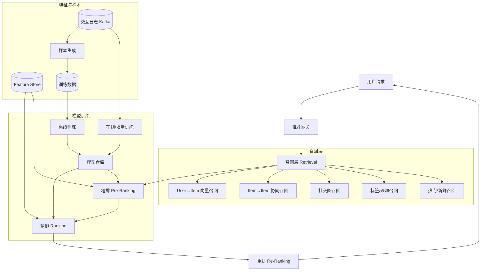

# Design Recommendation System（推荐系统）

---

## 问题定义

设计通用推荐系统，覆盖三类典型场景：

| 场景 | 目标 | 反馈信号 | 关键约束 |
|---|---|---|---|
| **News Feed**（Facebook/Twitter） | 个性化信息流排序 | 点赞、评论、停留时长、分享 | 时效性（新鲜度）、多样性、好友关系权重 |
| **短视频**（TikTok/Reels） | 最大化观看时长/完播率 | 完播率、二次播放、滑走速度、点赞 | 冷启动快速定向、强实时反馈、长尾探索 |
| **好友推荐**（People You May Know） | 推荐可能认识的人 | 加好友、主动 dismiss | 社交图谱稀疏、隐私合规、避免尴尬推荐 |

**核心挑战：** 海量候选（百亿级 item）、毫秒级延迟、冷启动、探索 vs 利用、反馈信号稀疏且偏置。

---

## 规模估算

- DAU：10 亿
- 候选池：视频 10 亿级、用户 30 亿、帖子 每日新增百亿
- 单次请求延迟：< 200ms（P99）
- 每日训练样本：百亿级交互事件
- 特征存储：TB~PB 级

---

## High-Level Design（通用分层架构）

---

## 核心分层详解（通用）

### 1. 召回（Retrieval）
**目标：** 从百亿候选缩到几千，速度优先。多路召回并行，结果取并集。

- **协同过滤（CF）**：User-based / Item-based，基于共现矩阵
- **向量召回（Two-Tower / DSSM）**：User Embedding 与 Item Embedding 分别离线计算，在线 ANN（HNSW/Faiss）检索 Top K
- **图召回**：GraphSAGE / PinSage 在用户-物品-社交图上聚合
- **规则召回**：热门榜、地理位置、新品池、好友互动

### 2. 粗排（Pre-Ranking）
候选 几千 → 几百。用轻量模型（双塔 / 小 DNN）快速打分，平衡精度与延迟。

### 3. 精排（Ranking）
候选 几百 → 几十。重模型预测多目标（CTR、CVR、停留时长等），是效果核心。

### 4. 重排（Re-Ranking）
业务规则层：多样性（MMR / DPP）、打散（同作者不连续）、业务干预（广告插入、新手保护）、探索（ε-greedy / Thompson Sampling）。

---

## 三类场景的模型选择与数据处理

### 场景一：News Feed（信息流）

**业务特点：** 用户关注图谱明确，内容更新快，新鲜度敏感，隐式反馈为主。

**召回：**
- **关注图召回**：直接拉取 following 用户的最新帖子（时间倒序 + 热度加权）
- **兴趣召回**：基于用户历史互动内容的话题 / 标签匹配
- **Two-Tower 向量召回**：用户塔（历史互动序列、社交特征）+ 内容塔（文本 Embedding、作者、话题）

**精排模型：**
- **Wide & Deep / DeepFM**：处理大量 ID 类特征（用户 ID、作者 ID、话题 ID）与连续特征（历史 CTR、新鲜度）
- **Multi-Task**：同时预测 点赞 / 评论 / 分享 / 停留时长，加权合成最终分
- **长短期兴趣建模**：DIN / SIM（Search-based Interest Model），从用户长序列里检索与候选相关的历史

**数据处理关键点：**
- **新鲜度衰减**：`score *= exp(-λ * age_hours)`，避免旧内容堆积
- **位置偏置去偏**：Position-aware 损失，排除 "越靠前越被点击" 的假象
- **负样本采样**：曝光未点击作为负样本，但要区分 "没看到" vs "看到没点"（用 viewport 日志）
- **Feed 端多样性**：避免同一作者 / 话题连续多条

### 场景二：短视频推荐

**业务特点：** 强信号（完播率、播放时长），冷启动频繁（新视频），探索意愿强，反馈延迟低。

**召回：**
- **向量召回（主力）**：视频塔用多模态 Embedding（视频帧 CNN/CLIP + 音频 + 文本字幕 + 作者），用户塔用行为序列
- **协同过滤召回**：Item-CF 基于 "看了 A 又看 B" 的共现
- **热门 / 实时召回**：最近 N 分钟爆款（上升趋势视频）
- **新视频探索池**：单独流量保护新作品，解决冷启动

**精排模型：**
- **多目标 MMoE / PLE**：预测 完播率、有效播放（>5s）、点赞、关注、评论，专家网络共享底层但分化顶层
- **序列建模**：Transformer 对用户观看序列编码，捕捉短时兴趣漂移
- **实时特征**：最近 N 次行为、当前 session 内偏好

**数据处理关键点：**
- **标签构造**：完播率 = 实际播放时长 / 视频时长，需按视频长度分桶（短视频完播易，长视频难）
- **Watch Time 回归**：用加权逻辑回归预测观看时长（YouTube 经典做法）
- **实时特征管道**：Flink 聚合最近 5 分钟行为，秒级更新 Feature Store 在线侧
- **在线学习 / 增量训练**：每小时增量更新模型参数，捕捉热点
- **探索利用平衡**：新视频前 N 次曝光无损失减免，Thompson Sampling 分配流量
- **刷走（Skip）信号**：<3s 滑走当强负样本；滑到底才有效

### 场景三：好友推荐（PYMK）

**业务特点：** 社交图谱稀疏，候选集是用户本身，精度要求高（错误推荐伤害体验），隐私敏感。

**召回：**
- **共同好友（FoF, Friends of Friends）**：二度好友是最强信号，按共同好友数排序
- **社交图嵌入**：Node2Vec / GraphSAGE 在社交图上训练用户 Embedding，相似度召回
- **地理 / 组织召回**：同公司、同学校、同城市
- **通讯录 / 外部信号**：导入通讯录匹配（需用户授权）
- **共现召回**：一起出现在某群组、共同关注同一名人

**排序模型：**
- **GNN 模型**：PinSage / GraphSAGE 直接在图上学习 Edge 预测概率
- **特征工程重要性 > 复杂模型**：共同好友数、二度路径数、共同群组数、地理距离、年龄差、注册时间接近度 → GBDT（XGBoost/LightGBM）往往已经够用
- **召回兼排序**：候选集小（几百-几千），可直接用 GBDT 打分

**数据处理关键点：**
- **图构建**：好友关系边 + 群组 / 评论互动作为弱边；定期全量重建 + 增量更新
- **负样本**：随机采样 或 "曝光未加" 作为负样本，避免全图负采样带来的偏差
- **隐私合规**：不跨用户泄露通讯录、不推荐已 block 用户、被 dismiss 的推荐长期不再出现
- **避免尴尬**：前任、前同事、医生患者关系 → 需要业务规则过滤（部分平台允许用户标记）
- **冷启动新用户**：靠通讯录 / 注册地 / 邀请人展开社交图

---

## 关键 Trade-off

| 决策点 | 选项 A | 选项 B | 推荐 |
|---|---|---|---|
| 训练频率 | 离线 T+1 | 在线 / 增量 | 短视频 B，Feed 混合，好友 A |
| 多目标合成 | 加权求和 | Multi-Task 模型学权重 | B（主流） |
| 召回数量 | 多路少量 | 单路大量 | 多路（鲁棒 + 多样） |
| 探索策略 | ε-greedy | Thompson Sampling | TS（统计上更优） |
| 精排模型复杂度 | 深模型（Transformer） | GBDT + 向量 | 看延迟预算；短视频深，好友浅 |
| 特征存储 | 全量在线 | 离线 + 实时缓存 | B（成本） |

---

## 离线评估 vs 在线 AB

**离线指标：** AUC、GAUC（按用户分组）、NDCG、Recall@K、MAP  
**在线指标：** CTR、停留时长、完播率、留存率、转化率  
**常见错位：** 离线 AUC 涨 ≠ 线上涨。必须以 AB 实验最终判定，离线只做筛选。

---

## 小结

> 推荐系统本质是 **"多路召回 + 多层排序 + 多目标优化"** 的流水线。三类场景差异在于：  
> - **News Feed** 强调新鲜度 + 社交图 + 多目标（互动 / 停留）  
> - **短视频** 强调完播率 + 多模态 Embedding + 实时反馈 + 冷启动探索  
> - **好友推荐** 强调图结构（FoF、GNN）+ 特征工程 + 隐私合规  
>
> 面试讲清三件事：**召回多样性、排序多目标建模、反馈数据的偏置与去偏**（位置偏置、曝光偏置、选择偏置）。
