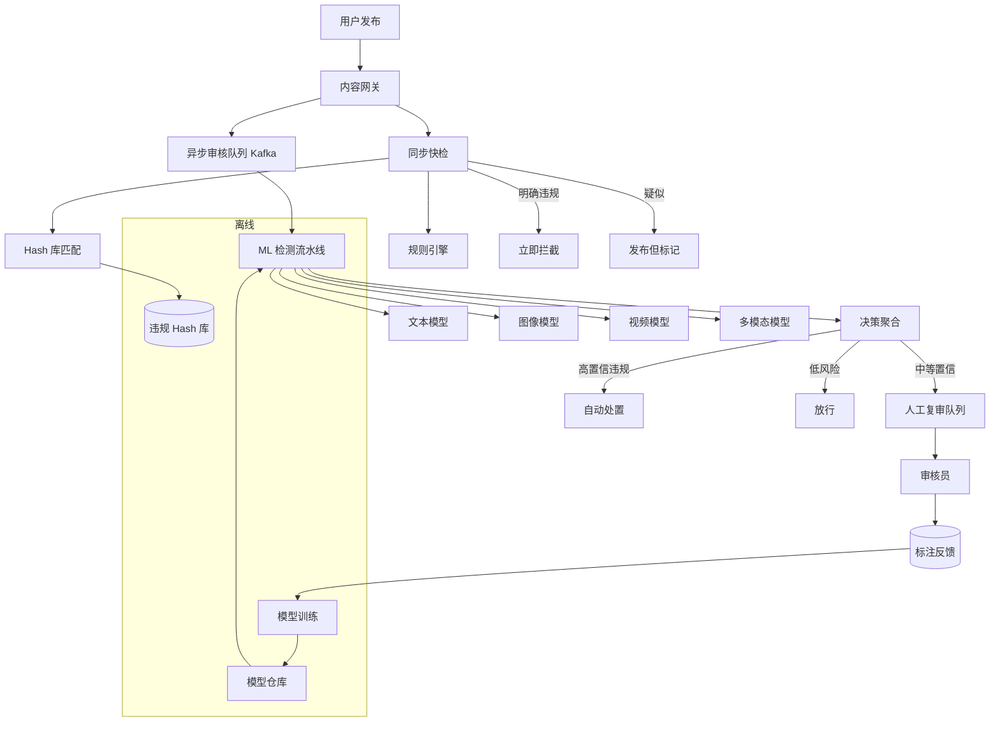

# Design Harmful Content Detection（有害内容检测系统）

---

## 问题定义

设计一个平台级的有害内容检测系统（类似 Meta Integrity / YouTube Trust & Safety），在用户发布的文本 / 图片 / 视频 / 直播流中识别并处置违规内容。

**违规类别：**
- 仇恨言论、骚扰、人身攻击
- 色情、暴力、血腥
- 虚假信息、政治操纵
- 垃圾广告、诈骗、钓鱼链接
- 未成年人安全、自残自杀内容
- 版权侵权

**处置动作：** 删除 / 降权 / 打标签（Sensitive）/ 限流 / 封号 / 转人工复审 / 报告执法。

**核心挑战：** 海量内容（每秒百万条）、多模态、对抗性（用户故意绕过）、多语言、低延迟（发布即审）、误杀成本高、法规合规（GDPR、COPPA、DSA）。

---

## 规模估算

- 每日发布内容：50 亿条
- 峰值 QPS：100 万+
- 检测延迟：发布后 < 1s（文本） / < 30s（视频）
- 误杀率：< 0.1%（否则伤害创作者）
- 漏检率：违规内容 < 1%（否则监管风险）

---

## High-Level Design



---

## 核心组件详解

### 1. 两段式检测（同步 + 异步）

**同步快检（< 50ms）：** 发布路径内联，只跑轻量检查：
- **哈希匹配**：PhotoDNA / PDQ 图像哈希、MD5 文本哈希、ContentID 音视频指纹 → 秒级命中已知违规
- **规则引擎**：关键词黑名单、正则、URL 黑名单、用户风险分
- **轻量分类器**：小模型 ONNX，做粗筛

**异步深检（秒级~分钟级）：** 发布成功后进队列，跑重模型：
- 大模型（BERT / CLIP / ViT）多分类
- 多模态融合（文本 + 图片 + OCR 结果）
- 上下文检测（结合用户历史、评论区互动）

**理由：** 发布延迟敏感，不能全部跑深模型；但漏检成本高，所以异步兜底并可追溯撤回。

### 2. 哈希 / 指纹库

处理 **已知违规内容的大规模复发**（同一张 CSAM 图片被反复上传）。

- **PhotoDNA**（微软）：感知哈希，抗裁剪、缩放、颜色变化
- **PDQ**（Meta 开源）：类似 PhotoDNA，汉明距离匹配
- **TMK+PDQF**：视频指纹
- **SimHash**：文本近似重复

部署：内存中维护 亿级哈希，LSH 加速近邻搜索。新举报内容审核确认后立即入库，全球同步。

### 3. ML 模型选择

| 内容类型 | 主力模型 | 说明 |
|---|---|---|
| 文本 | BERT / RoBERTa / XLM-R（多语言） | 多标签分类；细分语言用专用模型 |
| 图像 | ViT / CLIP / EfficientNet | 色情 / 暴力 / 血腥分类；CLIP 支持 Zero-shot 新类别 |
| 视频 | 关键帧采样 + 图像模型 + 音频模型（Wav2Vec） | 长视频抽帧 + 时序聚合 |
| OCR | Tesseract / PaddleOCR + 文本模型 | 图里藏字是常见绕过手段 |
| 多模态 | CLIP / BLIP / LLaVA | 图文不一致检测（SFW 图 + NSFW 配文） |
| 直播 | 实时抽帧 + 流式模型 | 秒级延迟，下线用户优先级 |

**LLM 的作用：** 用 LLM（Llama Guard、GPT-4）做复杂判断（反讽、政治立场、阴谋论），但成本高，只在高不确定样本上用。

### 4. 决策聚合与阈值

单模型输出概率，系统需综合：
- 多模型投票 / 加权
- 用户风险分（历史违规率、账号年龄、IP 地理）
- 分类别分阈值：CSAM 零容忍（低阈值立即删除），成人内容高阈值（减少误杀）

**分层处置：**
```
P > 0.95  → 自动删除 + 封号
0.7 < P < 0.95 → 人工复审
0.3 < P < 0.7  → 降权 / 限流
P < 0.3   → 放行
```

### 5. 人工复审（HITL）

- **任务分发**：按语言 / 类别路由到对应审核员
- **优先级排队**：高传播量内容优先（已 10 万播放 vs 10 播放）
- **双人复核**：高争议类别要多审核员一致
- **分歧仲裁**：升级到资深审核或政策团队
- **审核员健康**：接触有害内容有心理成本，需轮岗 + 心理支持
- **标注反馈闭环**：审核结论回流作为训练数据

### 6. 对抗与鲁棒性

用户会主动绕过检测：
- **文字变形**：v1agra、哈希符号、Unicode 相似字符 → 文本归一化（NFKC）+ 拼音 / 字形变体展开
- **图像扰动**：加噪、旋转、裁剪 → 感知哈希 + 数据增强训练
- **跨模态伪装**：正常图 + 违规配文 → 多模态联合建模
- **账号小号分散**：行为图检测关联账号

**Red Team**：专职团队模拟攻击，持续发现绕过手段并更新模型。

### 7. 反馈与再训练

```
用户举报 + 审核员标注 → 数据湖
            ↓
难例挖掘（主动学习）：模型置信度 0.4~0.6 的样本优先标注
            ↓
每日 / 每周增量训练
            ↓
Shadow Traffic 验证 → AB 测试 → 全量
```

---

## 关键 Trade-off

| 决策点 | 选项 A | 选项 B | 推荐 |
|---|---|---|---|
| 检测路径 | 全同步 | 同步快检 + 异步深检 | B |
| 阈值策略 | 统一阈值 | 按类别 / 地区分阈值 | B |
| 模型 | 单一大模型 | 分类别小模型 + LLM 难例 | B |
| 新违规类别上线 | 重新训练 | CLIP Zero-shot / Prompt | B 先上线再训练 |
| 审核员 | 集中 | 分布式多地区多语言 | B |
| 误杀 vs 漏检 | 低阈值（漏少） | 高阈值（杀少） | 按类别权衡，CSAM 零容忍 |

---

## 合规与争议

- **GDPR / 用户申诉**：删除后必须提供申诉渠道，误杀需可恢复（软删除而非硬删）
- **透明度报告**：季度披露删除量、类别、申诉成功率
- **司法管辖**：不同国家违规定义不同（政治敏感词、LGBTQ 内容），需按地区生效
- **隐私 vs 检测**：端到端加密（E2EE）平台无法做服务端扫描，只能靠客户端哈希（如 Apple CSAM 方案，争议很大）

---

## 小结

> 有害内容检测的核心模式是 **"同步快检 + 异步深检 + 人工兜底 + 反馈闭环"**。  
> 关键设计点：**哈希库防复发、分类别分阈值、多模态联合建模、对抗鲁棒性、HITL 标注回流**。  
> 面试时讲清楚：为什么要两段式（延迟 vs 精度）、为什么要分类别阈值（误杀成本不同）、如何应对对抗（绕过与 Red Team）、如何形成数据飞轮（人工标注→训练）。
