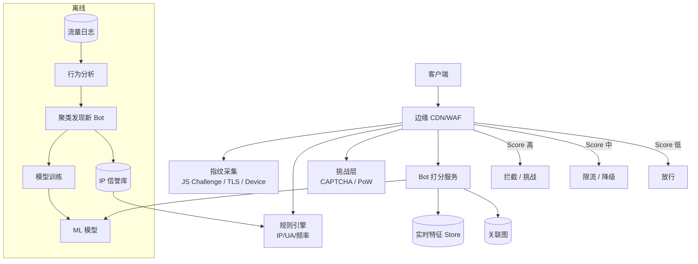

# Design Bot Detection（Bot 检测 / 反滥用系统）

---

## 问题定义

设计一个平台级的 Bot 检测系统，识别并处置自动化流量（爬虫、刷量、Credential Stuffing、薅羊毛、刷粉、广告欺诈、DDoS）。

**Bot 种类：**
- **Good Bot**：搜索引擎爬虫、监控机器人（Googlebot、Pingdom）→ 放行但限速
- **Gray Bot**：数据爬取、竞品抓取 → 限流或拦截
- **Bad Bot**：
  - Credential Stuffing（撞库）
  - Scraping（爬内容 / 价格）
  - Account Takeover（盗号）
  - Fake Account / Spam Registration
  - 刷量（Impression Fraud、点赞 / 粉丝刷量）
  - Scalping（抢票、抢购）
  - DDoS / Layer-7 攻击

**核心挑战：** 攻防对抗（攻击者持续进化）、低误杀（真人体验优先）、高对抗性（IP 池、指纹伪造、Headless 浏览器）、延迟敏感（登录 / 结算路径）。

---

## 规模估算

- 总流量：100 万 QPS
- Bot 占比：30~50%（行业平均）
- 检测延迟：< 50ms（内联拦截路径）
- 误杀率：< 0.01%（人类被误拦代价高）
- 特征维度：数百~数千

---

## High-Level Design

---

## 核心检测信号

### 1. 网络层信号
- **IP 信誉**：数据中心 IP（AWS/GCP/Azure ASN）、代理 / VPN / Tor 出口节点、历史恶意 IP
- **ASN / 地理**：不合常理的 ASN 组合（如某国家突然来自某数据中心）
- **TCP / TLS 指纹**：JA3 / JA4 指纹识别客户端库（Python requests vs 真浏览器）→ 程序化工具 TLS 指纹和真实浏览器不同
- **HTTP/2 指纹**：Akamai 的 HTTP/2 fingerprinting

### 2. 浏览器指纹
- **User-Agent + Header 顺序**：浏览器 header 顺序固定，伪造容易错乱
- **Canvas / WebGL 指纹**：GPU 渲染结果作为指纹
- **Font / Screen / Timezone**：设备属性组合
- **Headless 检测**：`navigator.webdriver`、缺失的 `chrome` 对象、Puppeteer Stealth 的残留特征
- **JS Challenge**：发送一段 JS 要求客户端执行返回结果，检测是否真浏览器执行环境

### 3. 行为信号
- **请求频率**：单 IP / 账号 QPS 分布
- **访问模式**：只爬 API 不加载静态资源（真人浏览器一定加载 CSS/JS/图片）
- **鼠标 / 键盘轨迹**：真人有不规则抖动，Bot 常直线 / 等间隔
- **页面停留时长、滚动模式、点击位置分布**
- **会话连贯性**：真人会浏览多个页面，Bot 常固定 URL 反复命中

### 4. 账号 / 业务信号
- **注册密度**：同 IP / 同设备短期注册多账号
- **账号年龄、邮箱域名**（10分钟邮箱、一次性邮箱）
- **图关联**：同设备指纹下关联账号簇、同支付卡号、同收货地址
- **业务行为异常**：新号立即大额下单、0 元购、新号发外链

### 5. 挑战层（Active Challenge）
- **CAPTCHA**：reCAPTCHA v2/v3、hCaptcha、Turnstile（Cloudflare 无感）
- **Proof-of-Work**：让客户端算一小段 hash（对单个请求几乎无感，对百万级 bot 成本陡增）
- **Device Attestation**：iOS App Attest、Android Play Integrity

---

## 模型选择

| 场景 | 模型 | 说明 |
|---|---|---|
| 实时打分（内联） | GBDT / LightGBM / XGBoost | 毫秒级推理，可解释 |
| 异常检测 | Isolation Forest / Autoencoder | 无监督发现未知 bot 类型 |
| 聚类发现 bot 簇 | DBSCAN / HDBSCAN on 指纹特征 | 离线批处理，找同源攻击 |
| 行为序列 | LSTM / Transformer on click stream | 建模会话行为 |
| 图关联 | GNN / Connected Components | 发现设备-账号-IP 关联团伙 |
| 深度指纹 | DNN on 高维指纹 | 难解释但精度高 |

**实践：** 一线厂商多用 **规则引擎（硬信号）+ GBDT（软信号）+ 离线图聚类（发现团伙）** 的组合。

---

## 分层处置策略

| Score | 处置 | 理由 |
|---|---|---|
| 极高 | 直接 403 / 黑洞 | 明确 bot |
| 高 | 强 CAPTCHA / 挑战 | 让真人通过，bot 卡住 |
| 中 | 限流 / 降级（缓存老数据） | 容忍但不信任 |
| 低 | 打分但放行，埋点收集 | 避免误杀 |

**不要直接拒绝**：告诉攻击者被识别了反而帮他调参。静默降级（假数据、极慢响应、限流）更有效。

---

## 数据处理与反馈闭环

1. **日志采集**：边缘节点 → Kafka → 数据湖（所有请求维度特征）
2. **标签生成**：
   - 硬标签：已验证的撞库攻击、CAPTCHA 失败多次、已知恶意 IP
   - 弱标签：业务风控回溯（下单后退款异常、账号被封）
   - 对抗性标注：人工分析 bot 流量样本
3. **特征存储**：实时侧 Redis（单 IP QPS、单账号近 5 分钟行为），离线侧 Hive
4. **模型训练**：每日增量 + 每周全量；严格时间切分防数据泄漏
5. **线上反馈**：CAPTCHA 通过率、业务侧后验违规率作为回流信号

---

## 攻防对抗

Bot 方持续进化，常见手段：
- **住宅代理 IP 池**（Bright Data 等）→ 无法纯靠 IP
- **真实浏览器 Headless + Stealth 插件** → 无法纯靠浏览器指纹
- **打 CAPTCHA 平台**（人工打码、2Captcha）→ CAPTCHA 通过率不再可信
- **录制回放真人轨迹** → 行为信号也会被模仿

**应对：**
- **多信号融合**：任何单一信号都可绕过，组合起来成本大增
- **持续对抗演练**：Red Team 模拟新 bot，更新规则 / 特征
- **成本不对称**：让 bot 每次攻击成本上升（PoW、Token 消耗、必须算法验签）
- **主动诱捕（Honeypot）**：埋 bot 才会点的隐藏链接，被点即判定

---

## 关键 Trade-off

| 决策点 | 选项 A | 选项 B | 推荐 |
|---|---|---|---|
| 检测位置 | 边缘（CDN/WAF） | 应用层 | 边缘主，应用层兜底业务风控 |
| 拦截方式 | 硬拒绝 403 | 静默降级 / 假数据 | B（不暴露规则） |
| CAPTCHA | 显式 v2 | 隐式 v3 / Turnstile | 隐式（体验好），高风险场景升级为显式 |
| 模型 | 纯深度学习 | 规则 + GBDT + 图 | B（可解释、可迭代） |
| 阻断时机 | 登录 / 注册 / 下单内联 | 事后风控 | 关键节点内联；低风险路径事后 |

---

## 与相邻系统的关系

- **WAF / DDoS 防护**：L3/L4 流量清洗在 Bot 检测之前
- **业务风控**：本系统侧重 "是不是 bot"，业务风控侧重 "这个动作有没有欺诈"（可能是真人恶意）
- **Account Security**：登录成功后的设备变更、异地登录告警是独立系统
- **反垃圾 / 内容审核**：Bot 生成的垃圾内容 → 交给有害内容检测（互补）

---

## 小结

> Bot 检测的本质是 **"多层信号融合 + 分层处置 + 持续对抗"**。  
> 关键设计点：**网络 / 浏览器 / 行为 / 业务四类信号联合，规则引擎 + GBDT + 图聚类的组合，静默降级而非硬拒绝，数据飞轮闭环训练**。  
> 面试讲清楚：为什么不能单靠 CAPTCHA、为什么要静默降级、如何对抗住宅代理 + Headless 伪装、如何做人机比例评估和模型离线 / 在线验证。
