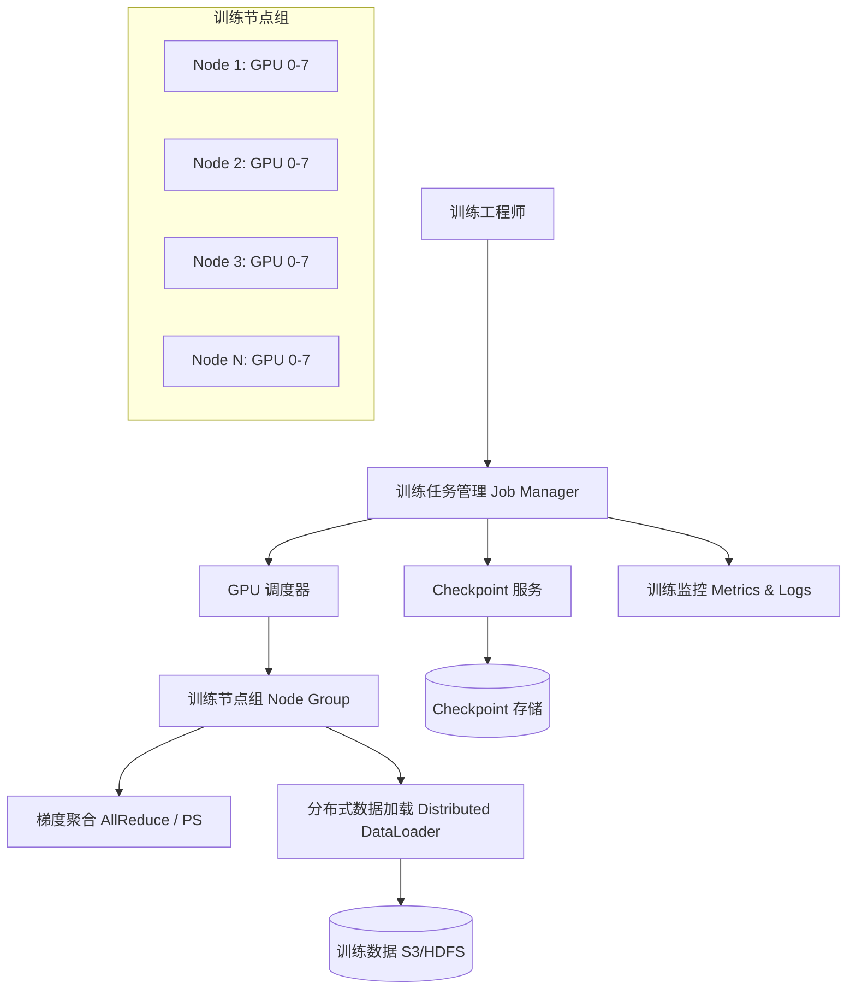

# Design Distributed Training System（分布式训练系统）

---

## 问题定义

设计一个支持大规模模型训练的分布式训练系统，核心功能：
- 支持数据并行（Data Parallelism）、模型并行（Model Parallelism）、流水线并行（Pipeline Parallelism）
- 跨多机多卡的梯度同步与聚合
- 高效利用 GPU 集群资源，最小化通信开销
- 支持弹性训练（Elastic Training），容忍节点故障

**核心挑战：** 通信瓶颈（梯度同步）、GPU 利用率、大模型显存不足、节点故障恢复。

---

## 规模估算

- 训练集群规模：数千到数万张 GPU（H100/A100）
- 模型参数量：数十亿到万亿参数
- 单次训练周期：数天到数周
- 单卡显存：80GB（A100/H100），大模型远超单卡容量

---

## High-Level Design

---

## 核心组件详解

### 1. 并行策略

**数据并行（Data Parallelism）：** 每张 GPU 持有完整模型副本，各自处理不同数据 mini-batch，训练后通过 AllReduce 同步梯度。适合模型能放入单卡的场景。

**模型并行（Tensor Parallelism）：** 将模型的某一层（如大矩阵乘法）切分到多张 GPU 上并行计算。通信频繁（每层前向/反向都需同步），要求 GPU 间高带宽（NVLink/NVSwitch）。

**流水线并行（Pipeline Parallelism）：** 将模型按层切分到不同 GPU，形成流水线。GPU 0 负责前几层，GPU 1 负责后几层。问题：流水线气泡（Pipeline Bubble）导致 GPU 空闲。解决：微批次（Micro-batching），如 GPipe、PipeDream。

**混合并行（3D Parallelism）：** 大模型训练通常组合使用三种并行：节点内用 Tensor Parallelism（高带宽 NVLink），节点间用 Pipeline Parallelism + Data Parallelism（较低带宽网络）。

| 并行策略 | 通信量 | 适用场景 | 典型框架 |
|---|---|---|---|
| 数据并行 | 梯度大小 × 节点数 | 模型可放入单卡 | PyTorch DDP |
| 张量并行 | 每层激活值 | 超大单层（如 Attention） | Megatron-LM |
| 流水线并行 | 层间激活值 | 超深模型 | DeepSpeed, GPipe |
| 3D 混合并行 | 综合 | 千亿/万亿参数模型 | Megatron-DeepSpeed |

### 2. 梯度同步机制

**AllReduce（去中心化）：** 所有节点两两通信，聚合梯度后每个节点拿到全局梯度均值。实现：Ring-AllReduce（带宽最优）、Tree-AllReduce（延迟最优）。框架：NCCL（NVIDIA）。

**Parameter Server（中心化）：** 专门的 PS 节点存储参数，Worker 推送梯度、拉取更新后的参数。优点：支持异步更新。缺点：PS 是瓶颈，且异步更新可能导致梯度陈旧（Stale Gradient）。

| 方案 | 优点 | 缺点 | 适用场景 |
|---|---|---|---|
| AllReduce | 无中心瓶颈，同步更新 | 最慢节点拖慢全局（Straggler） | 同构 GPU 集群 |
| Parameter Server | 支持异步，容忍慢节点 | PS 是瓶颈，梯度可能陈旧 | 异构环境、稀疏模型 |

### 3. 通信优化

**梯度压缩（Gradient Compression）：** 将梯度从 FP32 压缩到 FP16/BF16，通信量减半。混合精度训练（Mixed Precision Training）同时减少计算量和通信量。

**梯度累积（Gradient Accumulation）：** 多个 micro-batch 的梯度在本地累积后再做一次 AllReduce，减少通信频次。

**计算-通信重叠（Overlap）：** 在反向传播计算下一层梯度的同时，异步发送上一层已计算完的梯度。PyTorch DDP 默认支持此优化。

### 4. 弹性训练（Elastic Training）

大规模集群中 GPU 故障是常态（万卡集群每天数次）：
- **心跳检测：** 定期检查每个节点存活状态
- **故障恢复：** 检测到节点失败后，从最近 Checkpoint 恢复，重新分配剩余节点继续训练
- **弹性伸缩：** 支持训练过程中动态增减节点数（如 PyTorch Elastic / TorchElastic）
- **冗余计算：** 关键节点做冗余计算，故障时无缝切换

### 5. 分布式数据加载

- 每个 Worker 加载不同的数据分片（Sharding），避免重复
- 数据预取（Prefetch）：在 GPU 训练当前 batch 时，CPU 预加载下一个 batch
- 数据存储在分布式文件系统（HDFS/S3），本地 SSD 做缓存
- Shuffle 在 Epoch 级别做，保证每个 Epoch 数据顺序不同

---

## 关键 Trade-off

| 决策点 | 选项 A | 选项 B | 推荐 |
|---|---|---|---|
| 梯度同步 | AllReduce（同步） | Parameter Server（异步） | AllReduce（主流 LLM 训练标配） |
| 并行策略 | 纯数据并行 | 3D 混合并行 | 模型放不进单卡时用 3D |
| 精度 | FP32 全精度 | BF16 混合精度 | BF16（性能翻倍，精度损失极小） |
| 故障恢复 | 整体重启 | 弹性恢复（Elastic） | B（万卡集群必须弹性恢复） |

---

## 小结

> 分布式训练系统的核心是**并行策略选择和通信效率优化**。面试时重点讲清楚：三种并行策略的适用场景和组合方式（3D Parallelism）、AllReduce vs Parameter Server 的 trade-off、通信优化技术（梯度压缩、计算通信重叠）、以及大规模集群的容错机制。
