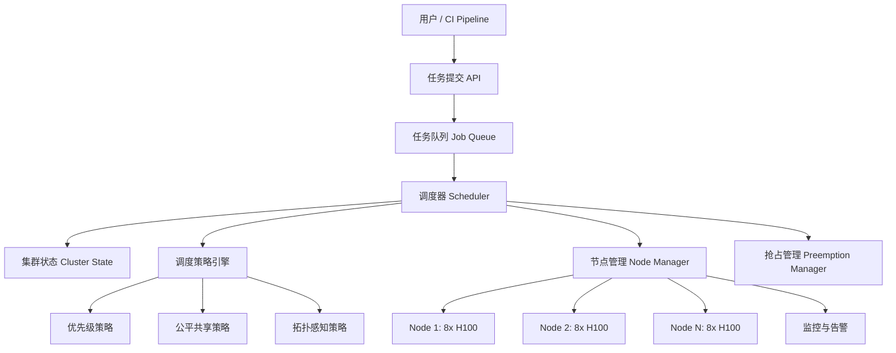

# Design GPU Cluster Scheduler（GPU 集群调度器）

---

## 问题定义

设计一个 GPU 集群调度系统，核心功能：
- 管理数千到数万张 GPU 的分配与调度
- 支持多种任务类型：训练、推理、数据处理
- Gang Scheduling：一个训练任务的所有 GPU 必须同时分配
- 支持优先级、抢占、公平共享等调度策略
- 最大化 GPU 利用率，减少资源碎片

**核心挑战：** GPU 资源碎片化、Gang Scheduling 的死锁风险、多租户公平性、拓扑感知调度。

---

## 规模估算

- GPU 总量：10,000 - 100,000 张
- 并发任务数：数百到数千
- 单个大模型训练任务可能占用 256-2048 张 GPU
- GPU 单价高（H100 约 $30K），利用率每提升 1% 意味着巨大成本节约

---

## High-Level Design



---

## 核心组件详解

### 1. 任务模型

```
Job:
  - job_id: 唯一标识
  - user / team: 所属团队
  - priority: 优先级（P0-P3）
  - gpu_count: 需要的 GPU 数量
  - gpu_type: GPU 型号要求（H100/A100）
  - topology: 拓扑要求（同机 / 同机架 / 同 Pod）
  - max_runtime: 最大运行时间
  - preemptible: 是否可被抢占
```

### 2. 调度策略

**FIFO + Priority：** 基础策略，高优先级任务优先调度。问题：低优先级任务可能饿死（Starvation）。

**公平共享（Fair Share）：** 每个团队按配额（Quota）分配 GPU 份额。未使用的份额可被其他团队借用（Borrowing），原团队需要时可回收。类似 YARN 的 Capacity Scheduler。

**Dominant Resource Fairness (DRF)：** 多维资源（GPU、CPU、内存）场景下的公平策略，按每个用户的"主导资源"份额做公平分配。

**Bin-Packing vs Spread：**

| 策略 | 机制 | 优点 | 缺点 |
|---|---|---|---|
| Bin-Packing | 尽量将任务打包到少数节点 | 减少碎片，空出整机给大任务 | 热点节点负载高 |
| Spread | 尽量将任务分散到不同节点 | 负载均衡 | 资源碎片化严重 |

### 3. Gang Scheduling

分布式训练要求所有 GPU 同时就绪（All-or-Nothing）：
- **挑战：** 需要 256 张 GPU 的任务，如果只有 200 张空闲，就无法调度，但这 200 张也不能分给其他任务（否则大任务永远凑不齐）
- **解决方案：**
  - **Backfill Scheduling：** 空闲 GPU 先分给小任务，但设置"可抢占"标记，大任务凑齐后抢占回来
  - **Reservation：** 为大任务预留资源，随着小任务完成逐步积累到所需数量
  - **Coscheduling：** 调度器一次性原子分配所有 GPU，避免部分分配导致的死锁

### 4. 拓扑感知调度（Topology-Aware Scheduling）

GPU 间通信带宽差异巨大：
- 同一节点内 GPU（NVLink）：600 GB/s
- 同一机架节点间（InfiniBand）：400 Gb/s
- 跨机架（网络）：100 Gb/s

调度器应尽量将需要高通信带宽的 GPU（如 Tensor Parallelism 组）调度到同一节点，Pipeline Parallelism 组可以跨节点。

**拓扑模型：**
```
集群 → Pod → 机架（Rack）→ 节点（Node）→ GPU
```

调度时的偏好：同节点 > 同机架 > 同 Pod > 跨 Pod

### 5. 抢占机制（Preemption）

高优先级任务可以抢占低优先级任务的 GPU：
- **Checkpoint-based 抢占：** 通知被抢占任务保存 Checkpoint，然后释放资源。被抢占任务稍后恢复。
- **Graceful Period：** 给被抢占任务一个宽限期（如 5 分钟）保存状态
- **抢占成本评估：** 优先抢占运行时间短的任务（损失少）、可被抢占标记的任务

### 6. 资源碎片管理

**碎片化问题：** 集群有 1000 张空闲 GPU，但分散在 200 个节点上，每个节点只有 5 张空闲，无法满足需要 8 卡的任务。

**解决方案：**
- **整理（Defragmentation）：** 将运行中的任务迁移合并，腾出整机。代价高，需要 Checkpoint + 恢复。
- **Bin-Packing 策略：** 前置预防，优先填满节点减少碎片产生
- **弹性任务：** 允许任务在非最优拓扑下运行（如跨节点），降低对整机的刚性需求

---

## 关键 Trade-off

| 决策点 | 选项 A | 选项 B | 推荐 |
|---|---|---|---|
| 调度模式 | 集中式调度器 | 分层调度（全局 + 节点级） | 万卡以上用分层 |
| 碎片策略 | Bin-Packing | Spread | Bin-Packing（大任务为主的集群） |
| 抢占 | 立即 Kill | Graceful Checkpoint | B（减少浪费） |
| 公平性 | 严格配额 | 配额 + Borrowing | B（提高利用率） |

---

## 小结

> GPU 集群调度的核心是**资源利用率最大化和多租户公平性**。面试时重点讲清楚：Gang Scheduling 的挑战与解决方案、拓扑感知调度的必要性（NVLink vs InfiniBand 带宽差异）、碎片化问题的应对策略、以及抢占机制与 Checkpoint 的配合。
