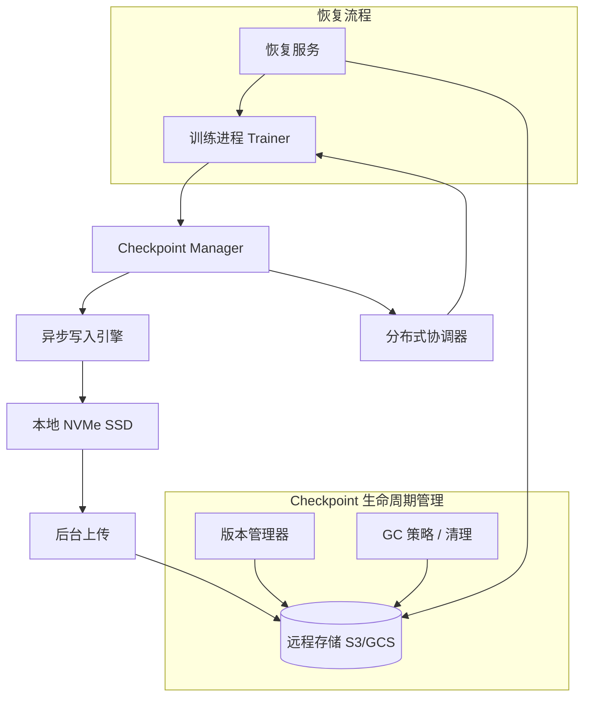

# Design Model Checkpoint System（模型 Checkpoint 系统）

---

## 问题定义

设计一个大规模模型训练的 Checkpoint 系统，核心功能：
- 定期保存训练状态（模型权重、优化器状态、训练进度），支持断点续训
- 最小化 Checkpoint 对训练吞吐量的影响
- 支持超大模型（数百 GB 到 TB 级）的高效保存与恢复
- 管理多版本 Checkpoint，支持回退

**核心挑战：** Checkpoint 文件巨大（TB 级）、保存过程阻塞训练、分布式一致性、存储成本。

---

## 规模估算

- 模型权重：70B 参数 × FP16 = ~140 GB
- 优化器状态（Adam）：3x 模型大小 = ~420 GB
- 单次完整 Checkpoint：~560 GB
- Checkpoint 频率：每 10-30 分钟一次
- 训练周期：数周 → 数千个 Checkpoint 版本

---

## High-Level Design



---

## 核心组件详解

### 1. Checkpoint 内容

一个完整 Checkpoint 包含：
- **模型权重（Model Weights）：** 所有层的参数张量
- **优化器状态（Optimizer State）：** Adam 的 momentum 和 variance（体积是模型权重的 2-3 倍）
- **学习率调度器状态：** 当前学习率、warmup 步数等
- **训练元数据：** 当前 step、epoch、数据加载器位置、随机数种子
- **分布式状态：** 各 rank 的分片信息（FSDP/ZeRO 场景）

### 2. 异步 Checkpoint（核心优化）

**同步保存的问题：** 训练暂停 → 所有 GPU 将显存中的状态写入存储 → 写完后继续训练。TB 级数据写入可能耗时数分钟，期间 GPU 完全空闲。

**异步保存方案：**
```
1. 训练到 Checkpoint 步时，将 GPU 显存中的状态拷贝到 CPU 内存（GPU→CPU 拷贝速度快，秒级）
2. GPU 立即继续下一步训练
3. 后台线程将 CPU 内存中的状态写入本地 SSD
4. 另一个后台线程将本地 SSD 数据上传到远程存储（S3）
```

**关键点：** GPU→CPU 拷贝必须是一致性快照（所有 GPU 在同一个 training step 做拷贝）。使用 CUDA Event 同步确保所有 GPU 完成当前 step 后再拷贝。

### 3. 分布式 Checkpoint

**ZeRO / FSDP 场景：** 模型状态分片到多张 GPU，每张 GPU 只保存自己的分片（Shard）。
- 每个 rank 独立保存自己的分片文件
- 保存一份 metadata 文件描述分片方式
- 恢复时按 metadata 重新分配分片（支持不同并行度恢复）

**Resharding（重分片）：** 训练可能需要更换并行度（如从 256 卡扩到 512 卡）。Checkpoint 恢复时需要重新切分状态，这要求保存格式支持灵活的 resharding。

### 4. 增量 Checkpoint（Delta Checkpoint）

**全量保存的开销：** 每次保存完整的 560 GB 状态。

**增量方案：** 只保存与上一次 Checkpoint 的差异（Delta）。
- 比较当前参数与上一版本，只保存变化的张量
- 优点：大幅减少写入量（训练后期参数变化小）
- 缺点：恢复时需要从基线 + 多个 Delta 重建，恢复速度慢
- 实践：每 N 次增量保存做一次全量保存

### 5. 存储层设计

```
热存储（本地 NVMe SSD）：最近 2-3 个 Checkpoint，快速恢复
温存储（分布式文件系统）：最近数十个 Checkpoint
冷存储（S3/GCS）：所有历史 Checkpoint，长期保留
```

**生命周期管理（GC 策略）：**
- 保留最近 N 个全量 Checkpoint
- 保留每天/每周的里程碑 Checkpoint
- 自动清理过期 Checkpoint 释放存储空间
- 关键实验的 Checkpoint 标记为"永不删除"

### 6. 恢复流程

```
1. 从 metadata 确定最新有效 Checkpoint
2. 从远程存储下载 Checkpoint 分片到本地 SSD（并行下载）
3. 各 rank 加载自己的分片到 GPU 显存
4. 如需 resharding，先在 CPU 上合并再重新切分
5. 恢复数据加载器位置和随机数种子
6. 继续训练
```

**恢复速度优化：** 预热（Pre-stage）——在训练启动前提前将 Checkpoint 下载到本地 SSD。

---

## 关键 Trade-off

| 决策点 | 选项 A | 选项 B | 推荐 |
|---|---|---|---|
| 保存方式 | 同步保存 | 异步保存（GPU→CPU→SSD→S3） | B（训练吞吐几乎不受影响） |
| Checkpoint 粒度 | 全量保存 | 增量 + 定期全量 | 按场景选择，增量省空间 |
| 保存格式 | 框架原生格式（PyTorch） | 自定义 Reshardable 格式 | B（支持并行度变更） |
| 保存频率 | 高频（每 5 分钟） | 低频（每 30 分钟） | 按 GPU 故障率和训练成本权衡 |

---

## 小结

> Checkpoint 系统的核心是**最小化对训练的干扰，同时保证可靠恢复**。面试时重点讲清楚：异步 Checkpoint 的流水线设计（GPU→CPU→SSD→S3）、分布式 Checkpoint 的分片与 Resharding 问题、存储分层与生命周期管理、以及恢复流程的优化策略。
