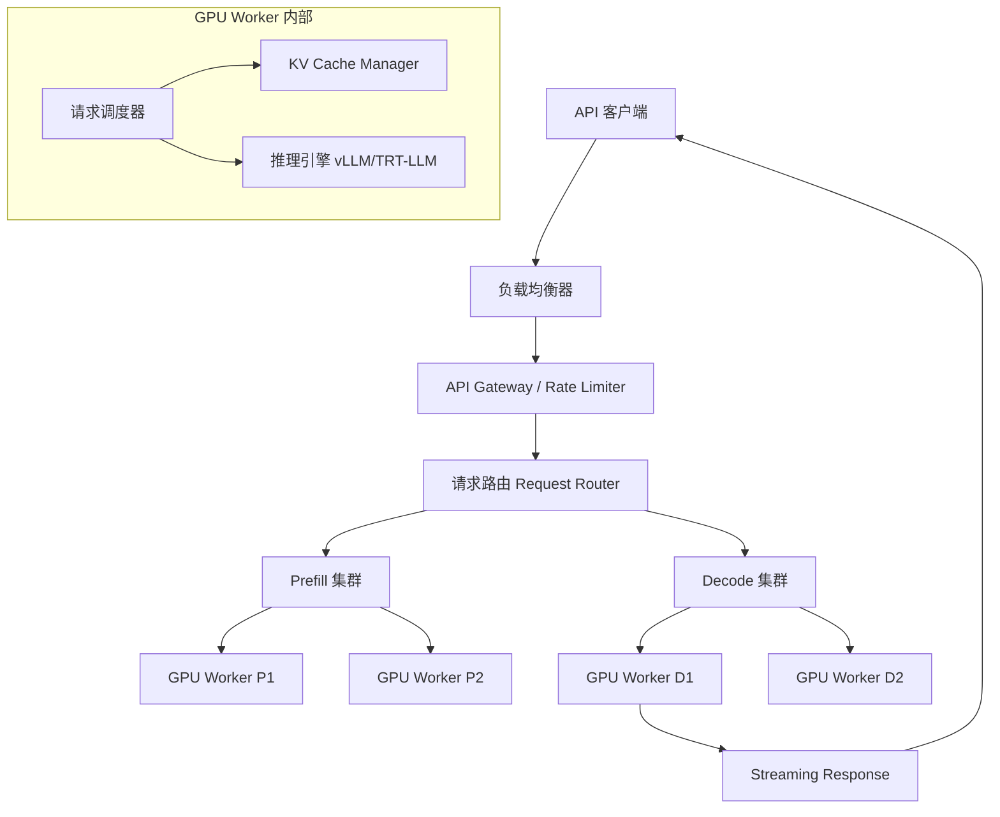

# Design LLM Serving System（LLM 推理服务系统）

---

## 问题定义

设计一个大语言模型推理服务系统，核心功能：
- 接收用户 Prompt，返回模型生成的文本（支持 Streaming）
- 高吞吐量：同时服务大量并发请求
- 低延迟：首 Token 延迟（TTFT）和 Token 间延迟（TBT）
- 高效利用 GPU 显存和算力

**核心挑战：** KV Cache 显存管理、批处理优化、Prefill 与 Decode 阶段的资源竞争、长序列支持。

---

## 规模估算

- 并发请求数：数万到数十万
- 模型大小：70B-400B+ 参数
- 单请求延迟要求：TTFT < 1s，TBT < 50ms
- 单张 H100 推理吞吐：约 1000-3000 tokens/s（取决于批大小和模型）

---

## High-Level Design

---

## 核心组件详解

### 1. LLM 推理的两个阶段

**Prefill（预填充）：** 处理用户输入的全部 Prompt Token，并行计算所有 Token 的 Attention，生成第一个输出 Token。Prefill 是**计算密集型**，GPU 算力是瓶颈。

**Decode（解码）：** 逐个生成后续 Token，每一步只计算一个新 Token 的 Attention（复用之前的 KV Cache）。Decode 是**显存带宽密集型**，受限于 KV Cache 读取速度。

| 阶段 | 特点 | 瓶颈 | 延迟指标 |
|---|---|---|---|
| Prefill | 处理整个 Prompt，可并行 | GPU 计算 | TTFT（Time to First Token） |
| Decode | 逐 Token 生成，串行 | 显存带宽 | TBT（Time Between Tokens） |

### 2. KV Cache 管理（核心难点）

**KV Cache 是什么：** Transformer 模型中，每一层的 Attention 计算会产生 Key 和 Value 张量。Decode 阶段需要复用所有历史 Token 的 KV 值，因此必须将其缓存在 GPU 显存中。

**显存占用：** 70B 模型，序列长度 4K，单请求 KV Cache ≈ 2-4 GB。显存 80GB 的 GPU 只能同时服务 10-20 个请求。

**PagedAttention（vLLM 核心创新）：** 借鉴操作系统虚拟内存的分页思想：
- KV Cache 不预分配连续显存，而是按需分配固定大小的 Page（如 16 Token 一个 Page）
- 显存利用率从 ~50% 提升到 ~95%（消除内部碎片）
- 支持 KV Cache 的 Copy-on-Write（Beam Search 场景共享前缀）

### 3. Continuous Batching（连续批处理）

**传统 Static Batching：** 一批请求一起开始，等最长的请求完成后整批返回。短请求被迫等待长请求，GPU 利用率低。

**Continuous Batching：** 在每个 Decode Step 检查：
- 有请求生成完毕 → 移出 Batch
- 有新请求在等待 → 加入 Batch（先做 Prefill）
- GPU 始终保持满负载

**效果：** 吞吐量相比 Static Batching 提升 5-20 倍。

### 4. Prefill-Decode 分离（Disaggregated Serving）

Prefill 和 Decode 的资源特征不同，混合在同一 GPU 上会互相干扰：
- Prefill 的大量计算会阻塞 Decode 的逐 Token 生成，导致 TBT 抖动

**分离架构：**
- Prefill 集群：高算力 GPU，专门做 Prompt 处理
- Decode 集群：高显存带宽 GPU，专门做 Token 生成
- Prefill 完成后将 KV Cache 传输到 Decode 节点

**Trade-off：** KV Cache 传输增加网络开销，但换来更稳定的延迟和更高的整体吞吐。

### 5. 请求调度策略

**FCFS（先来先服务）：** 简单，但长请求占用资源久。

**Shortest Job First（SJF）：** 优先处理短请求。问题：无法提前知道生成长度。可用启发式预测（基于 Prompt 长度或 max_tokens）。

**Preemption（抢占）：** 当显存不足时，暂停低优先级请求，将其 KV Cache Swap 到 CPU 内存，腾出空间给高优先级请求。稍后再 Swap 回来继续。

### 6. 推理优化技术

**Speculative Decoding（投机采样）：** 用一个小模型快速生成 K 个候选 Token，再用大模型一次性验证。如果全部正确，相当于一步生成了 K 个 Token。加速 2-3 倍。

**Prefix Caching：** 相同 System Prompt 的请求共享 KV Cache 前缀，避免重复计算。适用于 API 服务中大量请求共享同一 System Prompt 的场景。

**量化推理（Quantization）：** INT8/INT4 权重量化减少显存占用和访存带宽，提升吞吐。

---

## 关键 Trade-off

| 决策点 | 选项 A | 选项 B | 推荐 |
|---|---|---|---|
| Batching | Static Batching | Continuous Batching | B（吞吐提升数倍） |
| KV Cache 管理 | 预分配连续显存 | PagedAttention 分页管理 | B（显存利用率翻倍） |
| 架构 | Prefill-Decode 混合 | Prefill-Decode 分离 | 大规模服务用分离架构 |
| 显存不足时 | 拒绝新请求 | Swap KV Cache 到 CPU | B（吞吐优先场景） |

---

## 小结

> LLM Serving 系统的核心是**KV Cache 管理和批处理优化**。面试时重点讲清楚：Prefill vs Decode 两阶段的特征差异、PagedAttention 解决显存碎片的原理、Continuous Batching 提升吞吐的机制、以及 Prefill-Decode 分离架构的 trade-off。这是 AI Infra 面试中最高频的题目。
