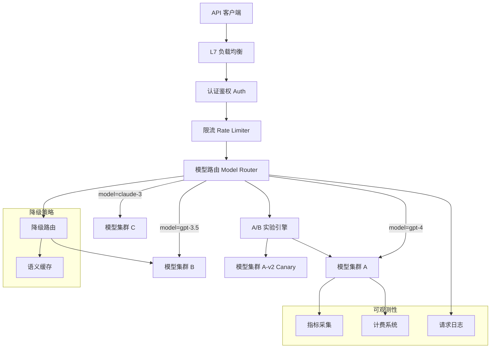

# Design Inference Gateway（模型推理网关）

---

## 问题定义

设计一个统一的模型推理网关，核心功能：
- 统一 API 入口，路由到不同模型和版本
- 限流、认证、计费
- A/B 测试与灰度发布
- 多模型版本管理与流量分配
- Graceful Degradation（优雅降级）

**核心挑战：** 高并发下的低延迟路由、多模型版本的流量管理、GPU 资源与请求量的动态匹配、故障时的降级策略。

---

## High-Level Design



---

## 核心组件详解

### 1. 请求路由

**模型路由：** 根据请求中的 `model` 参数路由到对应的推理集群。维护一张路由表：

```
model_name → [cluster_endpoints, weights, health_status]
```

**版本路由：** 同一模型可能有多个版本同时在线（如 v1 稳定版 + v2 灰度版），按权重分配流量。

**智能路由：** 根据请求特征（Prompt 长度、max_tokens）选择最合适的实例：
- 短请求 → 小 Batch 实例（低延迟）
- 长请求 → 大显存实例（避免 OOM）

### 2. 限流与配额

**多层限流：**
- **全局限流：** 系统总请求量上限，保护后端 GPU 集群
- **租户级限流：** 每个 API Key 的 RPM（Requests Per Minute）和 TPM（Tokens Per Minute）配额
- **模型级限流：** 热门模型单独限流

**Token 计费：**
- 输入 Token 和输出 Token 分别计费（输出通常更贵）
- 实时计量，异步写入计费系统
- 预付费用户做余额检查，后付费用户做用量统计

**限流算法：** Token Bucket（令牌桶），支持突发流量。每个租户维护 RPM Bucket 和 TPM Bucket。

### 3. A/B 测试与灰度发布

**灰度发布（Canary）：** 新模型版本先接收 5% 流量，监控关键指标：
- 延迟（P50/P99）
- 错误率
- 输出质量评估（自动化 eval 或人工抽样）
- 用户满意度信号

**A/B 实验：** 基于用户 ID 哈希做分流，确保同一用户始终命中同一版本（Sticky Routing），避免实验污染。

**发布流程：** Canary 5% → 25% → 50% → 100%，每阶段检查指标后决定是否继续。

### 4. Graceful Degradation（优雅降级）

后端 GPU 过载或故障时的降级策略：

| 级别 | 策略 | 用户感知 |
|---|---|---|
| L1 | 排队等待，延长超时 | 响应变慢 |
| L2 | 降级到更小的模型（如 70B → 7B） | 质量略降 |
| L3 | 返回语义缓存中的相似回答 | 非实时回答 |
| L4 | 返回 429 / 503，引导重试 | 服务不可用 |

**语义缓存（Semantic Cache）：** 对相似的 Prompt 返回缓存的回答。用 Embedding 相似度判断是否命中缓存。适用于高频重复查询场景（如客服机器人）。

### 5. 负载均衡策略

传统的 Round-Robin 不适用于 LLM 推理（请求处理时间差异巨大）：

**Least Outstanding Requests（最少未完成请求）：** 将新请求发到当前处理中请求最少的实例。

**Token-Aware Balancing：** 根据每个实例当前处理的 Token 总量（而非请求数）做均衡，更准确反映 GPU 负载。

**Queue-Depth Aware：** 监控每个实例的请求队列深度，避免将请求发到队列已满的实例。

### 6. 可观测性

- **请求级 Trace：** 记录每个请求的完整链路（网关 → 路由 → 推理 → 返回），包括各阶段延迟
- **实时指标 Dashboard：** QPS、延迟分布、GPU 利用率、Token 吞吐量、错误率
- **告警：** P99 延迟超 SLO、错误率突增、GPU 利用率异常

---

## 关键 Trade-off

| 决策点 | 选项 A | 选项 B | 推荐 |
|---|---|---|---|
| 路由策略 | Round-Robin | Token-Aware Balancing | B（LLM 请求异构性大） |
| 降级策略 | 直接拒绝 | 多级降级 | B（提升可用性） |
| 缓存 | 不缓存（每次实时推理） | 语义缓存 | 按场景选择 |
| 计费 | 同步计费（阻塞请求） | 异步计量 + 批量结算 | B（不影响延迟） |

---

## 小结

> 推理网关的核心是**智能路由和流量管理**。面试时重点讲清楚：Token-Aware 的负载均衡策略、多级降级机制、灰度发布的指标监控与回滚策略、以及 Token 级限流与计费的实现方式。
