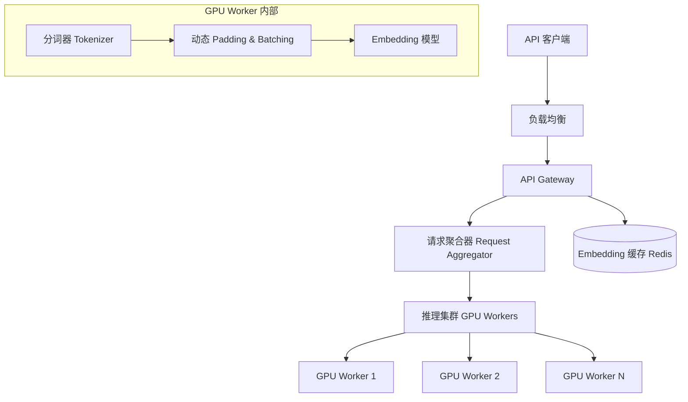

# Design Embedding Service（Embedding 向量生成服务）

---

## 问题定义

设计一个高吞吐的文本 Embedding 生成服务，核心功能：
- 接收文本输入，返回高维向量表示（如 1536 维 / 3072 维）
- 支持批量请求和单条请求
- 低延迟、高吞吐（百万级 QPS）
- 多模型支持（不同维度、不同用途的 Embedding 模型）

**核心挑战：** 高吞吐下的批处理优化、请求异构性（文本长度差异大）、GPU 利用率、缓存策略。

---

## High-Level Design



---

## 核心组件详解

### 1. 请求聚合与动态批处理

**问题：** 单条文本推理 GPU 利用率极低（< 5%）。必须将多个请求聚合成 Batch 一起推理。

**请求聚合器（Request Aggregator）：**
- 设置 Batch 窗口：收集请求直到达到 `max_batch_size`（如 128）或 `max_wait_time`（如 10ms）
- 触发任一条件后，将聚合的请求作为一个 Batch 发送到 GPU

**动态 Padding：** 同一 Batch 内文本长度不同，需要 Padding 到相同长度。优化：
- **排序分桶（Sorted Batching）：** 按文本长度排序后分 Batch，减少 Padding 浪费
- **动态 Shape：** 每个 Batch 的 Padding 长度取 Batch 内最长文本，而非固定最大长度

### 2. 缓存层

相同文本的 Embedding 结果是确定性的，天然适合缓存：
- **缓存 Key：** `hash(model_name + text)`
- **缓存 Value：** 向量（1536 维 × FP32 ≈ 6 KB）
- **Redis 集群存储热点 Embedding**
- **命中率：** 在搜索、RAG 等场景下，热门文档的 Embedding 被反复请求，命中率可达 30-60%

**缓存策略：** LRU 淘汰，根据显存/内存预算设置容量上限。

### 3. 模型优化

**ONNX Runtime / TensorRT 加速：** 将 PyTorch 模型导出为 ONNX 或 TensorRT Engine，推理速度提升 2-5 倍。

**量化：** INT8 量化减少显存占用和计算量，Embedding 质量损失极小（< 1% 精度下降）。

**多模型管理：** 不同场景使用不同 Embedding 模型：
- 通用文本 Embedding（如 text-embedding-3-large）
- 代码 Embedding
- 多语言 Embedding

每个模型部署独立的 GPU Worker 组，路由层按请求参数分发。

### 4. 扩缩容

Embedding 推理相比 LLM 推理更轻量（模型更小，无自回归），扩缩容更灵活：
- 按 QPS 水平扩缩 GPU Worker 数量
- 模型加载时间短（秒级），扩容响应快
- 可混用 GPU 和 CPU（小模型 CPU 推理也有不错吞吐）

### 5. 批量接口设计

```
POST /v1/embeddings
{
  "model": "text-embedding-3-large",
  "input": ["text1", "text2", ..., "textN"],  // 支持批量
  "dimensions": 1536  // 可选降维
}
```

**Matryoshka Embedding：** 新一代 Embedding 模型支持可变维度输出（如 256/512/1536/3072），低维用于粗筛，高维用于精排。

---

## 关键 Trade-off

| 决策点 | 选项 A | 选项 B | 推荐 |
|---|---|---|---|
| 批处理 | 固定 Batch Size | 动态聚合（时间 + 大小触发） | B（平衡延迟和吞吐） |
| 缓存 | 不缓存 | Redis 缓存热点 Embedding | B（命中率可观） |
| 推理引擎 | PyTorch | ONNX/TensorRT | B（推理场景性能更优） |
| Padding | 固定最大长度 | 动态 Padding + 排序分桶 | B（减少计算浪费） |

---

## 小结

> Embedding Service 的核心是**批处理优化和缓存设计**。面试时重点讲清楚：请求聚合器的触发机制（时间窗口 + 批大小）、Sorted Batching 减少 Padding 浪费的原理、缓存的适用性和命中率分析、以及 ONNX/TensorRT 的推理加速。相比 LLM Serving，Embedding 服务更强调吞吐而非生成延迟。
