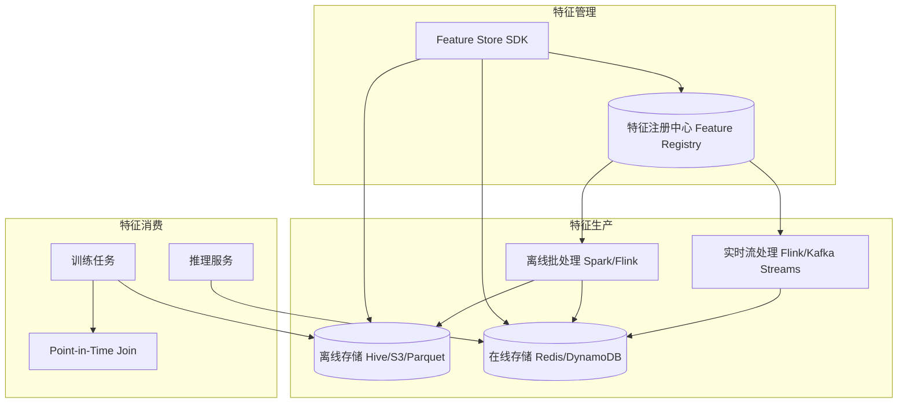

# Design Feature Store（特征存储系统）

---

## 问题定义

设计一个 Feature Store 系统，核心功能：
- 统一管理 ML 特征的定义、计算、存储和服务
- 在线服务（Online Store）：低延迟查询，支持推理时实时获取特征
- 离线存储（Offline Store）：大规模历史特征，支持训练时批量读取
- 在线/离线特征一致性（Training-Serving Skew 消除）
- 特征共享与复用

**核心挑战：** 在线低延迟查询、在线离线一致性、特征回填（Backfill）、实时特征计算。

---

## High-Level Design



---

## 核心组件详解

### 1. 在线存储（Online Store）

服务推理时的实时特征查询：
- **存储：** Redis / DynamoDB / Bigtable
- **数据模型：** `(entity_id, feature_name) → feature_value`，如 `(user_123, avg_watch_time) → 45.2`
- **延迟要求：** P99 < 10ms
- **数据特点：** 只存最新值（Latest Value），不存历史

### 2. 离线存储（Offline Store）

服务训练时的历史特征批量读取：
- **存储：** S3 / Hive / Delta Lake（Parquet 格式）
- **数据模型：** `(entity_id, feature_name, timestamp) → feature_value`，保留完整历史
- **特点：** 按时间分区，支持大规模扫描

### 3. Point-in-Time Join（时间点关联）

**核心问题：** 训练时需要回溯历史——"在事件发生的那个时间点，该用户的特征值是什么？" 不能使用未来的数据（Data Leakage）。

**实现：** 对每个训练样本的 `event_timestamp`，从离线存储中查找该时间点之前的最新特征值。

```
训练样本: (user_123, clicked_ad, 2024-03-15 10:00:00)
特征查询: user_123 在 2024-03-15 10:00:00 之前的最新 avg_watch_time
```

这是 Feature Store 区别于普通数据库的关键能力。

### 4. 实时特征（Streaming Features）

某些特征需要实时计算（如"最近 5 分钟的点击次数"）：
- 事件流（Kafka）→ 流处理引擎（Flink）→ 实时聚合 → 写入 Online Store
- 支持滑动窗口、滚动窗口等聚合方式
- 同一份计算逻辑也要可以在离线模式下运行（保证一致性）

### 5. 特征注册中心（Feature Registry）

```yaml
feature:
  name: user_avg_watch_time_7d
  entity: user
  value_type: FLOAT
  description: "用户最近 7 天平均观看时长"
  owner: recommendation-team
  data_source: user_events
  aggregation: AVG(watch_time) OVER 7d
  freshness: 1h  # 在线值的最大允许延迟
  tags: [engagement, video]
```

**元数据管理：** 特征名、数据类型、数据源、更新频率、Owner、依赖关系。
**特征发现：** 其他团队可搜索和复用已有特征，避免重复计算。

### 6. 在线离线一致性

**Training-Serving Skew：** 训练用离线特征，推理用在线特征，如果两者计算逻辑不一致，模型效果会下降。

**解决方案：**
- **统一特征定义：** 在线和离线共享同一份特征计算逻辑（Feature Definition）
- **离线写入在线：** 离线批处理计算的结果直接同步到 Online Store
- **日志特征（Logged Features）：** 推理时记录实际使用的在线特征值，训练时直接用这些记录值

---

## 关键 Trade-off

| 决策点 | 选项 A | 选项 B | 推荐 |
|---|---|---|---|
| 在线存储 | Redis（快但贵） | DynamoDB（便宜但稍慢） | 按延迟要求选择 |
| 一致性 | 统一计算逻辑 | Logged Features | 两者结合 |
| 实时特征 | 预计算写入 | 推理时现算 | A（延迟更低） |
| 离线格式 | 行存（Avro） | 列存（Parquet） | B（分析场景更优） |

---

## 小结

> Feature Store 的核心是**在线离线一致性和低延迟特征服务**。面试时重点讲清楚：Online/Offline Store 的双存储架构、Point-in-Time Join 防止 Data Leakage、Training-Serving Skew 的成因和解决方案、以及实时特征的流处理管道。典型开源实现：Feast、Tecton、Featureform。
