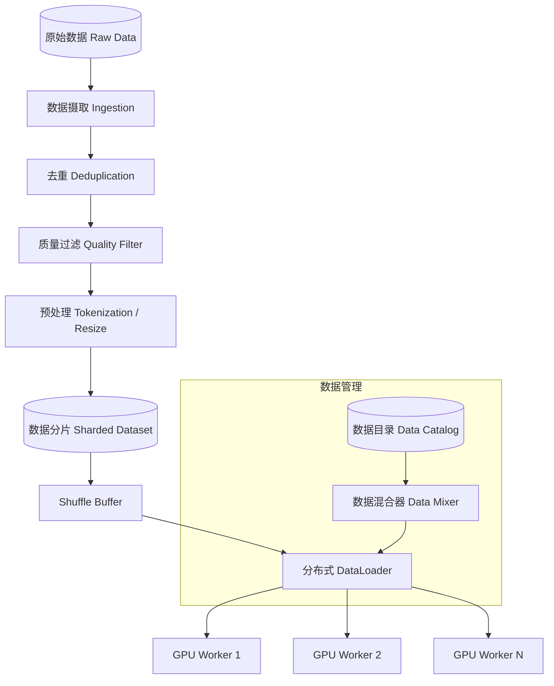

# Design Training Data Pipeline（大规模训练数据管道）

---

## 问题定义

设计一个支持大规模模型训练的数据管道系统，核心功能：
- 海量训练数据（PB 级）的存储、预处理和加载
- 高效的分布式数据加载，不让 GPU 等数据
- 数据 Shuffle、采样和混合（Data Mixing）
- 数据质量控制（去重、过滤、清洗）
- 支持多种数据格式（文本、图片、音视频）

**核心挑战：** 数据吞吐瓶颈（IO 跟不上 GPU 计算）、数据 Shuffle 的随机性需求、PB 级数据的高效预处理、数据质量保证。

---

## High-Level Design



---

## 核心组件详解

### 1. 数据预处理流水线

**阶段式处理（多阶段 MapReduce / Spark）：**

```
原始文本 → 语言检测 → 质量评分 → 去重 → 有害内容过滤 → 分词(Tokenize) → 打包(Packing) → 分片存储
```

**去重（Deduplication）：**
- **精确去重：** 对文档内容做 hash，去除完全相同的文档
- **模糊去重（Near-Dedup）：** MinHash + LSH 检测近似重复文档。训练数据中的重复会导致模型记忆而非泛化。
- 规模：万亿 Token 级数据集，去重是计算密集型任务

**质量过滤（Quality Filtering）：**
- 基于规则：过滤过短、乱码、重复率高的文档
- 基于模型：用小型分类器评估文档质量分数
- Perplexity 过滤：用语言模型计算困惑度，过滤低质量文本

### 2. 数据分片与格式

**分片（Sharding）：** 将处理后的数据切分为固定大小的分片（如 256MB/片），每个分片是一个独立文件。

**常用格式：**
| 格式 | 特点 | 适用场景 |
|---|---|---|
| WebDataset（.tar） | 顺序读取友好，IO 高效 | 大规模图文训练 |
| Parquet | 列存，压缩率高 | 结构化特征数据 |
| TFRecord | TensorFlow 原生格式 | TF 生态 |
| Tokenized Binary | 预分词二进制，零解析开销 | LLM 预训练 |

**Token Packing：** 将多个短文档拼接到一个固定长度的序列中（如 4096 Token），避免 Padding 浪费。文档间用特殊分隔符（`<EOS>`）隔开。

### 3. 分布式数据加载

**核心原则：** GPU 不能等数据。数据加载的吞吐必须 ≥ GPU 训练的消耗速度。

**多级预取（Multi-level Prefetch）：**
```
远程存储(S3) → 本地 SSD 缓存 → CPU 内存 Buffer → GPU 显存
```

每一级都做异步预取，流水线并行。

**分布式分配：**
- N 个 GPU Worker，M 个数据分片
- 每个 Worker 被分配 M/N 个不重复的分片
- 每个 Epoch 结束后重新 Shuffle 分片分配

**Worker 内部流水线：**
```
IO 线程（读取数据）→ 预处理线程（解码、增强）→ 训练线程（GPU 计算）
```
三者并行执行，通过 Queue 连接。

### 4. 数据 Shuffle

**为什么需要 Shuffle：** 相邻的训练样本如果来自同一来源/主题，模型会学到虚假的局部模式，影响泛化。

**Shuffle 策略：**
- **全局 Shuffle：** 完美随机，但 PB 级数据无法全部加载到内存做全局 Shuffle
- **分片级 Shuffle：** 随机打乱分片顺序 + 分片内 Shuffle。折中方案，实际效果接近全局 Shuffle
- **Buffer Shuffle：** 维护一个固定大小的 Shuffle Buffer（如 10 万条样本），从 Buffer 中随机采样输出

### 5. 数据混合（Data Mixing）

LLM 训练数据通常来自多个来源（Web、Books、Code、Wikipedia 等），需要按比例混合：

```yaml
data_mix:
  web_crawl: 60%
  books: 15%
  code: 15%
  wikipedia: 5%
  academic_papers: 5%
```

**动态混合：** 训练过程中可以动态调整混合比例（如发现 Code 能力不足，增加 Code 数据占比）。

**采样策略：** 小数据源可能需要上采样（重复使用），但过度重复会导致过拟合。通常限制最大重复次数（如 ≤ 3 Epochs）。

### 6. 数据版本与血缘

- 每个数据集版本对应一份不可变的分片集合
- 记录完整的处理血缘：原始数据 → 处理步骤 → 最终分片
- 训练实验可精确复现：记录使用的数据集版本、混合比例、Shuffle 种子

---

## 关键 Trade-off

| 决策点 | 选项 A | 选项 B | 推荐 |
|---|---|---|---|
| 预处理时机 | 在线处理（训练时） | 离线预处理（提前处理好） | B（避免 GPU 等待） |
| Shuffle | 全局 Shuffle | 分片 Shuffle + Buffer Shuffle | B（可扩展） |
| 存储格式 | 通用格式（Parquet） | 预分词二进制 | B（LLM 训练零解析开销） |
| 数据缓存 | 每次从 S3 读取 | 本地 SSD 缓存 | B（多 Epoch 训练必备） |

---

## 小结

> 训练数据管道的核心是**保证 GPU 不等数据，同时保证数据质量和随机性**。面试时重点讲清楚：多级预取的流水线设计、Shuffle 策略的权衡（全局 vs 分片）、数据去重和质量过滤的方法、以及 Data Mixing 的比例控制。
