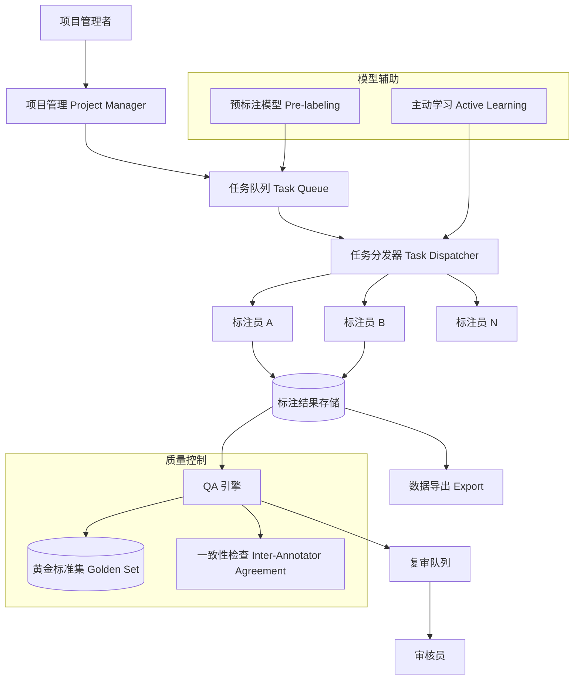

# Design Data Labeling Platform（数据标注平台）

---

## 问题定义

设计一个大规模数据标注平台，核心功能：
- 支持多种标注任务类型（文本分类、NER、图片标框、语义分割等）
- 任务分发与标注员管理
- 标注质量控制（Quality Assurance）
- Human-in-the-Loop：模型辅助标注，提升效率
- 标注数据的版本管理与导出

**核心挑战：** 标注质量控制、标注效率与成本平衡、标注员一致性、大规模任务管理。

---

## High-Level Design



---

## 核心组件详解

### 1. 任务模型

```yaml
project:
  name: "情感分类标注"
  task_type: text_classification
  labels: [positive, negative, neutral]
  guidelines: "标注规范文档链接"
  redundancy: 3  # 每条数据由 3 人标注
  deadline: 2024-04-01

task:
  task_id: "task_001"
  data: { text: "这个产品非常好用！" }
  assigned_to: annotator_A
  status: pending | in_progress | submitted | approved | rejected
```

### 2. 任务分发策略

**基础分配：** Round-Robin 或随机分配，保证负载均衡。

**智能分配：**
- **技能匹配：** 复杂任务分给高质量标注员
- **语言匹配：** 多语言任务按标注员语言能力分配
- **避免偏差：** 避免同一标注员连续标注同一来源的数据

**冗余标注（Redundancy）：** 每条数据由 K 个标注员独立标注（通常 K=3-5），通过投票或聚合得出最终标签。

### 3. 质量控制（核心）

**黄金标准集（Golden Set / Honeypot）：**
- 预先准备一批已知正确答案的数据，混入正常任务中
- 标注员不知道哪些是 Golden Set
- 如果 Golden Set 准确率低于阈值（如 90%），标记该标注员质量异常

**标注员一致性（Inter-Annotator Agreement, IAA）：**
- Cohen's Kappa：衡量两个标注员之间的一致性
- Fleiss' Kappa：衡量多个标注员之间的一致性
- 一致性低 → 标注规范不清晰 or 任务本身模糊

**多轮审核（Multi-level Review）：**
```
标注员标注 → 自动质检（规则 + 模型） → 抽样人工审核 → 问题数据打回重标
```

**标注员评分系统：** 综合 Golden Set 准确率、IAA 分数、标注速度、被打回率，生成标注员质量分。高质量标注员获得更多任务和更高报酬。

### 4. 模型辅助标注

**预标注（Pre-labeling）：** 用已有模型对数据做预标注，标注员只需验证和修正。效率提升 2-5 倍。

**主动学习（Active Learning）：** 优先标注模型最不确定的样本：
- 模型对大量未标注数据做预测
- 选择预测置信度最低的样本（Uncertainty Sampling）
- 优先分配给标注员
- 用新标注的数据重新训练模型，循环迭代

**效果：** 用 30% 的标注量达到全量标注 90% 的模型效果。

### 5. 标注工具（Frontend）

- **文本标注：** 高亮选择 + 标签分配（NER）、单选/多选（分类）
- **图片标注：** 画框（Bounding Box）、多边形（Polygon）、语义分割
- **快捷键支持：** 标注员效率的关键，常用标签绑定快捷键
- **撤销/重做：** 支持操作历史
- **标注规范内嵌：** 标注界面直接显示 Guidelines 和示例

### 6. 数据版本与导出

- 每次标注任务完成后生成不可变的数据集版本
- 支持多种导出格式：JSONL、COCO、VOC、CSV
- 记录标注元数据：标注员、标注时间、修改历史
- 支持按质量分数过滤导出（如只导出 IAA > 0.8 的数据）

---

## 关键 Trade-off

| 决策点 | 选项 A | 选项 B | 推荐 |
|---|---|---|---|
| 冗余度 | 单人标注（K=1） | 多人标注（K=3-5） | 按质量要求和预算选择 |
| 质量控制 | 纯人工审核 | Golden Set + 模型辅助 | B（可扩展） |
| 预标注 | 不使用 | 模型预标注 + 人工修正 | B（效率提升显著） |
| 优先级 | 随机标注 | 主动学习选择最有价值样本 | B（标注预算有限时） |

---

## 小结

> 数据标注平台的核心是**质量控制和标注效率**。面试时重点讲清楚：Golden Set 质量检测机制、Inter-Annotator Agreement 的计算和应用、主动学习减少标注量的原理、以及预标注提升效率的方式。典型参考：Label Studio、Scale AI、Labelbox。
