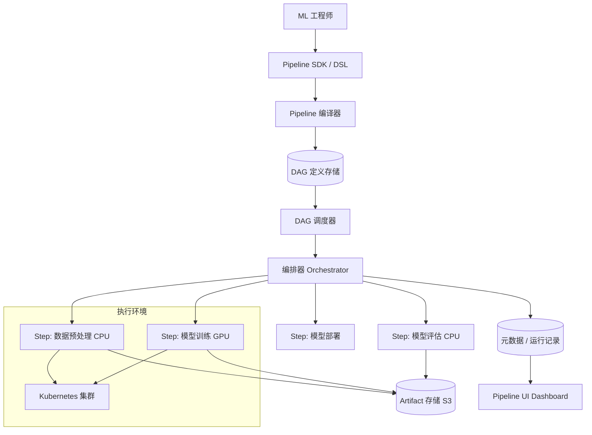

# Design ML Pipeline（ML 工作流编排系统）

---

## 问题定义

设计一个 ML Pipeline / Workflow 编排系统，核心功能：
- 定义、调度和执行 ML 工作流（数据处理 → 训练 → 评估 → 部署）
- DAG（有向无环图）编排，支持步骤间依赖关系
- 实验追踪与可复现性
- 支持异构计算资源（CPU/GPU/TPU）
- 失败重试与断点续跑

**核心挑战：** DAG 调度的可靠性、异构资源管理、实验可复现、长时间运行任务的容错。

---

## High-Level Design



---

## 核心组件详解

### 1. Pipeline 定义（DSL）

用户通过 Python SDK 定义 Pipeline：

```python
@pipeline
def training_pipeline(data_path: str, epochs: int):
    processed = preprocess_step(data_path)
    model = train_step(processed.output, epochs=epochs)
    metrics = eval_step(model.output)
    with Condition(metrics.output["accuracy"] > 0.95):
        deploy_step(model.output)
```

**编译器：** 将 Python DSL 编译为 DAG 描述（JSON/YAML），记录步骤依赖、输入输出、资源需求。

### 2. DAG 调度器

**调度逻辑：**
```
1. 解析 DAG 拓扑，确定执行顺序
2. 就绪步骤（所有上游已完成）加入执行队列
3. 按资源需求分配计算资源（CPU Pod / GPU Pod）
4. 步骤完成后触发下游步骤
5. 所有步骤完成 → Pipeline 成功
```

**并行执行：** DAG 中无依赖关系的步骤并行执行，最大化资源利用。

**条件分支：** 支持基于上游输出的条件判断（如准确率 > 阈值才部署）。

### 3. 步骤执行（Step Runner）

每个步骤在独立的容器中执行：
- **容器化：** 每个步骤打包为 Docker 镜像，包含代码和依赖
- **资源声明：** 每个步骤声明所需资源（如 `gpu: 4, memory: 64Gi`）
- **输入/输出：** 通过 Artifact Store（S3）传递数据，步骤间松耦合

**Kubernetes 集成：** 每个步骤创建一个 K8s Job/Pod，利用 K8s 的调度、资源管理和故障恢复能力。

### 4. Artifact 管理

Pipeline 中各步骤产生的中间和最终产物：
- **数据 Artifact：** 预处理后的数据集
- **模型 Artifact：** 训练好的模型文件
- **指标 Artifact：** 评估指标（accuracy、loss 等）
- **日志 Artifact：** 训练日志、TensorBoard 日志

**存储：** S3 / GCS，按 `pipeline_run_id/step_name/` 组织。

**血缘追踪（Lineage）：** 每个 Artifact 记录其来源步骤、输入参数、代码版本，支持完整复现。

### 5. 容错与重试

- **步骤级重试：** 步骤失败后自动重试（如最多 3 次），支持指数退避
- **断点续跑：** Pipeline 中间失败后，从最后一个成功步骤继续执行，已完成步骤的 Artifact 直接复用
- **缓存：** 如果步骤的输入和代码版本未变，直接跳过执行，使用缓存的输出

### 6. 定时与触发

- **Cron 触发：** 定时执行（如每天凌晨跑数据处理 + 重训练）
- **事件触发：** 新数据到达、模型指标下降时自动触发
- **手动触发：** 用户在 UI 上手动启动

---

## 关键 Trade-off

| 决策点 | 选项 A | 选项 B | 推荐 |
|---|---|---|---|
| 执行引擎 | 自建调度器 | 基于 Kubernetes | B（复用 K8s 生态） |
| 步骤隔离 | 共享进程 | 独立容器 | B（环境隔离，可复现） |
| 数据传递 | 内存传递 | Artifact Store（S3） | B（步骤解耦，支持断点续跑） |
| 缓存策略 | 不缓存 | 基于输入+代码 hash 缓存 | B（避免重复计算） |

---

## 小结

> ML Pipeline 的核心是**DAG 编排的可靠性和实验的可复现性**。面试时重点讲清楚：DAG 调度的并行执行策略、步骤容器化和资源隔离、Artifact 血缘追踪保证可复现、以及缓存和断点续跑的容错机制。典型系统：Kubeflow Pipelines、Airflow、Metaflow、Argo Workflows。
