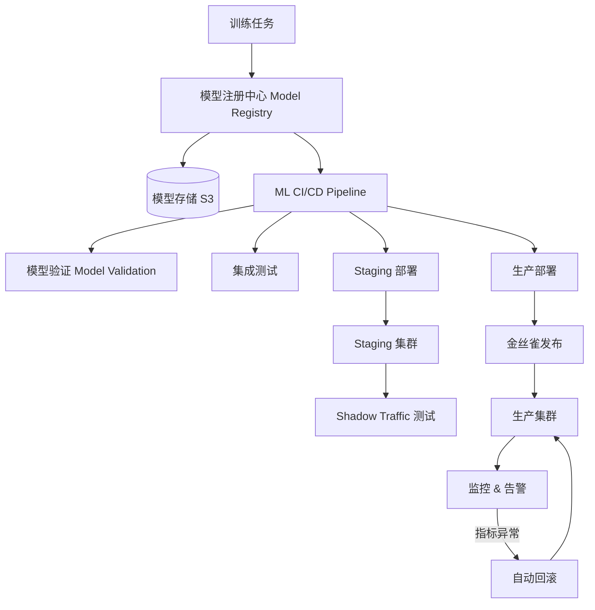

# Design Model Registry and Deployment（模型注册与部署系统）

---

## 问题定义

设计一个模型注册与部署系统，核心功能：
- 模型版本管理（Model Registry）
- CI/CD for ML：自动化测试、验证和部署
- 多环境部署（staging → production）
- 金丝雀发布与回滚
- 模型生命周期管理

**核心挑战：** 模型文件巨大（GB-TB 级）的版本管理、部署安全性验证、无缝流量切换、回滚速度。

---

## High-Level Design



---

## 核心组件详解

### 1. 模型注册中心（Model Registry）

**模型元数据：**
```yaml
model:
  name: recommendation-v2
  version: 2.3.1
  framework: PyTorch
  size: 140GB
  metrics:
    accuracy: 0.952
    latency_p99: 45ms
  artifacts:
    weights: s3://models/rec-v2/2.3.1/weights/
    config: s3://models/rec-v2/2.3.1/config.json
    tokenizer: s3://models/rec-v2/2.3.1/tokenizer/
  status: staging  # none → staging → production → deprecated → archived
  created_by: training-pipeline-run-456
  created_at: 2024-03-15T10:30:00Z
  tags: [recommendation, production-ready]
```

**版本状态流转：**
```
None → Staging（待验证）→ Production（线上服务）→ Deprecated（下线中）→ Archived（归档）
```

**模型对比：** 支持多个版本的指标对比（accuracy、latency、模型大小等），辅助发布决策。

### 2. ML CI/CD Pipeline

**训练完成后自动触发：**

```
1. 模型验证（Model Validation）
   - 格式检查：模型文件完整性、可加载性
   - 性能基准：在标准测试集上评估指标，不低于上一版本
   - 推理延迟：单条推理延迟不超过 SLO
   - 安全检查：偏差检测、有害输出检测

2. 集成测试
   - 端到端推理测试（输入→输出格式正确）
   - 与上下游服务的兼容性测试
   - 负载测试：在目标 QPS 下性能达标

3. Staging 部署
   - 部署到 Staging 环境
   - Shadow Traffic：复制生产流量到 Staging，对比新旧模型输出
   - 人工审核（可选）：ML 工程师确认结果质量
```

### 3. 部署策略

**金丝雀发布（Canary Deployment）：**
```
阶段 1：新版本接收 1% 流量，持续 1 小时
阶段 2：扩大到 10%，持续 2 小时
阶段 3：扩大到 50%，持续 4 小时
阶段 4：全量切换到 100%
```

每个阶段自动检查：延迟、错误率、业务指标。任一指标异常 → 自动回滚到上一版本。

**蓝绿部署（Blue-Green）：** 同时维护两套完整环境（Blue=当前版本，Green=新版本），流量瞬间切换。优点：回滚极快。缺点：需要双倍 GPU 资源。

**Shadow Deployment：** 新版本接收生产流量的副本，但不返回给用户。只用于对比评估，零风险。

### 4. 模型加载优化

模型文件巨大，部署时的加载时间是关键：

| 优化手段 | 效果 |
|---|---|
| 模型预下载到本地 SSD | 避免部署时从 S3 下载 |
| 模型预热（Warm-up Pool） | 预先加载到 GPU 显存的 Standby 实例 |
| 模型缓存（Model Cache） | 多版本模型缓存在本地，快速切换 |
| 增量更新 | 只下载与上一版本的差异文件 |

### 5. 回滚机制

**快速回滚：**
- 上一版本的模型保持在本地缓存，回滚时直接加载（秒级）
- 路由层切换流量到旧版本实例
- 保留最近 N 个版本的 GPU 实例（Hot Standby）

**自动回滚触发条件：**
- 错误率 > 阈值（如 > 1%）
- P99 延迟 > SLO（如 > 500ms）
- 业务指标下降 > X%（如 CTR 下降 > 5%）

### 6. 模型生命周期管理

- **Deprecation 流程：** 标记旧版本为 Deprecated → 停止新流量 → 等待存量请求完成 → 释放 GPU 资源 → 归档模型文件到冷存储
- **模型审计：** 记录每个版本的部署时间、服务时长、处理请求量
- **合规：** 保留所有生产版本的完整记录，满足审计要求

---

## 关键 Trade-off

| 决策点 | 选项 A | 选项 B | 推荐 |
|---|---|---|---|
| 部署策略 | 蓝绿部署 | 金丝雀发布 | B（资源效率高，风险可控） |
| 验证深度 | 基础指标检查 | 完整 Shadow Traffic 对比 | 按模型重要性选择 |
| 回滚速度 | 冷启动（重新加载模型） | Hot Standby | B（关键模型必须秒级回滚） |
| 版本保留 | 只保留最新版本 | 保留最近 N 个版本 | B（支持快速回滚） |

---

## 小结

> 模型注册与部署系统的核心是**部署安全性和回滚速度**。面试时重点讲清楚：ML CI/CD 的自动化验证流程、金丝雀发布的分阶段策略与自动回滚、模型加载优化（预下载、预热、缓存）、以及模型生命周期管理。
