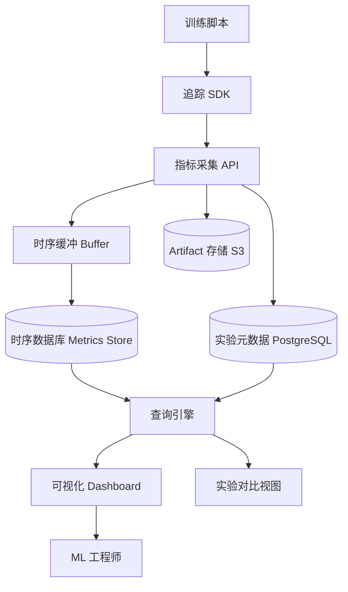

# Design Experiment Tracking System（实验追踪系统）

---

## 问题定义

设计一个 ML 实验追踪系统（类似 MLflow / Weights & Biases），核心功能：
- 记录实验的超参数、指标、代码版本、数据集版本
- 实时训练指标可视化（Loss 曲线、学习率等）
- 多实验对比与分析
- Artifact 管理（模型文件、日志、图表）
- 团队协作与实验共享

**核心挑战：** 高频指标写入的性能、海量实验数据的存储与查询、实时可视化、实验可复现性。

---

## High-Level Design



---

## 核心组件详解

### 1. 追踪 SDK（客户端）

嵌入训练脚本，自动或手动记录实验信息：

```python
import tracker

run = tracker.init(project="llm-finetune", config={
    "model": "llama-70b",
    "learning_rate": 3e-4,
    "batch_size": 32,
    "epochs": 10,
    "dataset": "dataset-v2.3"
})

for epoch in range(10):
    loss = train_one_epoch()
    tracker.log({"epoch": epoch, "loss": loss, "lr": scheduler.get_lr()})

tracker.log_artifact("model.pt", type="model")
tracker.finish()
```

**自动记录：**
- Git commit hash 和 diff
- 环境信息（Python 版本、GPU 型号、依赖列表）
- 系统指标（GPU 利用率、显存使用、CPU、内存）

### 2. 指标采集与存储

**写入模式：** 训练过程每个 step 都会写入指标（loss、accuracy 等），高频写入（每秒数十到数百条）。

**写入优化：**
- **客户端缓冲：** SDK 在本地缓冲指标，批量发送（如每 5 秒一批）
- **服务端缓冲：** 采集 API 先写入内存 Buffer，异步刷入存储
- **采样降精度：** 对超高频指标（如每 step 的 loss）做降采样存储

**存储选择：**
| 数据类型 | 存储 | 原因 |
|---|---|---|
| 时序指标（loss, lr） | 时序数据库（InfluxDB / TimescaleDB） | 高效时序查询和聚合 |
| 实验元数据（超参、配置） | PostgreSQL | 结构化查询和筛选 |
| Artifact（模型、日志） | S3 / GCS | 大文件存储 |
| 系统指标（GPU 利用率） | Prometheus + 时序 DB | 监控生态集成 |

### 3. 实验对比

**核心功能：** 选择多个实验，并排对比：
- 超参数差异高亮（哪些参数不同）
- 指标曲线叠加对比（不同实验的 loss 曲线画在同一图上）
- 最终指标排序（按 accuracy 排序所有实验）

**Parallel Coordinates Plot：** 可视化超参数与最终指标的关系，快速发现最优超参数区域。

**查询与筛选：**
```sql
SELECT * FROM experiments
WHERE project = 'llm-finetune'
  AND config.learning_rate BETWEEN 1e-4 AND 1e-3
  AND metrics.accuracy > 0.90
ORDER BY metrics.accuracy DESC
```

### 4. 可复现性

**完整快照记录：**
```
实验 = 代码版本（git hash）
     + 数据集版本（dataset hash）
     + 超参数（config）
     + 环境（Python、CUDA、依赖版本）
     + 随机种子（random seed）
```

**一键复现：** 从实验记录中提取所有配置，重新启动相同的训练任务。

### 5. 团队协作

- **项目空间：** 按项目组织实验，团队成员可查看彼此的实验
- **实验标注：** 对有意义的实验加 Tag（如 "baseline"、"best-so-far"）
- **评论与讨论：** 在实验结果上添加评论
- **报告生成：** 从选定实验自动生成对比报告

### 6. 存储与清理

- **保留策略：** 重要实验（有 Tag）永久保留，其余实验按时间自动清理
- **Artifact 去重：** 相同内容的模型文件只存一份（Content-Addressable Storage）
- **存储分层：** 最近实验在热存储（SSD），历史实验迁移到冷存储（S3 Glacier）

---

## 关键 Trade-off

| 决策点 | 选项 A | 选项 B | 推荐 |
|---|---|---|---|
| 指标写入 | 实时同步写入 | 客户端缓冲批量写入 | B（减少网络开销） |
| 指标存储 | 通用数据库 | 时序数据库 | B（时序查询效率高 10 倍+） |
| 可视化 | 静态图表 | 实时流式更新 | B（训练过程实时观察） |
| Artifact 存储 | 全部存储 | 按重要性分层 | B（控制存储成本） |

---

## 小结

> 实验追踪系统的核心是**高频指标的高效采集存储和实验可复现性**。面试时重点讲清楚：SDK 的客户端缓冲和批量写入策略、时序数据库选型理由、实验对比和可视化的功能设计、以及完整快照实现可复现性的方案。典型系统：MLflow、Weights & Biases、Neptune、ClearML。
