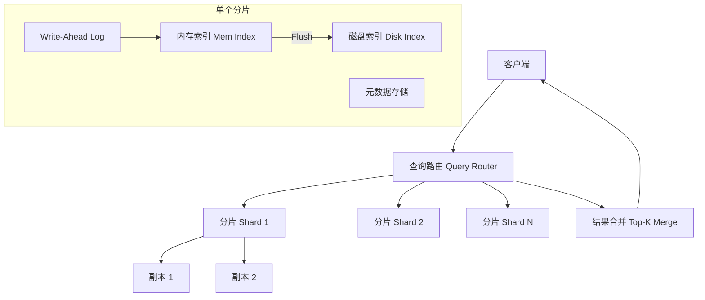

# Design Vector Database（向量数据库）

---

## 问题定义

设计一个分布式向量数据库，核心功能：
- 存储高维向量（如 1536 维 Embedding）及其关联元数据
- 近似最近邻搜索（ANN：Approximate Nearest Neighbor）
- 支持过滤查询（Metadata Filtering + Vector Search）
- 实时插入和更新
- 水平扩展到数十亿向量

**核心挑战：** 高维空间的高效检索、精度与速度的平衡、实时更新与索引一致性、大规模分布式架构。

---

## 规模估算

- 向量数量：10 亿级
- 向量维度：768-3072 维
- 单向量大小：1536 维 × FP32 = 6 KB
- 总数据量：10 亿 × 6 KB = ~6 TB（仅向量）
- 查询延迟要求：P99 < 50ms
- 写入吞吐：数万 TPS

---

## High-Level Design



---

## 核心组件详解

### 1. ANN 索引算法

**HNSW（Hierarchical Navigable Small World）：**
- 构建多层图结构，上层稀疏（快速定位区域），下层密集（精确搜索）
- 查询时从最高层开始贪心搜索，逐层下沉到最底层
- **优点：** 查询速度快（O(log N)），召回率高（>95%）
- **缺点：** 内存占用大（需要额外存储图的边），构建时间长

**IVF（Inverted File Index）：**
- 先用 K-Means 将向量聚类到 N 个簇
- 查询时先找最近的 K 个簇，只在这些簇内做精确搜索
- **优点：** 内存效率高，可配合 PQ 压缩
- **缺点：** 召回率依赖探测簇数（nprobe），调优复杂

**PQ（Product Quantization）：**
- 将高维向量切分为子空间，每个子空间独立量化
- 大幅压缩向量体积（如 6 KB → 64 Bytes）
- 用于 IVF-PQ 组合：粗筛用 IVF，精排用 PQ 近似距离

| 算法 | 查询速度 | 召回率 | 内存效率 | 适用场景 |
|---|---|---|---|---|
| HNSW | 极快 | 高 | 低（全量内存） | 数据量适中，高性能要求 |
| IVF-PQ | 快 | 中 | 高（压缩存储） | 超大规模数据 |
| IVF-HNSW | 极快 | 高 | 中 | 大规模 + 高召回 |

### 2. 分布式架构

**分片（Sharding）：** 数据按向量 ID hash 分到多个 Shard，每个 Shard 独立维护索引。

**查询流程：**
```
1. 查询路由将请求广播到所有 Shard
2. 每个 Shard 在本地索引中搜索 Top-K
3. 路由收集所有 Shard 的结果
4. 合并排序，返回全局 Top-K
```

**副本（Replication）：** 每个 Shard 有 2-3 个副本，读请求分散到副本上，提升读吞吐和可用性。

### 3. 实时写入与索引更新

**挑战：** ANN 索引（如 HNSW）不适合频繁更新，重建索引成本高。

**方案：双层索引**
- **内存索引（Mutable）：** 新写入的向量先进入内存索引（小型 HNSW 或暴力搜索）
- **磁盘索引（Immutable）：** 定期将内存索引 Flush 合并到磁盘上的大索引

**查询时同时搜索两层索引，合并结果。**

**WAL（Write-Ahead Log）：** 写入先记录 WAL 保证持久性，再异步更新内存索引。

### 4. 混合查询（Metadata Filtering + Vector Search）

用户通常需要"在某个条件下找最相似的向量"：
```
查找 category="electronics" AND price < 100 的商品中，与查询向量最相似的 Top 10
```

**Pre-filtering：** 先过滤元数据，再在过滤后的子集上做向量搜索。问题：如果过滤后数据太少，ANN 索引效率低。

**Post-filtering：** 先做向量搜索取 Top-K'（K' >> K），再过滤元数据。问题：如果过滤条件严格，可能返回结果不足 K 个。

**混合方案：** 在 ANN 搜索过程中实时检查元数据条件，跳过不满足条件的向量。需要索引支持（如 HNSW 遍历时检查过滤条件）。

### 5. 向量压缩与量化

为了在有限内存中存储更多向量：
- **标量量化（SQ）：** FP32 → INT8，体积缩小 4 倍
- **Product Quantization（PQ）：** 体积缩小 50-100 倍，精度损失可控
- **Binary Quantization：** FP32 → 1-bit，速度极快但精度下降明显
- **Matryoshka 降维：** 用低维向量做粗筛，高维向量做精排

### 6. 距离度量

| 度量 | 公式 | 适用场景 |
|---|---|---|
| 余弦相似度 | cos(A,B) = A·B / (‖A‖·‖B‖) | 文本 Embedding（方向重要） |
| 欧氏距离 | L2 = ‖A-B‖₂ | 图像特征 |
| 内积（Dot Product） | A·B | 推荐系统（已归一化） |

---

## 关键 Trade-off

| 决策点 | 选项 A | 选项 B | 推荐 |
|---|---|---|---|
| 索引算法 | HNSW（高召回） | IVF-PQ（省内存） | 按数据量和内存预算选择 |
| 写入模式 | 批量重建索引 | 实时写入 + 双层索引 | B（需要实时更新时） |
| 过滤策略 | Pre-filtering | 混合过滤 | 混合（通用性最好） |
| 存储 | 全量内存 | 磁盘 + 内存缓存 | 按数据量和成本选择 |

---

## 小结

> 向量数据库的核心是**ANN 索引算法选型和分布式架构设计**。面试时重点讲清楚：HNSW 和 IVF-PQ 的原理和 trade-off、分片查询的广播 + 合并流程、实时写入的双层索引方案、以及混合查询（Metadata Filter + Vector Search）的实现方式。典型系统：Pinecone、Milvus、Weaviate、Qdrant、Chroma。
