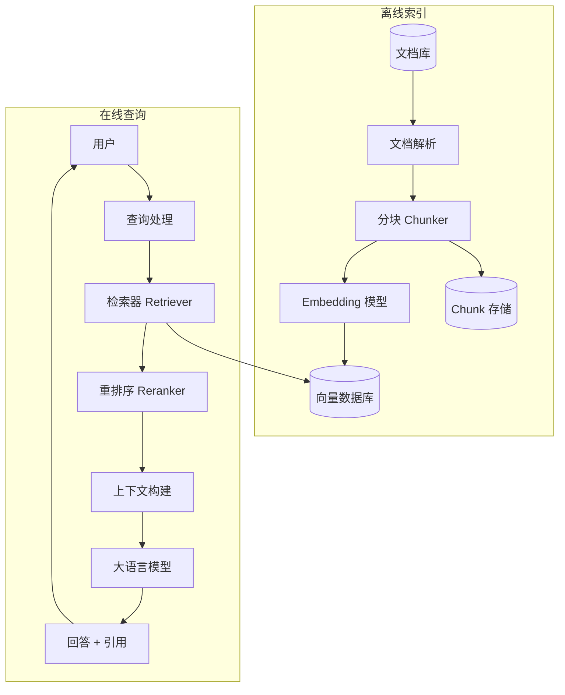

# Design RAG System（检索增强生成系统）

---

## 问题定义

设计一个 RAG（Retrieval-Augmented Generation）系统，核心功能：
- 基于用户查询，从知识库中检索相关文档
- 将检索结果作为上下文，送入 LLM 生成回答
- 支持多种数据源（文档、网页、数据库）
- 回答带有引用来源，可溯源

**核心挑战：** 检索质量（召回率和精度）、Chunk 策略、上下文窗口限制、实时性、幻觉控制。

---

## High-Level Design



---

## 核心组件详解

### 1. 文档处理与分块（Chunking）

**文档解析：** 支持多种格式（PDF、HTML、Markdown、Word），提取纯文本和结构信息（标题层级、表格）。

**分块策略（核心设计点）：**

| 策略 | 方法 | 优点 | 缺点 |
|---|---|---|---|
| 固定大小 | 按 Token 数切分（如 512 Token） | 简单 | 可能切断语义 |
| 语义分块 | 按段落/章节边界切分 | 保持语义完整 | Chunk 大小不均 |
| 递归分块 | 先按大结构切分，再递归细分 | 层级感强 | 实现复杂 |
| 滑动窗口 | 固定大小 + 重叠（Overlap） | 减少信息丢失 | 存储冗余 |

**Chunk 大小的权衡：**
- 太小：上下文不完整，检索噪声多
- 太大：向量表示过于笼统，检索精度低
- 经验值：256-1024 Token，30-50 Token 重叠

**元数据附加：** 每个 Chunk 附加来源文档、章节标题、页码等元数据，用于后续过滤和引用。

### 2. Embedding 与索引

- 文档 Chunk → Embedding 模型 → 高维向量 → 存入向量数据库
- 同时保存原始文本到 Chunk Store（向量数据库只存向量，原文单独存储）
- 索引时可为每个 Chunk 生成多种表示（如摘要 Embedding + 原文 Embedding）

### 3. 检索策略

**基础检索：** 查询文本 → Embedding → 向量数据库 Top-K 检索

**混合检索（Hybrid Search）：**
```
最终得分 = α × 向量相似度 + (1-α) × 关键词匹配分（BM25）
```
向量检索擅长语义匹配，BM25 擅长精确关键词匹配，两者互补。

**查询改写（Query Rewriting）：**
- **查询扩展：** 用 LLM 将用户查询改写为多个表达方式，分别检索后合并结果
- **HyDE（Hypothetical Document Embeddings）：** 先让 LLM 生成一个假设性回答，用假设回答的 Embedding 去检索（假设回答与真实文档更相似）

**多轮检索（Iterative Retrieval）：** 第一轮检索结果不够好时，根据初步结果生成新的查询再检索。

### 4. 重排序（Reranker）

向量检索的 Top-K 结果中可能有噪声，用 Cross-Encoder Reranker 精排：
- **Bi-Encoder（Embedding）：** 查询和文档独立编码，速度快但精度有限
- **Cross-Encoder（Reranker）：** 查询和文档一起编码，精度高但速度慢

**流程：** 向量检索 Top-50 → Reranker 精排 → 取 Top-5 送入 LLM

### 5. 上下文构建与 Prompt 工程

**上下文窗口管理：**
```
System Prompt + 检索到的 Chunks + 用户查询 ≤ 模型上下文窗口
```

**Chunk 排列策略：**
- 按相关度排序（最相关的放前面）
- "Lost in the Middle" 问题：LLM 对中间位置的信息关注度低。解决：最相关的放开头和结尾

**Prompt 模板：**
```
基于以下参考文档回答用户问题。如果参考文档中没有相关信息，请说明无法回答。

参考文档：
[1] {chunk_1_text} (来源: {source_1})
[2] {chunk_2_text} (来源: {source_2})
...

用户问题：{query}

请在回答中标注引用来源编号。
```

### 6. 评估指标

| 指标 | 含义 | 评估对象 |
|---|---|---|
| Recall@K | Top-K 检索结果中包含正确文档的比例 | 检索质量 |
| MRR | 正确文档在检索结果中的平均排名倒数 | 检索排序质量 |
| Faithfulness | 生成回答是否忠于检索到的文档 | 幻觉控制 |
| Answer Relevancy | 回答与用户查询的相关度 | 端到端质量 |
| Context Precision | 检索的上下文中有多少是真正有用的 | 检索精度 |

---

## 关键 Trade-off

| 决策点 | 选项 A | 选项 B | 推荐 |
|---|---|---|---|
| 检索方式 | 纯向量检索 | 混合检索（向量 + BM25） | B（互补效果好） |
| Chunk 大小 | 小（256 Token） | 大（1024 Token） | 中等（512）+ 重叠 |
| 重排序 | 不使用 | Cross-Encoder Reranker | B（精度显著提升） |
| 查询处理 | 直接查询 | 查询改写 + HyDE | 按查询质量选择 |

---

## 小结

> RAG 系统的核心是**检索质量决定生成质量**。面试时重点讲清楚：Chunking 策略的选择和 trade-off、混合检索（向量 + BM25）的互补性、Reranker 的精排作用、以及上下文构建和幻觉控制的方法。RAG 是当前 AI 应用中最常见的架构模式，面试高频。
