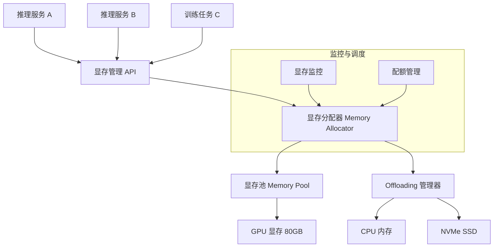

# Design GPU Memory Manager（GPU 显存管理系统）

---

## 问题定义

设计一个 GPU 显存管理系统，核心功能：
- 高效管理 GPU 显存的分配与回收
- 支持多租户隔离（Multi-Tenant GPU Sharing）
- 显存池化（Memory Pooling），减少碎片
- 显存不足时的 Offloading（GPU → CPU → Disk）
- 支持动态显存需求（如 KV Cache 随序列长度增长）

**核心挑战：** 显存碎片化、多租户公平隔离、Offloading 延迟、动态显存需求预测。

---

## High-Level Design



---

## 核心组件详解

### 1. 显存池化（Memory Pooling）

**问题：** 默认的 CUDA malloc/free 存在碎片化问题，频繁分配回收导致"总显存够，但找不到连续大块"。

**缓存分配器（Caching Allocator）：**
- PyTorch 默认使用缓存分配器：释放的显存不归还系统，而是保留在缓存池中复用
- 维护多个大小桶（如 1MB、2MB、4MB...），分配时找最小满足的桶
- 大块分配不进池，直接调用 CUDA malloc

**Slab Allocator：**
- 将显存划分为固定大小的 Slab（如 2MB 一个 Slab）
- 每个 Slab 内部再细分为相同大小的 Object
- 适合分配大量相同大小的对象（如 KV Cache 的 Page）

### 2. PagedAttention 的显存管理

（与 LLM Serving 紧密相关）

**传统方式：** 为每个请求预分配最大序列长度的 KV Cache 空间。浪费严重（实际序列通常远短于最大长度）。

**Paged 方式（vLLM）：**
- 显存划分为固定大小的 Page（如 16 Token 一个 Page）
- 每个请求按需分配 Page，序列增长时追加新 Page
- Page 不需要物理连续，通过 Page Table 映射
- 请求结束后 Page 回收到空闲池

**显存利用率：** 从约 50% 提升到 95%+。

### 3. 多租户显存隔离

**场景：** 一张 GPU 同时服务多个模型或多个用户。

**隔离机制：**
- **硬隔离（MIG - Multi-Instance GPU）：** NVIDIA H100 支持将一张 GPU 硬件级拆分为多个实例（如 7 个实例），每个实例有独立的显存和计算资源。隔离彻底但灵活性低。
- **软隔离（配额管理）：** 在应用层为每个租户设置显存配额上限，超限时拒绝分配或触发 Offloading。灵活但隔离不完全。
- **时分复用（Time-Slicing）：** 多个任务分时使用 GPU，不共享显存。通过 CUDA MPS 或 GPU Context Switching 实现。

| 方案 | 隔离级别 | 灵活性 | 开销 |
|---|---|---|---|
| MIG | 硬件级 | 低（分区固定） | 无额外开销 |
| 配额管理 | 应用级 | 高 | 软件检查开销 |
| 时分复用 | 进程级 | 中 | Context Switch 开销 |

### 4. 显存 Offloading

显存不足时将数据卸载到更低层级存储：

```
GPU 显存 (80GB, ~2TB/s) → CPU 内存 (TB级, ~50GB/s) → NVMe SSD (TB级, ~7GB/s)
```

**Offloading 策略：**
- **LRU 淘汰：** 最近最少使用的数据优先卸载
- **优先级淘汰：** 低优先级任务的数据优先卸载
- **预测性 Offloading：** 根据计算图分析，提前卸载即将不用的数据

**ZeRO-Offload / ZeRO-Infinity：**
- 训练时将优化器状态和部分参数 Offload 到 CPU 内存
- 用 NVMe SSD 作为扩展"显存"
- 在计算需要时异步 Prefetch 回 GPU

**推理场景的 KV Cache Offloading：**
- 当 GPU 显存放不下所有活跃请求的 KV Cache 时
- 将优先级低或暂停的请求的 KV Cache Swap 到 CPU 内存
- 该请求被调度时再 Swap 回 GPU

### 5. 显存碎片整理

**碎片类型：**
- **内部碎片：** 分配的块比实际需要大，浪费块内空间
- **外部碎片：** 空闲空间总量够，但不连续，无法分配大块

**整理方法：**
- **Compaction（压缩）：** 移动已分配的数据使空闲空间合并。代价高，需要暂停使用该数据的计算。
- **Defragmentation：** 定期在低负载时执行碎片整理
- **预防：** 使用 Slab/Page 分配器从设计上减少碎片

### 6. 监控与告警

- **实时显存使用率：** 每个 GPU 的已用/空闲/碎片率
- **分配失败计数：** 频繁分配失败说明显存不足或碎片严重
- **Offloading 频率：** 高频 Offloading 说明显存压力大
- **租户级用量：** 每个租户/模型的显存占用

---

## 关键 Trade-off

| 决策点 | 选项 A | 选项 B | 推荐 |
|---|---|---|---|
| 分配方式 | CUDA 原生 malloc | 缓存分配器 / Slab | B（减少碎片和系统调用） |
| 多租户隔离 | MIG 硬隔离 | 软隔离 + 配额 | 按隔离要求选择 |
| 显存不足 | 拒绝新请求 | Offload 到 CPU | B（吞吐优先场景） |
| KV Cache 管理 | 预分配最大长度 | PagedAttention 按需分配 | B（利用率翻倍） |

---

## 小结

> GPU 显存管理的核心是**最大化显存利用率和减少碎片**。面试时重点讲清楚：缓存分配器和 Slab 分配器的原理、PagedAttention 的分页管理（类比 OS 虚拟内存）、多租户隔离的三种方案（MIG、配额、时分）、以及 Offloading 的分层策略和 ZeRO 系列技术。
