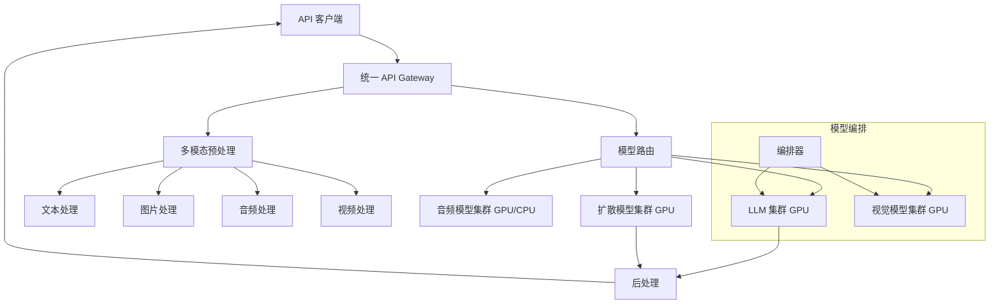

# Design Multimodal Serving Platform（多模态模型服务平台）

---

## 问题定义

设计一个统一的多模态模型服务平台，核心功能：
- 支持多种输入模态：文本、图片、音频、视频
- 支持多种任务：文生图、图生文、语音识别、视频理解等
- 统一 API 接口，屏蔽底层模型差异
- 异构硬件调度（GPU/CPU/专用加速器）
- 高效的多模态数据预处理

**核心挑战：** 不同模态的处理延迟差异大、异构硬件资源管理、多模态数据的流式处理、模型组合编排。

---

## High-Level Design



---

## 核心组件详解

### 1. 统一 API 设计

```json
POST /v1/completions
{
  "model": "gpt-4-vision",
  "messages": [
    {
      "role": "user",
      "content": [
        {"type": "text", "text": "描述这张图片"},
        {"type": "image_url", "image_url": {"url": "https://..."}},
        {"type": "audio", "audio": {"data": "base64...", "format": "wav"}}
      ]
    }
  ],
  "max_tokens": 1024
}
```

**设计原则：**
- 输入支持混合模态（一个请求可以包含文本 + 图片 + 音频）
- 输出也可以是多模态（文本 + 图片生成）
- 统一的 Message 格式，content 是多模态内容数组

### 2. 多模态预处理

不同模态的预处理差异巨大：

| 模态 | 预处理 | 计算量 | 硬件 |
|---|---|---|---|
| 文本 | Tokenization | 极轻 | CPU |
| 图片 | Resize、Normalize、Patch 切分 | 轻 | CPU |
| 音频 | 重采样、Mel 频谱图提取 | 中 | CPU |
| 视频 | 关键帧提取、逐帧处理 | 重 | CPU/GPU |

**预处理与推理解耦：** 预处理在 CPU 上完成，推理在 GPU 上完成。通过队列连接，各自独立扩缩容。

**大文件处理：** 图片和音频可能很大（MB 级），需要：
- 客户端上传到对象存储，传 URL 而非 Base64（减少 API 负载）
- 服务端异步下载和预处理

### 3. 异构硬件调度

不同模型对硬件需求不同：

| 模型类型 | 硬件需求 | 原因 |
|---|---|---|
| LLM（文本生成） | 高显存 GPU（H100 80GB） | KV Cache 占用大 |
| 扩散模型（文生图） | 高算力 GPU | 多步迭代去噪 |
| 语音识别（Whisper） | 中等 GPU 或 CPU | 模型较小 |
| Embedding | GPU 或 CPU | 模型小，可 CPU 推理 |

**调度策略：**
- 维护异构资源池，按模型类型分配
- 支持 GPU 共享（小模型可多个共享一张 GPU）
- 优先级调度：交互式请求（实时聊天）优先于批量请求（文档处理）

### 4. 模型编排（Multi-Model Pipeline）

复杂的多模态任务需要多个模型协作：

**示例：视频问答**
```
视频输入 → 关键帧提取（CPU）→ 视觉编码器（GPU A）→ 帧特征序列
              ↓
用户问题 → 文本编码（GPU B）→ 多模态融合（GPU B）→ LLM 生成回答
```

**编排器设计：**
- 定义模型间的 DAG 依赖
- 并行执行无依赖的步骤（如视觉编码和文本编码并行）
- 中间结果通过共享内存或 gRPC 传递

### 5. 流式处理

**文本流式输出：** SSE（Server-Sent Events），逐 Token 返回。

**音频流式输入：** WebSocket 连接，客户端持续发送音频片段，服务端实时识别。

**视频流式处理：** 逐帧或逐 segment 处理，不需要等整个视频上传完成。

**挑战：** 不同模态的处理速度不同，需要同步机制确保多模态对齐。

### 6. 缓存策略

- **图片 Embedding 缓存：** 相同图片的视觉特征可以缓存复用
- **音频 Transcription 缓存：** 相同音频的转写结果缓存
- **Prefix KV Cache：** 多模态模型中，System Prompt + 固定图片的 KV Cache 可在请求间共享

---

## 关键 Trade-off

| 决策点 | 选项 A | 选项 B | 推荐 |
|---|---|---|---|
| 架构 | 单一多模态模型 | 模块化模型组合 | 按模型可用性选择 |
| 预处理位置 | 客户端处理 | 服务端处理 | B（统一控制，版本一致） |
| 大文件传输 | Base64 内嵌 | 上传 URL 引用 | B（大文件用 URL） |
| 硬件 | 统一 GPU 池 | 异构专用池 | B（资源效率更高） |

---

## 小结

> 多模态服务平台的核心是**统一 API 抽象和异构资源管理**。面试时重点讲清楚：多模态输入的统一 Message 格式设计、预处理与推理的解耦架构、异构硬件的调度策略、以及多模型编排的 DAG 流水线。
