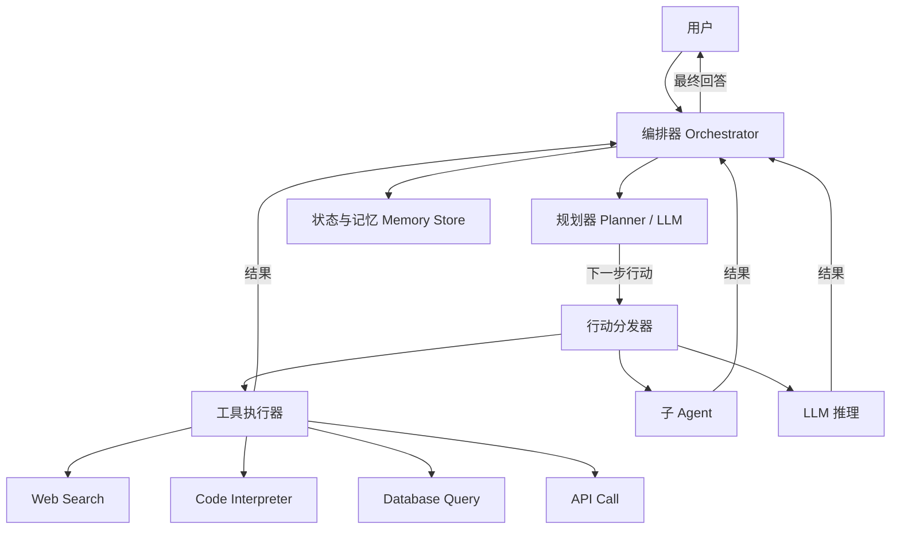

# Design AI Agent Orchestration（AI Agent 编排系统）

---

## 问题定义

设计一个 AI Agent 编排系统，核心功能：
- 支持 LLM 驱动的多步推理（ReAct、Chain-of-Thought）
- Tool Calling：Agent 可以调用外部工具（API、数据库、代码执行）
- 多 Agent 协作（Multi-Agent）
- 状态管理与对话记忆
- 并发控制与错误恢复

**核心挑战：** 多步执行的可靠性、工具调用的安全性、状态管理、成本控制、延迟优化。

---

## High-Level Design



---

## 核心组件详解

### 1. 编排循环（Agent Loop）

Agent 的核心是一个"思考-行动-观察"循环：

```
while not done:
    1. 将当前状态（用户请求 + 历史步骤 + 工具结果）发送给 LLM
    2. LLM 决定下一步行动（调用工具 or 生成最终回答）
    3. 如果是工具调用 → 执行工具，获取结果
    4. 将工具结果添加到上下文，回到步骤 1
    5. 如果是最终回答 → 返回给用户
```

**ReAct 模式：** Reasoning + Acting，LLM 先输出思考过程（Thought），再决定行动（Action），观察结果（Observation）后继续思考。

**最大步数限制：** 防止无限循环，设置 max_steps（如 10-20 步）。

### 2. Tool Calling（工具调用）

**工具定义：**
```json
{
  "name": "web_search",
  "description": "搜索互联网获取最新信息",
  "parameters": {
    "type": "object",
    "properties": {
      "query": {"type": "string", "description": "搜索关键词"}
    },
    "required": ["query"]
  }
}
```

**工具执行器：**
- 解析 LLM 返回的工具调用请求（function_call）
- 验证参数合法性（Schema Validation）
- 执行工具并收集结果
- 超时控制：每个工具调用设置超时（如 30 秒）
- 结果截断：工具返回过长时截断，避免撑爆上下文

**安全控制：**
- **白名单：** 只允许调用预定义的工具
- **权限隔离：** 不同用户/Agent 可访问的工具不同
- **沙箱执行：** Code Interpreter 在沙箱容器中运行，限制网络和文件系统访问
- **人工确认（Human-in-the-Loop）：** 高风险操作（如发邮件、修改数据库）需要用户确认

### 3. 状态管理

**短期记忆（Working Memory）：** 当前对话的所有消息和工具调用历史。随对话增长，可能超出 LLM 上下文窗口。

**上下文压缩策略：**
- **滑动窗口：** 只保留最近 N 轮对话
- **摘要压缩：** 用 LLM 将早期对话压缩为摘要
- **关键信息提取：** 提取关键事实存入结构化记忆

**长期记忆：** 跨对话的持久化记忆。
- 向量数据库存储历史对话和知识
- 每次对话开始时检索相关历史记忆
- 支持记忆的增删改（用户可以要求"忘记"某些信息）

### 4. 多 Agent 协作（Multi-Agent）

**模式一：分层委托（Hierarchical）**
```
主 Agent（协调者）
  ├── 搜索 Agent（负责信息检索）
  ├── 分析 Agent（负责数据分析）
  └── 写作 Agent（负责内容生成）
```
主 Agent 分解任务，委托给专家 Agent，收集结果后综合。

**模式二：对等协作（Peer-to-Peer）**
多个 Agent 共享一个消息板（Blackboard），各自发布观点和结果，通过讨论达成共识。

**模式三：流水线（Pipeline）**
```
Agent A（调研）→ Agent B（草稿）→ Agent C（审核）→ Agent D（润色）
```

**通信机制：**
- 共享上下文（Shared Context）：所有 Agent 读写同一个状态空间
- 消息传递（Message Passing）：Agent 间通过结构化消息通信

### 5. 并发与错误处理

**并行工具调用：** LLM 可以一次请求多个工具调用（parallel function calling），编排器并行执行：
```
LLM: "我需要同时搜索天气和查询航班"
→ 并行执行 web_search("天气") 和 flight_api("查询航班")
→ 收集两个结果后继续推理
```

**错误恢复：**
- **工具调用失败：** 重试 → 换一个工具 → 告知 LLM 工具不可用，让它换策略
- **LLM 输出格式错误：** 重新提示 LLM，附加格式要求
- **超时：** 返回部分结果，让 LLM 基于已有信息生成回答
- **无限循环检测：** 如果 Agent 连续多步执行相同操作，强制终止

### 6. 成本与延迟优化

**成本控制：**
- 每次 LLM 调用都有 Token 成本，多步推理成本可能很高
- 设置每次对话的 Token 预算上限
- 简单任务用小模型，复杂任务升级到大模型（Model Cascading）

**延迟优化：**
- 流式输出：LLM 的思考过程实时展示给用户
- 工具调用结果缓存：相同参数的工具调用复用缓存结果
- 投机执行：在 LLM 思考的同时，预测性地预执行可能的工具调用

---

## 关键 Trade-off

| 决策点 | 选项 A | 选项 B | 推荐 |
|---|---|---|---|
| 规划方式 | 预先规划全部步骤 | 逐步规划（ReAct） | B（更灵活，适应中间结果） |
| 多 Agent | 单 Agent + 多工具 | 多 Agent 协作 | 简单任务用 A，复杂任务用 B |
| 记忆管理 | 完整历史 | 摘要压缩 | B（长对话必须压缩） |
| 安全 | 全自动执行 | Human-in-the-Loop | 高风险操作用 B |

---

## 小结

> AI Agent 编排系统的核心是**可靠的多步执行循环和工具调用管理**。面试时重点讲清楚：Agent Loop 的"思考-行动-观察"循环、Tool Calling 的安全控制（沙箱、白名单、Human-in-the-Loop）、上下文管理和压缩策略、以及多 Agent 协作的模式选择。这是 2024-2025 年 AI Infra 面试的新兴热门方向。
